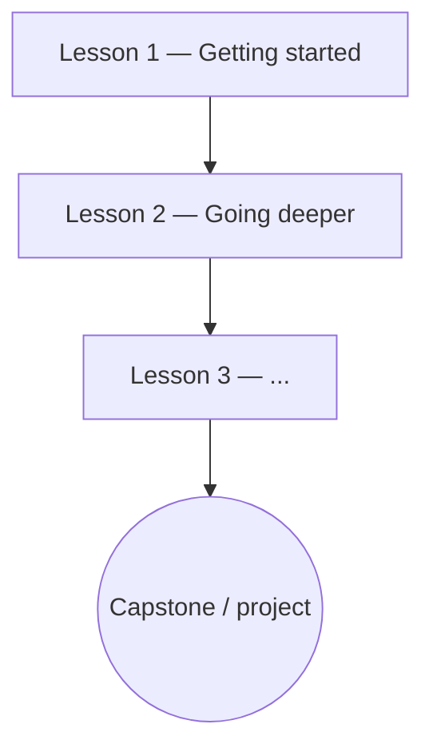

# [Course Title]

<!--
  COURSE OVERVIEW = the curriculum hub. It orients the learner and links out; the teaching
  itself lives in the lessons. Keep the Diátaxis boundary: a course is LEARNING-oriented
  (study, skill acquisition) — not a how-to recipe and not a reference dump.

  FRONTMATTER RULES:
   - title: Title Case, quoted; reuse the SAME course name across the overview and lessons.
   - icon: only hub/index pages carry an icon (this page yes; individual lessons no).
   - tags: corner:academy + type:course + topic:<subject> (reuse the Observatory topic
     vocabulary so the course appears in observatory/tags.en.md) + difficulty: + status:.
   - entry_type: Course  (emitted as JSON-LD @type by overrides/main.html).
   - Bump status: seedling → budding (real lessons exist) → evergreen (mature/curated).
-->

A short, motivating introduction: what this course is about, who it is for, and what you will be
able to do by the end. Name the through-line that ties the lessons together.

## Learning objectives

By the end of this course you will be able to:

<!-- Use measurable Bloom verbs (build, explain, compare, implement…) — not "understand"/"know". -->

- [verb] [a concrete, demonstrable outcome].
- [verb] [another outcome].
- [verb] [another outcome].

## Prerequisites

What you should already know or have set up before starting:

- [Prior knowledge, tool, or account] — [why it's needed / where to get it].
- Optional: [a related Academy course/tutorial or an Observatory field to skim first].

## Roadmap

The path through this course. Solid arrows = required order; dashed = optional/parallel.

<!-- Mermaid is enabled (fenced ```mermaid block). Keep node labels short; one node per lesson
     or module. This is the visual "roadmap" — mirror it in the Syllabus below. -->



## Syllabus

| # | Lesson | You'll learn | Difficulty | Est. time |
|---|--------|--------------|------------|-----------|
| 1 | [Getting started](./lessons/01_getting_started/index.en.md) | [one line] | Beginner | ~20 min |
| 2 | [Going deeper](./lessons/02_going_deeper/index.en.md) | [one line] | Beginner | ~30 min |

## Final project

<!-- FINAL PROJECT = the course capstone. It should pull together everything the course taught and
     simulate a REAL, meaningful product/scenario the learner is proud to submit. Offer a small menu
     of options when it helps motivation. Mirror this as the terminal node in the Roadmap above. -->

To finish the course you'll build and submit a project that ties everything together and simulates a
real, useful product:

- **[Option A]** — [one-line description of what it is and which skills it exercises].
- **[Option B]** — [an alternative for a different taste].

It should demonstrate [the course's core skills], and be something you'd be glad to show someone.

## How to use this course

- Work the lessons in order; each opens with its own objectives and prerequisites.
- Every lesson ends with **Classwork** (quick exercises); important lessons add **Homework** (longer,
  cumulative). Do them before moving on — skills stick through use, not reading.
- Each lesson carries a **Key Terms** page (hover a term for its definition); it is your local glossary.
- Finish with the **Final project** above.

## Related

Connective tissue, each with a phrase saying *why* it connects (not a bare link):

- **[Related course or tutorial]** — [how it builds on or complements this one].
- **[Observatory field]** — [../../../observatory/<category>/<field>/index.en.md] for the reference
  vocabulary behind this subject.
