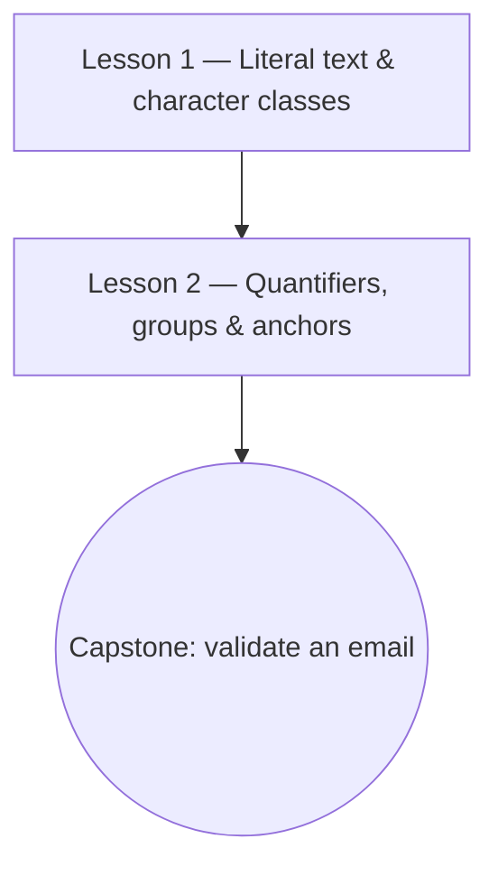

# Regular Expressions from Scratch

!!! note "Example course"
    This course is a **worked demonstrator** of the Academy course pattern (overview → roadmap →
    syllabus → lessons, each lesson carrying its own key terms). Use it as a model when authoring
    a real course from `_templates/course_template/`.

Regular expressions are a small language for describing patterns in text. They look cryptic at
first, but the vocabulary is tiny and learnable. This course builds it up piece by piece: you'll
start by matching literal characters and finish by writing patterns that validate and extract
real-world data.

## Learning objectives

By the end of this course you will be able to:

- Read a regular expression and predict what it matches.
- Write patterns using character classes, quantifiers, groups, and anchors.
- Build and test a pattern that validates a real input (e.g. an email address).

## Prerequisites

- Comfort editing text and running a small script or using an online regex tester — no prior
  regex experience needed.
- Optional: skim the [Computer Science](../../../observatory/formal_sciences/computer_science/index.en.md)
  field in the Observatory for the reference vocabulary this course draws on.

## Roadmap

Solid arrows = required order; the capstone applies everything.

## Syllabus

| # | Lesson | You'll learn | Difficulty | Est. time |
|---|--------|--------------|------------|-----------|
| 1 | [Literal text & character classes](./lessons/01_getting_started/index.en.md) | Match exact text and sets of characters | Beginner | ~20 min |
| 2 | [Quantifiers, groups & anchors](./lessons/02_going_deeper/index.en.md) | Repeat, capture, and pin patterns to positions | Beginner | ~30 min |

## How to use this course

- Work the lessons in order; each opens with its own objectives and prerequisites.
- Do each lesson's **Practice** before moving on — regex sticks through use, not reading.
- Keep the online tester open in a tab and test every pattern as you meet it.

## Related

- **[Create your first Mermaid diagram](../../tutorials/example_tutorial.en.md)** — another
  small, hands-on tutorial if you want a quick standalone win.
- **[Why Diátaxis](../../explainers/example_explainer.en.md)** — why this course is shaped as a
  set of learning-oriented lessons rather than a reference dump.
- **[Computer Science](../../../observatory/formal_sciences/computer_science/index.en.md)** — the
  Observatory field where the underlying concepts (finite automata, formal languages) are catalogued.
