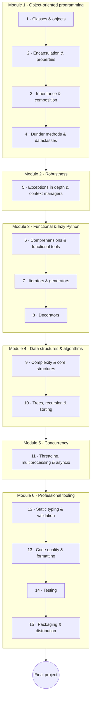

# Python Advanced

Once you can write Python, this course turns you into a Python *developer*. It opens with
object-oriented programming and moves through the language's expressive core (comprehensions,
generators, decorators), data structures & algorithms, concurrency, and the professional toolchain —
typing, testing, code quality, and packaging.

Like the rest of the track it is **project-interleaved**: **classwork** every lesson, **homework** on
the important ones, and a substantial **final project** at the end.

!!! tip "⚡ For programmers"
    Coming from another language, much here will be familiar in shape but distinctly Pythonic in
    detail (dunder methods, the GIL, `asyncio`, PEP 695 generics). The **"⚡ For programmers"** asides
    point out where Python differs from what you'd expect.

## Learning objectives

By the end of this course you will be able to:

- Design programs with classes, inheritance, composition, and Python's data model (dunder methods, dataclasses).
- Use comprehensions, generators, iterators, and decorators to write concise, lazy, reusable code.
- Reason about complexity and implement/choose core data structures and algorithms.
- Run work concurrently with threads, processes, and `asyncio`, and explain the GIL's role.
- Ship professional code: type hints + Pydantic, `ruff`, `pytest`, and a packaged, publishable project.

## Prerequisites

- **[Python for Beginners](../python_for_beginners/index.en.md)** (or equivalent) — comfortable with
  functions, data structures, files, errors, and virtual environments.

## Roadmap

## Syllabus

!!! note "Course in progress"
    Lesson titles become links as each lesson is published.

### Module 1 — Object-oriented programming

| # | Lesson | You'll learn |
|---|--------|--------------|
| 1 | Classes & objects | `class`, `__init__`, `self`, attributes, methods |
| 2 | Encapsulation & properties | `@property`, class/static methods, private-by-convention |
| 3 | Inheritance & composition | Subclassing, `super()`, polymorphism, composition-over-inheritance |
| 4 | Dunder methods & dataclasses | Magic methods, `@dataclass`, abstract base classes; a look at SOLID & patterns |

### Module 2 — Robustness

| # | Lesson | You'll learn |
|---|--------|--------------|
| 5 | Exceptions in depth | Custom exception hierarchies, chaining (`raise from`), `ExceptionGroup`/`except*`, context managers (`with`, `contextlib`) |

### Module 3 — Functional & lazy Python

| # | Lesson | You'll learn |
|---|--------|--------------|
| 6 | Comprehensions & functional tools | List/dict/set comprehensions, generator expressions, `lambda`, `map`/`filter`/`reduce`, `functools` |
| 7 | Iterators & generators | The iterator protocol, `yield`, lazy evaluation, `itertools` |
| 8 | Decorators | Function decorators, `functools.wraps`, decorators with arguments |

### Module 4 — Data structures & algorithms

| # | Lesson | You'll learn |
|---|--------|--------------|
| 9 | Complexity & core structures | Big-O, arrays & linked lists, stacks/queues, hash maps, `collections` |
| 10 | Trees, recursion & sorting | Binary search trees, recursion, and sorting/searching algorithms |

### Module 5 — Concurrency

| # | Lesson | You'll learn |
|---|--------|--------------|
| 11 | Concurrency | Threading, multiprocessing, `asyncio`/`await`, and the GIL (with a note on 3.13 free-threading) |

### Module 6 — Professional tooling

| # | Lesson | You'll learn |
|---|--------|--------------|
| 12 | Static typing & validation | Type hints in depth, `mypy`/`pyright`, PEP 695 generics, Pydantic v2 |
| 13 | Code quality & formatting | `ruff` (lint + format), pre-commit, logging, debugging with `pdb` |
| 14 | Testing | `unittest` vs `pytest`, fixtures, parametrization, mocking, coverage, TDD basics |
| 15 | Packaging & distribution | `pyproject.toml`, building with `uv`, wheels/sdists, semantic versioning, publishing |

## Final project

Build and submit a **well-structured, fully typed, tested, and packaged** project of your choice — a
small library or tool that a stranger could `pip install` and use. It should demonstrate sound OOP
design, type hints validated by a checker, a `pytest` suite, `ruff`-clean code, and a proper
`pyproject.toml`.

## How to use this course

- Work in order; each module leans on the previous.
- Do each lesson's **classwork**, and the **homework** on important lessons.
- Each lesson carries a **Key Terms** page (hover for definitions).
- Finish with the **Final project** above.

## Related

- **[Python for Beginners](../python_for_beginners/index.en.md)** — the prerequisite fundamentals.
- **[Python Web & APIs](../python_web_and_apis/index.en.md)**, **[Python & Networks](../python_and_networks/index.en.md)**,
  **[Python & Data](../python_and_data/index.en.md)** — apply these skills in a domain.
- **[Computer Science](../../../observatory/formal_sciences/computer_science/index.en.md)** — reference vocabulary (algorithms, complexity, concurrency).
