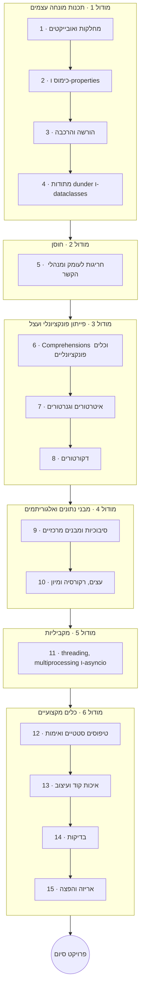

# פייתון למתקדמים

אחרי שאתם כבר יודעים לכתוב פייתון, הקורס הזה הופך אתכם ל*מפתחי* פייתון. הוא נפתח בתכנות
מונחה עצמים וממשיך דרך הליבה האקספרסיבית של השפה (comprehensions, גנרטורים, דקורטורים),
מבני נתונים ואלגוריתמים, מקביליות, וסביבת הכלים המקצועית — טיפוסים, בדיקות, איכות קוד ואריזה.

כמו שאר המסלול, גם הוא **שזור בפרויקטים**: **עבודת כיתה** בכל שיעור, **שיעורי בית** בשיעורים
החשובים, ו**פרויקט סיום** משמעותי בסוף.

!!! tip "⚡ למתכנתים"
    אם אתם מגיעים משפה אחרת, הרבה מהדברים כאן יהיו מוכרים במבנה אך פייתוניים באופן מובהק
    בפרטים (מתודות dunder, ה-GIL, `asyncio`, טיפוסים גנריים של PEP 695). הערות ה**"⚡ למתכנתים"**
    מצביעות על המקומות שבהם פייתון שונה ממה שהייתם מצפים.

## מטרות למידה

בסיום הקורס תוכלו:

- לתכנן תוכניות עם מחלקות, הורשה, הרכבה ומודל הנתונים של פייתון (מתודות dunder, dataclasses).
- להשתמש ב-comprehensions, גנרטורים, איטרטורים ודקורטורים כדי לכתוב קוד תמציתי, עצל וניתן לשימוש חוזר.
- לנתח סיבוכיות ולממש/לבחור מבני נתונים ואלגוריתמים מרכזיים.
- להריץ עבודה במקביל עם threading, תהליכים ו-`asyncio`, ולהסביר את תפקידו של ה-GIL.
- לספק קוד מקצועי: רמזי טיפוסים + Pydantic, `ruff`, `pytest`, ופרויקט ארוז וניתן לפרסום.

## דרישות קדם

- **[פייתון למתחילים](../python_for_beginners/index.he.md)** (או שווה ערך) — שליטה נוחה
  בפונקציות, מבני נתונים, קבצים, שגיאות וסביבות וירטואליות.

## מפת דרכים

## תוכנית הלימודים

!!! note "הקורס בתהליך כתיבה"
    כותרות השיעורים הופכות לקישורים ככל שכל שיעור מתפרסם.

### מודול 1 — תכנות מונחה עצמים

| # | שיעור | מה תלמדו |
|---|--------|--------------|
| 1 | מחלקות ואובייקטים | `class`, `__init__`, `self`, תכונות, מתודות |
| 2 | כימוס ו-properties | `@property`, מתודות מחלקה/סטטיות, פרטיות-במוסכמה |
| 3 | הורשה והרכבה | הורשת מחלקות, `super()`, פולימורפיזם, הרכבה-על-פני-הורשה |
| 4 | מתודות dunder ו-dataclasses | מתודות קסם, `@dataclass`, מחלקות בסיס אבסטרקטיות (ABC); מבט על SOLID ותבניות עיצוב |

### מודול 2 — חוסן

| # | שיעור | מה תלמדו |
|---|--------|--------------|
| 5 | חריגות לעומק | היררכיות חריגות מותאמות, שרשור (`raise from`), `ExceptionGroup`/`except*`, מנהלי הקשר (`with`, `contextlib`) |

### מודול 3 — פייתון פונקציונלי ועצל

| # | שיעור | מה תלמדו |
|---|--------|--------------|
| 6 | Comprehensions וכלים פונקציונליים | Comprehensions של רשימות/מילונים/קבוצות, ביטויי גנרטור, `lambda`, `map`/`filter`/`reduce`, `functools` |
| 7 | איטרטורים וגנרטורים | פרוטוקול האיטרטור, `yield`, הערכה עצלה, `itertools` |
| 8 | דקורטורים | דקורטורים לפונקציות, `functools.wraps`, דקורטורים עם ארגומנטים |

### מודול 4 — מבני נתונים ואלגוריתמים

| # | שיעור | מה תלמדו |
|---|--------|--------------|
| 9 | סיבוכיות ומבנים מרכזיים | Big-O, מערכים ורשימות מקושרות, מחסניות/תורים, מפות גיבוב, `collections` |
| 10 | עצים, רקורסיה ומיון | עצי חיפוש בינאריים (BST), רקורסיה, ואלגוריתמי מיון/חיפוש |

### מודול 5 — מקביליות

| # | שיעור | מה תלמדו |
|---|--------|--------------|
| 11 | מקביליות | threading, multiprocessing, `asyncio`/`await`, וה-GIL (עם הערה על free-threading ב-3.13) |

### מודול 6 — כלים מקצועיים

| # | שיעור | מה תלמדו |
|---|--------|--------------|
| 12 | טיפוסים סטטיים ואימות | רמזי טיפוסים לעומק, `mypy`/`pyright`, טיפוסים גנריים של PEP 695, Pydantic v2 |
| 13 | איכות קוד ועיצוב | `ruff` (lint + format), pre-commit, לוגים, ניפוי שגיאות עם `pdb` |
| 14 | בדיקות | `unittest` מול `pytest`, fixtures, פרמטריזציה, mocking, כיסוי, יסודות TDD |
| 15 | אריזה והפצה | `pyproject.toml`, בנייה עם `uv`, wheels/sdists, ניהול גרסאות סמנטי (semver), פרסום |

## פרויקט סיום

בנו והגישו פרויקט לבחירתכם ש**מובנה היטב, מטויפס במלואו, נבדק וארוז** — ספרייה או כלי קטן
שאדם זר יוכל להתקין ב-`pip install` ולהשתמש בו. הוא צריך להדגים תכנון מונחה עצמים תקין,
רמזי טיפוסים שאומתו על ידי בודק, חבילת `pytest`, קוד נקי מבחינת `ruff`, ו-`pyproject.toml` תקין.

## איך ללמוד בקורס הזה

- עבדו לפי הסדר; כל מודול נשען על הקודם.
- בצעו את **עבודת הכיתה** של כל שיעור, ואת **שיעורי הבית** בשיעורים החשובים.
- לכל שיעור יש דף **מונחי מפתח** (רחפו לקבלת הגדרות).
- סיימו עם **פרויקט הסיום** שלמעלה.

## ראו גם

- **[פייתון למתחילים](../python_for_beginners/index.he.md)** — יסודות דרישת הקדם.
- **[פייתון לרשת ו-APIs](../python_web_and_apis/index.he.md)**, **[פייתון ורשתות](../python_and_networks/index.he.md)**,
  **[פייתון ונתונים](../python_and_data/index.he.md)** — יישום המיומנויות הללו בתחום מסוים.
- **[מדעי המחשב](../../../observatory/formal_sciences/computer_science/index.en.md)** — אוצר מילים לעיון (אלגוריתמים, סיבוכיות, מקביליות).
