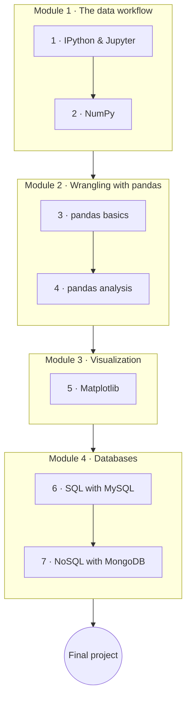

# Python & Data

Python is the lingua franca of data work. This course sets up the interactive workflow (IPython &
Jupyter), teaches the numerical and tabular workhorses (**NumPy**, **pandas**), covers visualization
with **Matplotlib**, and connects to both **SQL** (MySQL) and **NoSQL** (MongoDB) databases.

**Project-interleaved**: **classwork** every lesson, **homework** on the important ones, and an
end-to-end **final project**.

!!! tip "⚡ For programmers"
    If you've used data tools elsewhere (R, MATLAB, SQL), the **"⚡ For programmers"** asides map the
    ideas onto NumPy/pandas idioms and Python's data ecosystem.

## Learning objectives

By the end of this course you will be able to:

- Work fluently in Jupyter notebooks and the IPython shell.
- Manipulate numerical data with NumPy (arrays, vectorization, broadcasting).
- Load, clean, transform, and aggregate tabular data with pandas.
- Visualize results with Matplotlib.
- Store and query data in a relational (MySQL) and a document (MongoDB) database, and know which to reach for.

## Prerequisites

- **[Python for Beginners](../python_for_beginners/index.en.md)**; **[Python Advanced](../python_advanced/index.en.md)**
  helpful (comprehensions and iterators make data code cleaner).

## Roadmap

## Syllabus

!!! note "Course in progress"
    Lesson titles become links as each lesson is published.

### Module 1 — The data workflow

| # | Lesson | You'll learn |
|---|--------|--------------|
| 1 | IPython & Jupyter | Notebooks and the interactive data workflow |
| 2 | NumPy | Arrays, vectorization, and broadcasting |

### Module 2 — Wrangling with pandas

| # | Lesson | You'll learn |
|---|--------|--------------|
| 3 | pandas basics | `Series` and `DataFrame`, indexing/selection, and reading/writing CSV & Excel |
| 4 | pandas analysis | Cleaning, `groupby`, merge/join, and aggregation |

### Module 3 — Visualization

| # | Lesson | You'll learn |
|---|--------|--------------|
| 5 | Matplotlib | Building and styling plots (with a look at seaborn/plotly) |

### Module 4 — Databases

| # | Lesson | You'll learn |
|---|--------|--------------|
| 6 | SQL with MySQL | Relational modeling, CRUD, joins, and `mysql-connector`/SQLAlchemy |
| 7 | NoSQL with MongoDB | Documents and collections, `pymongo`, and when to use NoSQL vs SQL |

## Final project

Complete an **end-to-end data project** on a dataset of your choice: **load** it, **clean** it,
**analyze** it (pandas), **visualize** the findings (Matplotlib), and **store** the results in a
database (MySQL or MongoDB). Present it as a Jupyter notebook plus a short written takeaway.

## How to use this course

- Work in order; run every example in your own notebook.
- Do each lesson's **classwork**, and the **homework** on important lessons.
- Each lesson carries a **Key Terms** page (hover for definitions).
- Finish with the end-to-end **Final project**.

## Related

- **[Python for Beginners](../python_for_beginners/index.en.md)** · **[Python Advanced](../python_advanced/index.en.md)** — the foundations.
- **[Python Web & APIs](../python_web_and_apis/index.en.md)** — serve your analysis as an app or API.
- **[Computer Science](../../../observatory/formal_sciences/computer_science/index.en.md)** — data-structure and complexity background.
