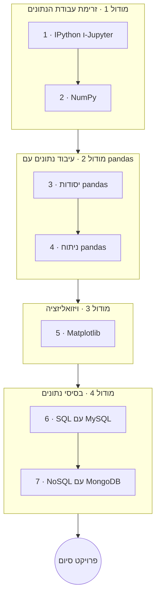

# פייתון ודאטא

פייתון היא שפת התקשורת המשותפת של עבודת הנתונים. הקורס הזה מקים את סביבת העבודה האינטראקטיבית (IPython
ו-Jupyter), מלמד את סוסי העבודה המספריים והטבלאיים (**NumPy**, **pandas**), מכסה ויזואליזציה
עם **Matplotlib**, ומתחבר לבסיסי נתונים מסוג **SQL** (MySQL) וגם **NoSQL** (MongoDB).

**שזור בפרויקטים**: **עבודת כיתה** בכל שיעור, **שיעורי בית** בשיעורים החשובים, ו**פרויקט סיום**
מקצה לקצה.

!!! tip "⚡ למתכנתים"
    אם השתמשתם בכלי נתונים במקומות אחרים (R, MATLAB, SQL), הערות הצד **"⚡ למתכנתים"** ממפות את
    הרעיונות אל הניבים של NumPy/pandas ואל מערכת הנתונים של פייתון.

## מטרות למידה

בסיום הקורס הזה תוכלו:

- לעבוד בשטף במחברות (notebook) של Jupyter ובמעטפת IPython.
- לתמרן נתונים מספריים עם NumPy (מערכים, וקטוריזציה, broadcasting).
- לטעון, לנקות, להמיר ולצבור נתונים טבלאיים עם pandas.
- לבצע ויזואליזציה של תוצאות עם Matplotlib.
- לאחסן ולתשאל נתונים בבסיס נתונים רלציוני (MySQL) ובבסיס נתונים מסמכי (MongoDB), ולדעת מתי לבחור בכל אחד.

## דרישות קדם

- **[פייתון למתחילים](../python_for_beginners/index.he.md)**; **[פייתון מתקדם](../python_advanced/index.he.md)**
  מועיל (comprehensions ואיטרטורים הופכים את קוד הנתונים לנקי יותר).

## מפת דרכים

## תוכנית הלימודים

!!! note "הקורס בתהליך"
    כותרות השיעורים הופכות לקישורים ככל שכל שיעור מתפרסם.

### מודול 1 — זרימת עבודת הנתונים

| # | שיעור | מה תלמדו |
|---|--------|--------------|
| 1 | IPython ו-Jupyter | מחברות (notebook) וזרימת עבודת הנתונים האינטראקטיבית |
| 2 | NumPy | מערכים, וקטוריזציה ו-broadcasting |

### מודול 2 — עיבוד נתונים עם pandas

| # | שיעור | מה תלמדו |
|---|--------|--------------|
| 3 | יסודות pandas | `Series` ו-`DataFrame`, אינדוקס/בחירה, וקריאה/כתיבה של CSV ו-Excel |
| 4 | ניתוח pandas | ניקוי נתונים, `groupby`, מיזוג/join וצבירה |

### מודול 3 — ויזואליזציה

| # | שיעור | מה תלמדו |
|---|--------|--------------|
| 5 | Matplotlib | בניה ועיצוב של גרפים (עם הצצה ל-seaborn/plotly) |

### מודול 4 — בסיסי נתונים

| # | שיעור | מה תלמדו |
|---|--------|--------------|
| 6 | SQL עם MySQL | מידול רלציוני, CRUD, joins ו-`mysql-connector`/SQLAlchemy |
| 7 | NoSQL עם MongoDB | מסמכים ואוספים, `pymongo`, ומתי להשתמש ב-NoSQL לעומת SQL |

## פרויקט סיום

השלימו **פרויקט נתונים מקצה לקצה** על מערך נתונים לבחירתכם: **טענו** אותו, **נקו** אותו,
**נתחו** אותו (pandas), בצעו **ויזואליזציה** של הממצאים (Matplotlib) ו**אחסנו** את התוצאות בבסיס
נתונים (MySQL או MongoDB). הציגו אותו כמחברת (notebook) של Jupyter בתוספת סיכום כתוב קצר.

## איך ללמוד בקורס הזה

- עבדו לפי הסדר; הריצו כל דוגמה במחברת (notebook) שלכם.
- בצעו את **עבודת הכיתה** של כל שיעור, ואת **שיעורי הבית** בשיעורים החשובים.
- כל שיעור נושא עמוד **מונחי מפתח** (רחפו לקבלת הגדרות).
- סיימו עם **פרויקט הסיום** מקצה לקצה.

## ראו גם

- **[פייתון למתחילים](../python_for_beginners/index.he.md)** · **[פייתון מתקדם](../python_advanced/index.he.md)** — היסודות.
- **[פייתון ווב ו-APIs](../python_web_and_apis/index.he.md)** — הגישו את הניתוח שלכם כאפליקציה או API.
- **[מדעי המחשב](../../../observatory/formal_sciences/computer_science/index.en.md)** — רקע במבני נתונים וסיבוכיות.
