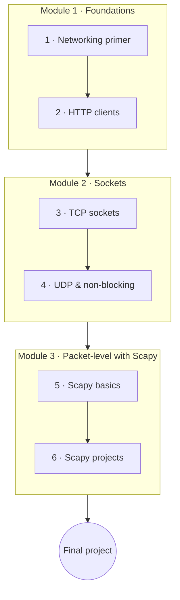

# Python & Networks

Python is a superb language for network programming. This course starts from the fundamentals of how
machines talk, builds clients and servers with raw **sockets**, and then moves up to packet-level work
with **Scapy** — crafting, sniffing, and dissecting traffic.

**Project-interleaved**: **classwork** every lesson, **homework** on the important ones, and a
**final project** that builds a real networking tool.

!!! warning "Authorized, educational use only"
    Sniffing and scanning are taught here for learning and for use **on networks and systems you own
    or are explicitly authorized to test**. Running these tools against others without permission is
    unethical and, in most places, illegal. Every relevant lesson repeats this note.

## Learning objectives

By the end of this course you will be able to:

- Explain the TCP/IP model, UDP, ports, and the client/server pattern.
- Talk to services over the network with `requests` and higher-level libraries.
- Build TCP and UDP clients and servers with the `socket` module.
- Craft, send, sniff, and dissect packets with Scapy — responsibly.

## Prerequisites

- **[Python for Beginners](../python_for_beginners/index.en.md)**; **[Python Advanced](../python_advanced/index.en.md)**
  helpful (concurrency and context managers show up in servers).
- Basic networking familiarity is a plus but not required — Lesson 1 covers what you need.

## Roadmap

## Syllabus

!!! note "Course in progress"
    Lesson titles become links as each lesson is published.

### Module 1 — Networking foundations

| # | Lesson | You'll learn |
|---|--------|--------------|
| 1 | Networking primer | TCP/IP, UDP, ports, the client/server model, and the protocol stack |
| 2 | HTTP clients | Talking to APIs with `requests`; a look at `paramiko`/`netmiko` for device automation |

### Module 2 — Sockets

| # | Lesson | You'll learn |
|---|--------|--------------|
| 3 | TCP sockets | The `socket` module — building a TCP client and server |
| 4 | UDP & non-blocking | Datagram sockets, blocking vs non-blocking, and `selectors` |

### Module 3 — Packet-level with Scapy

| # | Lesson | You'll learn |
|---|--------|--------------|
| 5 | Scapy basics | Crafting, sending, sniffing, and dissecting packets |
| 6 | Scapy projects | Building a packet sniffer and a port scanner (authorized use only) |

## Final project

Build and submit a real networking tool — **pick one**:

- **A chat app over sockets** — a TCP server and client that exchange messages.
- **A port scanner** — scan a host you own/control for open ports.
- **A packet sniffer** — capture and summarize traffic on your own network.

Whatever you pick, include a clear note on the **authorized scope** it's meant to run in.

## How to use this course

- Work in order; run your client and server locally as you go.
- Do each lesson's **classwork**, and the **homework** on important lessons.
- Each lesson carries a **Key Terms** page (hover for definitions).
- Finish with the **Final project** above — responsibly.

## Related

- **[Python for Beginners](../python_for_beginners/index.en.md)** · **[Python Advanced](../python_advanced/index.en.md)** — the foundations.
- **[Python Web & APIs](../python_web_and_apis/index.en.md)** — HTTP sits on top of the sockets you build here.
- **[Computer Science](../../../observatory/formal_sciences/computer_science/index.en.md)** — networking and protocol concepts.
