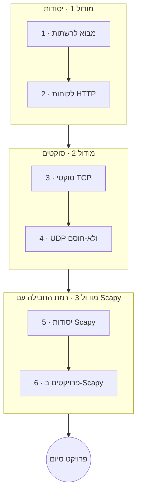

# פייתון ורשתות

פייתון היא שפה מצוינת לתכנות רשתות. הקורס הזה מתחיל מהיסודות של האופן שבו מכונות מדברות
ביניהן, בונה לקוחות ושרתים עם **סוקטים** גולמיים, ולאחר מכן מתקדם לעבודה ברמת החבילה (packet)
עם **Scapy** — בניית תעבורה, האזנה לה (sniffing) ופירוקה.

**שזור בפרויקטים**: **עבודת כיתה** בכל שיעור, **שיעורי בית** בשיעורים החשובים, ו**פרויקט סיום**
שבו בונים כלי רשת אמיתי.

!!! warning "לשימוש מורשה וחינוכי בלבד"
    האזנה (sniffing) וסריקה נלמדות כאן לצורכי לימוד ולשימוש **ברשתות ובמערכות שבבעלותכם
    או שקיבלתם הרשאה מפורשת לבדוק אותן**. הפעלת הכלים האלה נגד אחרים ללא רשות היא
    לא אתית, וברוב המקומות גם לא חוקית. כל שיעור רלוונטי חוזר על ההערה הזו.

## מטרות למידה

בסיום הקורס תוכלו:

- להסביר את מודל TCP/IP, את UDP, פורטים ואת דפוס הלקוח/שרת.
- לתקשר עם שירותים ברשת באמצעות `requests` וספריות ברמה גבוהה יותר.
- לבנות לקוחות ושרתי TCP ו-UDP עם המודול `socket`.
- לבנות, לשלוח, להאזין ולפרק חבילות (packets) עם Scapy — באחריות.

## דרישות קדם

- **[פייתון למתחילים](../python_for_beginners/index.he.md)**; **[פייתון מתקדם](../python_advanced/index.he.md)**
  מועיל (מקביליות ומנהלי הקשר מופיעים בשרתים).
- היכרות בסיסית עם רשתות היא יתרון אך אינה חובה — שיעור 1 מכסה את מה שצריך.

## מפת דרכים

## תוכנית הלימודים

!!! note "הקורס בבנייה"
    כותרות השיעורים הופכות לקישורים ככל שכל שיעור מתפרסם.

### מודול 1 — יסודות הרשתות

| # | שיעור | מה תלמדו |
|---|--------|--------------|
| 1 | מבוא לרשתות | TCP/IP, UDP, פורטים, מודל הלקוח/שרת ומחסנית הפרוטוקולים |
| 2 | לקוחות HTTP | תקשורת עם ממשקי API באמצעות `requests`; הצצה ל-`paramiko`/`netmiko` לאוטומציה של ציוד |

### מודול 2 — סוקטים

| # | שיעור | מה תלמדו |
|---|--------|--------------|
| 3 | סוקטי TCP | המודול `socket` — בניית לקוח ושרת TCP |
| 4 | UDP ולא-חוסם | סוקטי דאטגרם, חוסם מול לא-חוסם, ו-`selectors` |

### מודול 3 — רמת החבילה עם Scapy

| # | שיעור | מה תלמדו |
|---|--------|--------------|
| 5 | יסודות Scapy | בנייה, שליחה, האזנה (sniffing) ופירוק של חבילות (packets) |
| 6 | פרויקטים ב-Scapy | בניית packet sniffer ו-port scanner (לשימוש מורשה בלבד) |

## פרויקט סיום

בנו והגישו כלי רשת אמיתי — **בחרו אחד**:

- **אפליקציית צ'אט מעל סוקטים** — שרת ולקוח TCP שמחליפים הודעות.
- **port scanner** — סרקו מארח שבבעלותכם/בשליטתכם לאיתור פורטים פתוחים.
- **packet sniffer** — לכדו וסכמו תעבורה ברשת שלכם.

מה שלא תבחרו, כללו הערה ברורה על **ההיקף המורשה** שבו הכלי אמור לפעול.

## איך ללמוד בקורס הזה

- עבדו לפי הסדר; הריצו את הלקוח והשרת שלכם באופן מקומי תוך כדי התקדמות.
- בצעו את **עבודת הכיתה** של כל שיעור, ואת **שיעורי הבית** בשיעורים החשובים.
- כל שיעור נושא עמוד **מונחי מפתח** (רחפו לקבלת הגדרות).
- סיימו עם **פרויקט הסיום** שלמעלה — באחריות.

## ראו גם

- **[פייתון למתחילים](../python_for_beginners/index.he.md)** · **[פייתון מתקדם](../python_advanced/index.he.md)** — היסודות.
- **[פייתון: ווב ו-APIs](../python_web_and_apis/index.he.md)** — HTTP יושב מעל הסוקטים שאתם בונים כאן.
- **[מדעי המחשב](../../../observatory/formal_sciences/computer_science/index.en.md)** — מושגי רשתות ופרוטוקולים.
