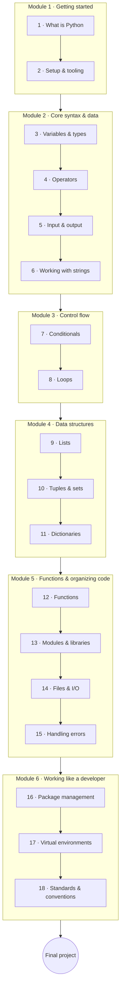

# Python for Beginners

This is the entry point to the **Python track**. We cover the fundamentals — the minimum a developer
should know to start understanding and writing Python: syntax, data, control flow, data structures,
functions, files, and the tools you work with day to day. Object-oriented programming and everything
deeper lives in [Python Advanced](../python_advanced/index.en.md).

We follow a **project-interleaved** approach: every lesson ends with quick **classwork**, important
lessons add longer **homework** (which may reuse earlier topics), and the course closes with a
**final project** you'll be glad to show someone.

!!! tip "⚡ For programmers"
    Already fluent in another language? Lessons carry optional **"⚡ For programmers"** call-outs that
    map Python's idioms to what you already know — skim the from-scratch parts and skip ahead.

## Learning objectives

By the end of this course you will be able to:

- Read and write Python using variables, types, operators, and the core control-flow constructs.
- Choose and use the built-in data structures (lists, tuples, sets, dictionaries) for a task.
- Organize code into functions and modules, read and write files, and handle errors gracefully.
- Set up a project the way a developer does: a virtual environment, dependencies, and clean, conventional code.
- Build a complete small program end to end as a final project.

## Prerequisites

- **None** — no programming experience assumed. Every concept starts from first principles.
- A computer where you can install software (we do this in Lesson 2).
- *Optional:* skim the [Computer Science](../../../observatory/formal_sciences/computer_science/index.en.md)
  field in the Observatory for background vocabulary.

## Roadmap

## Syllabus

!!! note "Course in progress"
    This course is being written lesson by lesson (`status:budding`). Lesson titles below become
    links as each lesson is published.

### Module 1 — Getting started

| # | Lesson | You'll learn |
|---|--------|--------------|
| 1 | What is Python | History, high- vs low-level languages, popularity, versions, Python 2 vs 3, where Python is used |
| 2 | Setup & tooling | Install Python 3.13, set up VS Code + extensions, the REPL, running a script, comments |

### Module 2 — Core syntax & data

| # | Lesson | You'll learn |
|---|--------|--------------|
| 3 | Variables & data types | `int`/`float`/`str`/`bool`, dynamic typing, type casting, `None` |
| 4 | Operators | Arithmetic, comparison, logical, membership (`in`), identity (`is`), precedence |
| 5 | Input & output | `print()`, `input()`, and f-strings as the default way to format |
| 6 | Working with strings | Indexing, slicing (`:`), string methods, and formatting |

### Module 3 — Control flow

| # | Lesson | You'll learn |
|---|--------|--------------|
| 7 | Conditionals | `if`/`elif`/`else`, truthiness, the ternary expression, and `match`/`case` |
| 8 | Loops | `while`, `for`, `range`, `break`/`continue`/`pass`, nested loops, loop-`else` |

### Module 4 — Data structures

| # | Lesson | You'll learn |
|---|--------|--------------|
| 9 | Lists | Creating, indexing, methods, iteration, and a first look at comprehensions |
| 10 | Tuples & sets | Immutability, set operations, and `frozenset` |
| 11 | Dictionaries | Keys and values, iteration, and common methods |

### Module 5 — Functions & organizing code

| # | Lesson | You'll learn |
|---|--------|--------------|
| 12 | Functions | `def`, parameters, `return`, defaults, `*args`/`**kwargs`, scope (LEGB), docstrings, type-hint intro |
| 13 | Modules & libraries | `import`, `from … import`, a tour of the standard library (`math`, `random`, `datetime`), and reading docs |
| 14 | Files & I/O | `open`/`with`, reading and writing, `pathlib`, and JSON/CSV |
| 15 | Handling errors | `try`/`except`/`else`/`finally` and `raise` — enough to write robust programs |

### Module 6 — Working like a developer

| # | Lesson | You'll learn |
|---|--------|--------------|
| 16 | Package management | PyPI and `pip`, plus a survey of `uv`, `poetry`, and `conda` |
| 17 | Virtual environments | `venv`, why isolation matters, `requirements.txt`, and a first look at `uv` |
| 18 | Standards & conventions | PEP 8, naming, docstrings, an intro to `ruff`, and sensible project layout |

## Final project

Finish by building and submitting one complete program that ties the course together — **pick the one
that appeals to you**:

- **A terminal game** — e.g. Hangman or Tic-Tac-Toe: input handling, control flow, data structures, and functions.
- **A CLI tool** — e.g. a todo or expense tracker that saves to a file: everything above, plus files and error handling.

Whichever you choose, it should run start-to-finish, handle bad input gracefully, and be something
you'd happily demo.

## How to use this course

- Work the lessons **in order** — each builds on the last.
- Do each lesson's **classwork** immediately; tackle **homework** on the important lessons before moving on.
- Keep a **virtual environment** active and the **REPL** open as you follow along.
- Each lesson carries a **Key Terms** page (hover a term for its definition) — your local glossary.

## Related

- **[Python Advanced](../python_advanced/index.en.md)** — the natural next step: OOP, concurrency, typing, testing, packaging.
- **[Python Web & APIs](../python_web_and_apis/index.en.md)**, **[Python & Networks](../python_and_networks/index.en.md)**,
  **[Python & Data](../python_and_data/index.en.md)** — specialization tracks once you have the fundamentals.
- **[Why Diátaxis](../../explainers/example_explainer.en.md)** — why this course is a set of learning-oriented lessons.
- **[Computer Science](../../../observatory/formal_sciences/computer_science/index.en.md)** — the Observatory field behind the concepts.
