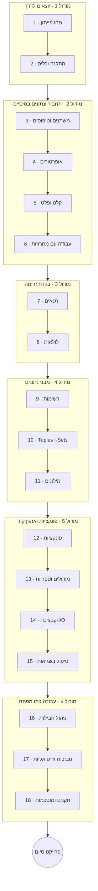

# פייתון למתחילים

זוהי נקודת הכניסה ל**מסלול הפייתון**. אנחנו מכסים את היסודות — המינימום שמפתח
צריך לדעת כדי להתחיל להבין ולכתוב פייתון: תחביר, נתונים, בקרת זרימה, מבני נתונים,
פונקציות, קבצים והכלים שעובדים איתם ביום-יום. תכנות מונחה עצמים וכל מה שעמוק יותר
נמצא ב[פייתון מתקדם](../python_advanced/index.he.md).

אנחנו נוקטים גישה **משולבת-פרויקטים**: כל שיעור מסתיים ב**עבודת כיתה** קצרה,
שיעורים חשובים מוסיפים **שיעורי בית** ארוכים יותר (שעשויים לחזור על נושאים קודמים),
והקורס נחתם ב**פרויקט סיום** שתשמחו להראות למישהו.

!!! tip "⚡ למתכנתים"
    כבר שולטים בשפה אחרת? שיעורים כוללים הערות **"⚡ למתכנתים"** אופציונליות
    שממפות את האידיומים של פייתון למה שאתם כבר מכירים — דלגו על החלקים שמתחילים מאפס והתקדמו הלאה.

## מטרות למידה

בסיום הקורס הזה תוכלו:

- לקרוא ולכתוב פייתון תוך שימוש במשתנים, טיפוסים, אופרטורים ומבני בקרת הזרימה המרכזיים.
- לבחור ולהשתמש במבני הנתונים המובנים (רשימות, tuples, sets, מילונים) עבור משימה נתונה.
- לארגן קוד לפונקציות ומודולים, לקרוא ולכתוב קבצים ולטפל בשגיאות בצורה חיננית.
- להקים פרויקט כמו שמפתח עושה: סביבה וירטואלית, תלויות וקוד נקי ומוסכם.
- לבנות תוכנית קטנה ומלאה מקצה לקצה כפרויקט סיום.

## דרישות קדם

- **אין** — לא מניחים ניסיון תכנותי קודם. כל מושג מתחיל מעקרונות ראשונים.
- מחשב שאפשר להתקין עליו תוכנות (נעשה זאת בשיעור 2).
- *אופציונלי:* עברו ברפרוף על תחום [מדעי המחשב](../../../observatory/formal_sciences/computer_science/index.en.md)
  ב-Observatory לרקע של אוצר מילים.

## מפת דרכים

## תוכנית הלימודים

!!! note "הקורס בכתיבה"
    הקורס הזה נכתב שיעור אחר שיעור (`status:budding`). כותרות השיעורים למטה הופכות
    לקישורים ככל שכל שיעור מתפרסם.

### מודול 1 — יוצאים לדרך

| # | שיעור | מה תלמדו |
|---|--------|--------------|
| 1 | מהו פייתון | היסטוריה, שפות רמה גבוהה מול רמה נמוכה, פופולריות, גרסאות, Python 2 מול 3, היכן משתמשים בפייתון |
| 2 | התקנה וכלים | התקנת Python 3.13, הקמת VS Code + הרחבות, ה-REPL, הרצת סקריפט, הערות |

### מודול 2 — תחביר ונתונים בסיסיים

| # | שיעור | מה תלמדו |
|---|--------|--------------|
| 3 | משתנים וטיפוסי נתונים | `int`/`float`/`str`/`bool`, טיפוסיות דינמית, המרת טיפוסים, `None` |
| 4 | אופרטורים | חשבוניים, השוואה, לוגיים, שייכות (`in`), זהות (`is`), קדימות |
| 5 | קלט ופלט | `print()`, `input()`, ו-f-strings כדרך ברירת המחדל לעיצוב |
| 6 | עבודה עם מחרוזות | אינדוקס, חיתוך (`:`), מתודות מחרוזת, ועיצוב |

### מודול 3 — בקרת זרימה

| # | שיעור | מה תלמדו |
|---|--------|--------------|
| 7 | תנאים | `if`/`elif`/`else`, אמיתיות (truthiness), ביטוי טרנארי, ו-`match`/`case` |
| 8 | לולאות | `while`, `for`, `range`, `break`/`continue`/`pass`, לולאות מקוננות, loop-`else` |

### מודול 4 — מבני נתונים

| # | שיעור | מה תלמדו |
|---|--------|--------------|
| 9 | רשימות | יצירה, אינדוקס, מתודות, איטרציה, ומבט ראשון על comprehensions |
| 10 | Tuples ו-Sets | אי-שינויות (immutability), פעולות על sets, ו-`frozenset` |
| 11 | מילונים | מפתחות וערכים, איטרציה, ומתודות נפוצות |

### מודול 5 — פונקציות וארגון קוד

| # | שיעור | מה תלמדו |
|---|--------|--------------|
| 12 | פונקציות | `def`, פרמטרים, `return`, ברירות מחדל, `*args`/`**kwargs`, תחום (LEGB), docstrings, מבוא ל-type-hint |
| 13 | מודולים וספריות | `import`, `from … import`, סיור בספריית התקן (`math`, `random`, `datetime`), וקריאת תיעוד |
| 14 | קבצים ו-I/O | `open`/`with`, קריאה וכתיבה, `pathlib`, ו-JSON/CSV |
| 15 | טיפול בשגיאות | `try`/`except`/`else`/`finally` ו-`raise` — מספיק כדי לכתוב תוכניות עמידות |

### מודול 6 — עבודה כמו מפתח

| # | שיעור | מה תלמדו |
|---|--------|--------------|
| 16 | ניהול חבילות | PyPI ו-`pip`, בתוספת סקירה של `uv`, `poetry`, ו-`conda` |
| 17 | סביבות וירטואליות | `venv`, מדוע בידוד חשוב, `requirements.txt`, ומבט ראשון על `uv` |
| 18 | תקנים ומוסכמות | PEP 8, מתן שמות, docstrings, מבוא ל-`ruff`, ומבנה פרויקט הגיוני |

## פרויקט סיום

סיימו בבנייה והגשה של תוכנית מלאה אחת שקושרת את הקורס יחד — **בחרו את זו
שמושכת אתכם**:

- **משחק טרמינל** — למשל איש תלוי או איקס-עיגול: טיפול בקלט, בקרת זרימה, מבני נתונים ופונקציות.
- **כלי CLI** — למשל מנהל משימות או מעקב הוצאות ששומר לקובץ: כל מה שלמעלה, בתוספת קבצים וטיפול בשגיאות.

בכל מקרה שתבחרו, זה צריך לרוץ מההתחלה עד הסוף, לטפל בקלט שגוי בצורה חיננית, ולהיות משהו
שתשמחו להדגים.

## איך ללמוד בקורס הזה

- עברו על השיעורים **לפי הסדר** — כל אחד בונה על הקודם.
- בצעו את **עבודת הכיתה** של כל שיעור מיד; התמודדו עם **שיעורי הבית** בשיעורים החשובים לפני שממשיכים.
- שמרו **סביבה וירטואלית** פעילה ואת ה-**REPL** פתוח תוך כדי המעקב.
- כל שיעור כולל עמוד **מונחי מפתח** (רחפו מעל מונח לקבלת ההגדרה שלו) — המילון המקומי שלכם.

## ראו גם

- **[פייתון מתקדם](../python_advanced/index.he.md)** — הצעד הטבעי הבא: OOP, מקביליות, טיפוסיות, בדיקות, אריזה.
- **[פייתון ל-Web ו-APIs](../python_web_and_apis/index.he.md)**, **[פייתון ורשתות](../python_and_networks/index.he.md)**,
  **[פייתון ונתונים](../python_and_data/index.he.md)** — מסלולי התמחות ברגע שיש לכם את היסודות.
- **[למה Diátaxis](../../explainers/example_explainer.en.md)** — למה הקורס הזה הוא סדרת שיעורים מוכווני-למידה.
- **[מדעי המחשב](../../../observatory/formal_sciences/computer_science/index.en.md)** — תחום ה-Observatory שמאחורי המושגים.
