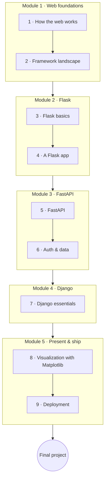

# Python Web & APIs

Take your Python to the web. This course covers how the web actually works, then the three
frameworks that matter — **Flask** (minimal, concepts visible), **FastAPI** (the modern default for
APIs), and **Django** (batteries-included full-stack) — plus visualizing data with Matplotlib and
shipping with Docker.

**Project-interleaved** as always: **classwork** every lesson, **homework** on the important ones,
and a deployed **final project**.

!!! tip "⚡ For programmers"
    Framework concepts (routing, ORMs, templating, middleware) transfer from other ecosystems; the
    **"⚡ For programmers"** asides map them to Python's conventions and to ASGI/WSGI.

## Learning objectives

By the end of this course you will be able to:

- Explain HTTP, REST, and JSON, and call APIs with `requests`.
- Choose the right framework for a job and justify it (Flask vs FastAPI vs Django).
- Build a small web app with Flask and a typed, documented API with FastAPI.
- Stand up a full-stack Django app with an ORM and admin.
- Visualize data with Matplotlib and deploy an app with Docker.

## Prerequisites

- **[Python for Beginners](../python_for_beginners/index.en.md)**; **[Python Advanced](../python_advanced/index.en.md)**
  recommended (OOP, typing, and Pydantic make the frameworks click).

## Roadmap

## Syllabus

!!! note "Course in progress"
    Lesson titles become links as each lesson is published.

### Module 1 — Web foundations

| # | Lesson | You'll learn |
|---|--------|--------------|
| 1 | How the web works | HTTP, requests/responses, status codes, REST, JSON, and the `requests` library |
| 2 | Framework landscape | Flask vs Django vs FastAPI — strengths and when to use which |

### Module 2 — Building with Flask

| # | Lesson | You'll learn |
|---|--------|--------------|
| 3 | Flask basics | Routes, request/response, and Jinja2 templates |
| 4 | A Flask app | Forms, sessions, a small SQLite database, and app structure |

### Module 3 — Modern APIs with FastAPI

| # | Lesson | You'll learn |
|---|--------|--------------|
| 5 | FastAPI | Path/query params, Pydantic models, validation, auto OpenAPI docs, async, Uvicorn/ASGI |
| 6 | Auth & data | Authentication basics, connecting a database, and project structure |

### Module 4 — Full-stack with Django

| # | Lesson | You'll learn |
|---|--------|--------------|
| 7 | Django essentials | Projects & apps, the ORM, models/migrations, the admin, views/URLs/templates |

### Module 5 — Presenting data & shipping

| # | Lesson | You'll learn |
|---|--------|--------------|
| 8 | Visualization with Matplotlib | Building plots and serving/embedding charts in a web response |
| 9 | Deployment | Containerizing with Docker and configuring for different environments |

## Final project

Build and **deploy** a small web project — **pick one**:

- **A Flask web app** — server-rendered pages, a form, and a SQLite database.
- **A FastAPI API** — typed endpoints with Pydantic, validation, and auto-generated docs.

Either way, include at least one **chart** (Matplotlib) and ship it in a **Docker** container.

## How to use this course

- Work in order; build the running example alongside each lesson.
- Do each lesson's **classwork**, and the **homework** on important lessons.
- Each lesson carries a **Key Terms** page (hover for definitions).
- Finish with the deployed **Final project**.

## Related

- **[Python for Beginners](../python_for_beginners/index.en.md)** · **[Python Advanced](../python_advanced/index.en.md)** — the foundations this course assumes.
- **[Python & Data](../python_and_data/index.en.md)** — pairs well when your app serves data/analytics.
- **[Python & Networks](../python_and_networks/index.en.md)** — the layer beneath HTTP.
