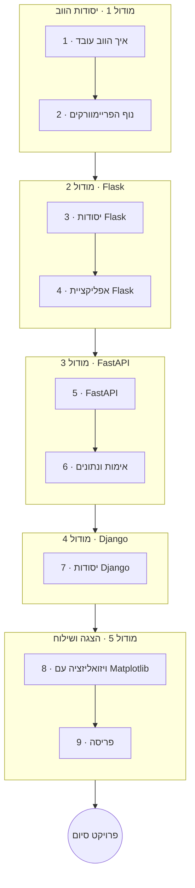

# פייתון פרונט-אנד ו-API

קחו את הפייתון שלכם אל הווב. הקורס הזה מכסה איך הווב באמת עובד, ואז את שלושת
הפריימוורקים שחשובים — **Flask** (מינימלי, המושגים גלויים), **FastAPI** (ברירת המחדל המודרנית עבור
API), ו-**Django** (פול-סטאק עם הכל כלול) — ובנוסף ויזואליזציה של נתונים עם Matplotlib
ושילוח עם Docker.

**שזור בפרויקטים** כמו תמיד: **עבודת כיתה** בכל שיעור, **שיעורי בית** בשיעורים החשובים,
ו**פרויקט סיום** פרוס.

!!! tip "⚡ למתכנתים"
    מושגי פריימוורק (ניתוב, ORM, תבניות, middleware) עוברים מאקוסיסטמות אחרות;
    ההערות **"⚡ למתכנתים"** ממפות אותם למוסכמות של פייתון ול-ASGI/WSGI.

## מטרות למידה

בסיום הקורס תוכלו:

- להסביר HTTP, REST ו-JSON, ולקרוא ל-API עם `requests`.
- לבחור את הפריימוורק הנכון למשימה ולנמק זאת (Flask מול FastAPI מול Django).
- לבנות אפליקציית ווב קטנה עם Flask ו-API מטויפס ומתועד עם FastAPI.
- להקים אפליקציית Django פול-סטאק עם ORM וממשק ניהול.
- להמחיש נתונים עם Matplotlib ולפרוס אפליקציה עם Docker.

## דרישות קדם

- **[פייתון למתחילים](../python_for_beginners/index.he.md)**; מומלץ גם **[פייתון מתקדם](../python_advanced/index.he.md)**
  (OOP, טיפוסים ו-Pydantic גורמים לפריימוורקים להתחבר).

## מפת דרכים

## תוכנית הלימודים

!!! note "הקורס בתהליך"
    כותרות השיעורים הופכות לקישורים ככל שכל שיעור מתפרסם.

### מודול 1 — יסודות הווב

| # | שיעור | מה תלמדו |
|---|--------|--------------|
| 1 | איך הווב עובד | HTTP, בקשות/תגובות, קודי סטטוס, REST, JSON, וספריית `requests` |
| 2 | נוף הפריימוורקים | Flask מול Django מול FastAPI — חוזקות ומתי להשתמש בכל אחד |

### מודול 2 — בנייה עם Flask

| # | שיעור | מה תלמדו |
|---|--------|--------------|
| 3 | יסודות Flask | נתיבים (routes), בקשה/תגובה, ותבניות Jinja2 |
| 4 | אפליקציית Flask | טפסים, sessions, בסיס נתונים SQLite קטן, ומבנה אפליקציה |

### מודול 3 — API מודרני עם FastAPI

| # | שיעור | מה תלמדו |
|---|--------|--------------|
| 5 | FastAPI | פרמטרים של נתיב/שאילתה, מודלים של Pydantic, ולידציה, תיעוד OpenAPI אוטומטי, async, Uvicorn/ASGI |
| 6 | אימות ונתונים | יסודות אימות, חיבור בסיס נתונים, ומבנה פרויקט |

### מודול 4 — פול-סטאק עם Django

| # | שיעור | מה תלמדו |
|---|--------|--------------|
| 7 | יסודות Django | פרויקטים ואפליקציות, ה-ORM, מודלים/מיגרציות, ממשק הניהול, views/URLs/תבניות |

### מודול 5 — הצגת נתונים ושילוח

| # | שיעור | מה תלמדו |
|---|--------|--------------|
| 8 | ויזואליזציה עם Matplotlib | בניית גרפים והגשה/הטמעה של תרשימים בתגובת ווב |
| 9 | פריסה | הכלה עם Docker והגדרה עבור סביבות שונות |

## פרויקט סיום

בנו ו**פרסו** (deploy) פרויקט ווב קטן — **בחרו אחד**:

- **אפליקציית ווב ב-Flask** — עמודים מרונדרים בשרת, טופס, ובסיס נתונים SQLite.
- **API ב-FastAPI** — נקודות קצה מטויפסות עם Pydantic, ולידציה, ותיעוד שנוצר אוטומטית.

כך או כך, כללו לפחות **תרשים** אחד (Matplotlib) ושלחו אותו בתוך קונטיינר **Docker**.

## איך ללמוד בקורס הזה

- עבדו לפי הסדר; בנו את הדוגמה הרצה לצד כל שיעור.
- בצעו את **עבודת הכיתה** של כל שיעור, ואת **שיעורי הבית** בשיעורים החשובים.
- כל שיעור נושא עמוד **מונחי מפתח** (רחפו לקבלת הגדרות).
- סיימו עם **פרויקט הסיום** הפרוס.

## ראו גם

- **[פייתון למתחילים](../python_for_beginners/index.he.md)** · **[פייתון מתקדם](../python_advanced/index.he.md)** — היסודות שהקורס הזה מניח.
- **[פייתון ונתונים](../python_and_data/index.he.md)** — משתלב היטב כשהאפליקציה שלכם מגישה נתונים/אנליטיקה.
- **[פייתון ורשתות](../python_and_networks/index.he.md)** — השכבה שמתחת ל-HTTP.
