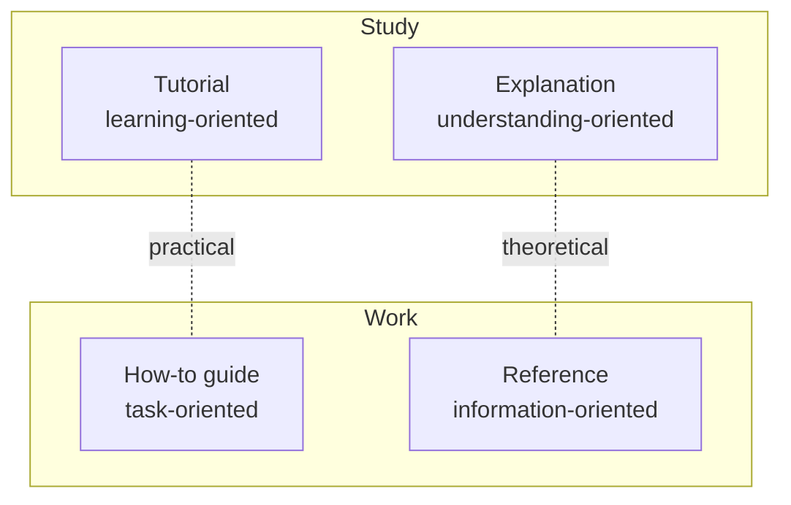

# Why Diátaxis: The Four Kinds of Learning Content

!!! note "Example explainer"
    A worked demonstrator of the Academy explainer pattern. Author real explainers from
    `_templates/explainer_template.en.md`.

> Learning content fails when it tries to do everything at once; the fix is to split it by the
> reader's need.

Ever followed a tutorial that kept stopping to explain theory, and lost the thread? Or opened a
reference page hoping to *learn* something and drowned in facts? These are not writing-skill
problems — they are **structure** problems. [Diátaxis](https://diataxis.fr/) diagnoses them.

## Context

Diátaxis (from the Greek for "arrangement") was articulated by Daniele Procida. Its claim is that
technical content serves four *distinct* needs, and each need wants a different shape. Crucially,
the needs split along two axes: **practical ↔ theoretical** (does it inform action or cognition?)
and **study ↔ work** (is the reader acquiring a skill or applying one?).

## Discussion

Those two axes produce four quadrants:

- A **tutorial** takes a beginner by the hand through a guided experience — success and confidence
  matter more than completeness.
- A **how-to guide** helps a competent person accomplish a specific goal — no hand-holding.
- **Reference** describes the machinery accurately and neutrally — you consult it, you don't read it.
- **Explanation** (this page) illuminates *why* — it connects and contextualises.

The central rule: **don't blur the boundaries.** Explanation smuggled into a tutorial distracts the
learner; instructions dumped into reference make it unusable. Most "bad docs" are actually two good
documents fighting inside one page.

That is exactly why the Academy is organised the way it is: **Tutorials** and **Courses** cover the
learning quadrant, **How-to Guides** the task quadrant, **Explainers** the understanding quadrant —
and the *reference* quadrant lives next door in the **Observatory** (with each course lesson keeping
a small local glossary). Same framework, applied to a personal knowledge base.

## Connections

- **[Courses](../courses/index.md)** — a sequenced set of tutorial-mode lessons.
- **[Observatory](../../observatory/index.en.md)** — where the Academy's reference quadrant lives.

## Sources

1. Daniele Procida — *Diátaxis* — <https://diataxis.fr/> — the primary, authoritative source.
