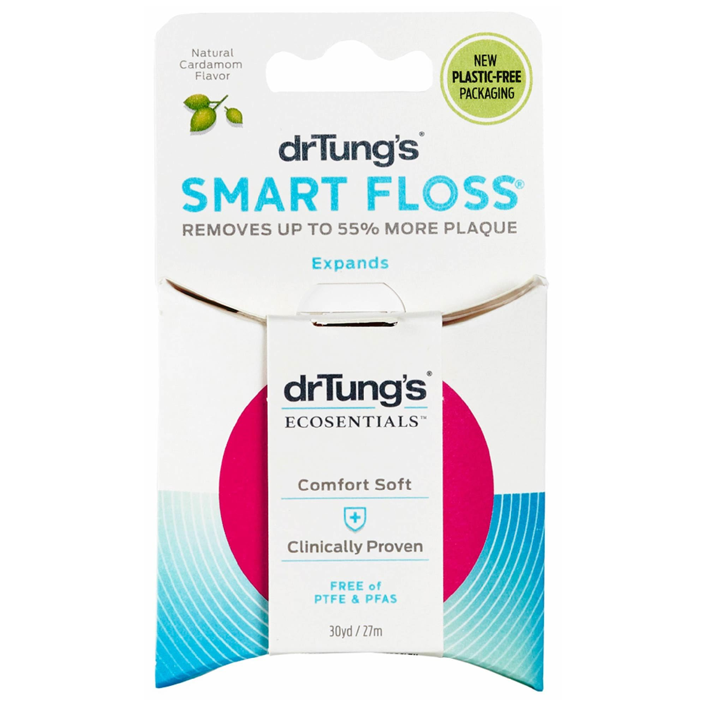
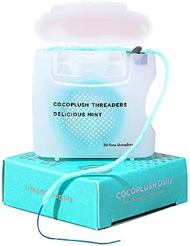
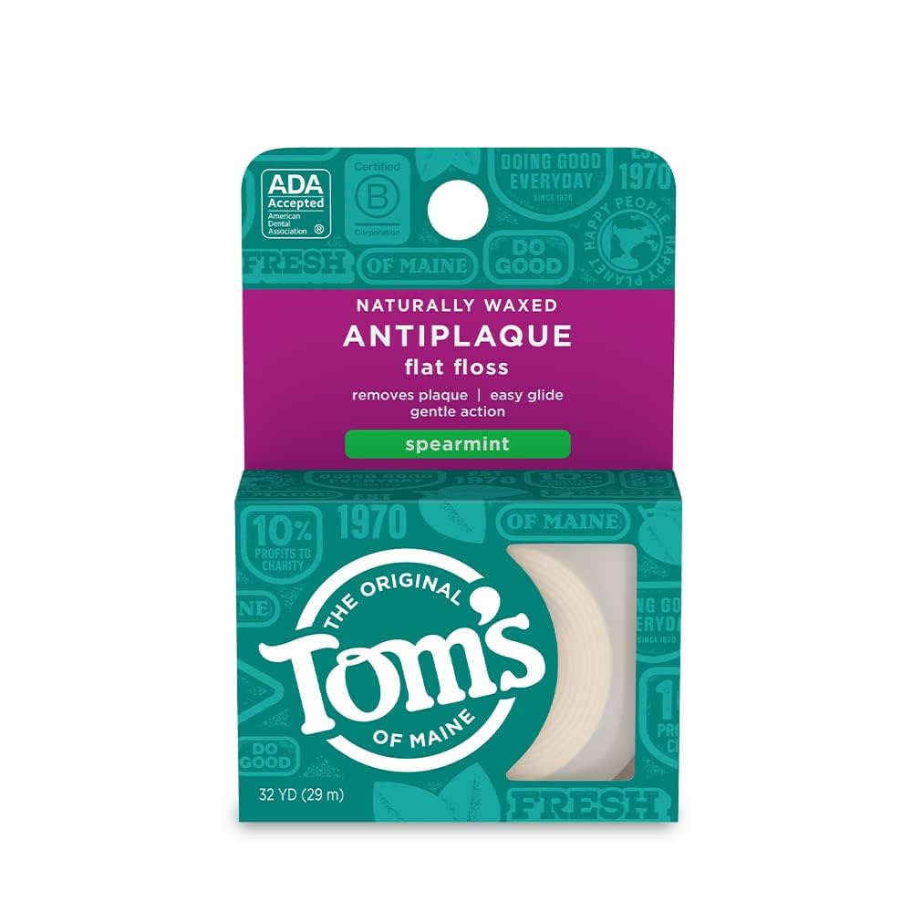
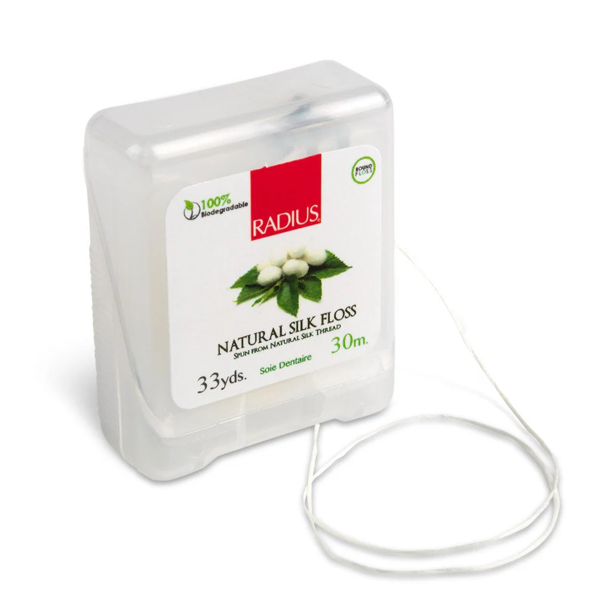
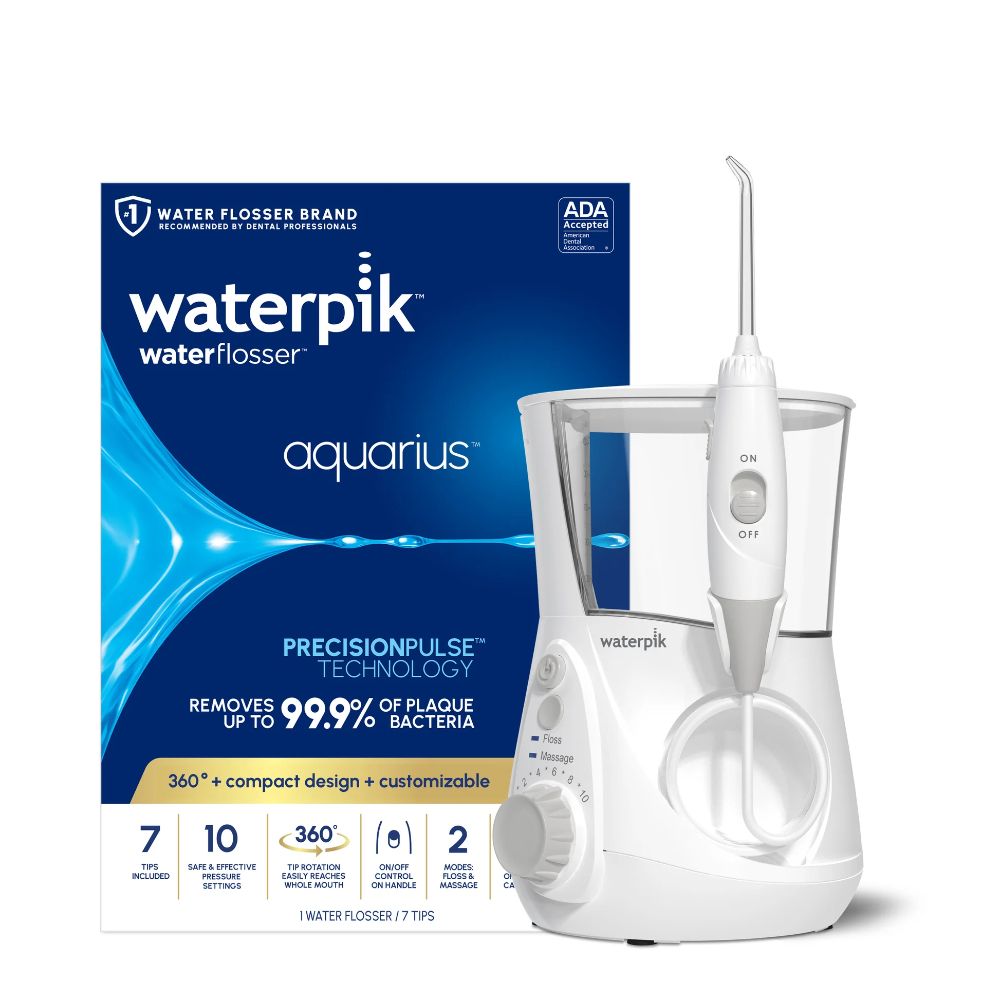
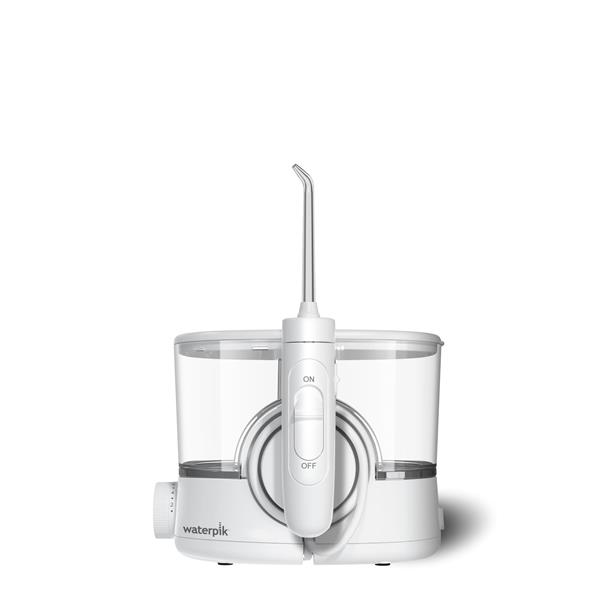
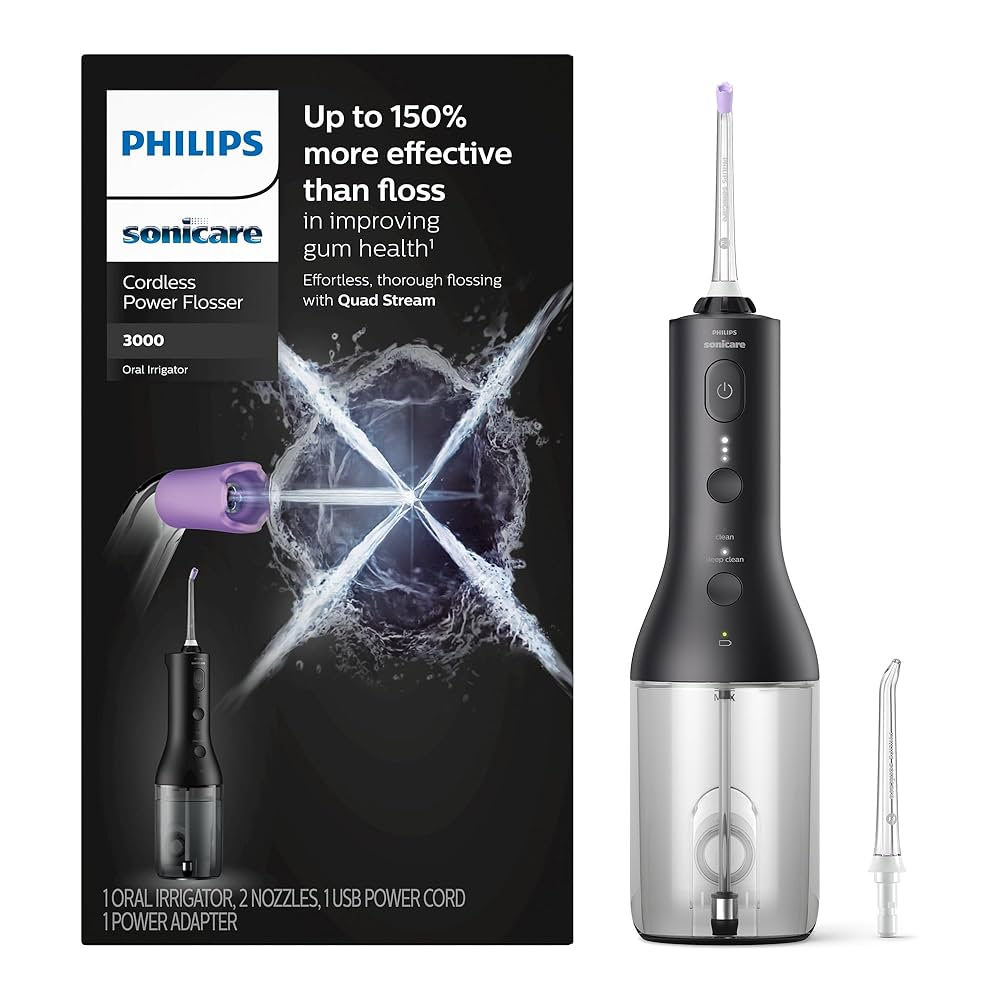
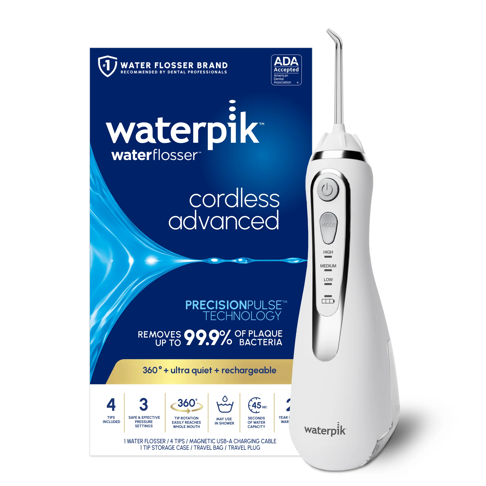

# Dental Floss

The goal is to find a flossing method that is effective, comfortable, and easy to incorporate into a daily routine, since brushing alone only cleans about 60% of the tooth's surface.

---

## Phase 1: Researching the Field

### Keywords, Terms and Concepts

1.  **Core Concepts**
    *   **Plaque:** The sticky, colorless film of bacteria that constantly forms on our teeth. Flossing dislodges plaque from areas a toothbrush can't reach.
    *   **Interdental Cleaning:** The technical term for cleaning between the teeth.

2.  **Material & Form Types**
    *   **Nylon Floss:** The traditional floss material, made of many small strands of nylon twisted together. It is available waxed (for a smoother glide) or unwaxed (thinner, but may fray).
    *   **PTFE (Monofilament) Floss:** A single-strand floss made from the same material as Gore-Tex fabric. It is extremely strong, shred-resistant, and glides easily between very tight teeth. Some PTFE flosses contain PFAS chemicals.
    *   **Dental Tape:** A broader, flatter type of floss that is more comfortable for people with wider gaps between their teeth.
    *   **Water Flosser (Oral Irrigator):** A device that shoots a high-pressure stream of pulsating water to clean between teeth. It's an excellent alternative or supplement for people with braces, bridges, or difficulty with manual dexterity.

3.  **Key Health Concerns**
    *   **PFAS (Per- and polyfluoroalkyl substances):** A class of chemicals sometimes used to coat floss to make it "non-stick." Due to potential health and environmental concerns, many consumers seek PFAS-free options.

### Guiding Questions

1.  **Is one type of floss really better than another?**
    For the most part, no. The best type of floss is the one you will use consistently and correctly. Efficacy depends more on technique than material. However, certain types are better suited for specific needs (e.g., PTFE for tight contacts, water flossers for orthodontics).

2.  **Are water flossers as effective as string floss?**
    Water flossers are excellent at removing loose food debris and stimulating the gums. However, most dentists agree they are not a complete substitute for string floss, which physically scrapes sticky plaque off the tooth surface. The ideal routine often involves using both: string floss to dislodge plaque, and a water flosser to flush everything away.

3.  **What are the health concerns with some floss materials?**
    The primary concern is the use of PFAS chemicals in some PTFE (monofilament) flosses. While the direct risk from floss is debated, many people choose to avoid these "forever chemicals" by opting for natural materials like silk or unwaxed nylon, or floss specifically marketed as PFAS-free.

---

## Phase 2: Defining My Needs & Priorities

1.  **Primary Use Case(s):**
    *   Daily cleaning between tightly spaced teeth, especially in the back, where food and plaque accumulate.
2.  **Key Features Needed:**
    1.  **Health & Safety:**
        *   Must be made from healthy, non-toxic materials.
        *   Must be beneficial for gum health.
    2.  **Efficacy:**
        *   Must effectively remove plaque and food from very tight contacts.
    3.  **Comfort & Ease of Use:**
        *   Should not shred or break easily.
        *   Must be gentle on the gums and easy to maneuver in hard-to-reach areas.
3.  **Nice to Have:**
    *   Biodegradable or environmentally friendly materials.
4.  **Deal-breakers:**
    *   Floss that contains PFAS chemicals.
    *   Floss that consistently shreds or breaks in tight spaces.
5.  **Budget Range:** Flexible for the most effective and healthy solution.

---

## Phase 3: Comparing & Choosing the Item *Type*

First, I need to decide on the best *type* of flossing tool for my needs.

### Available Types

#### 1. Standard String Floss (Nylon or PTFE)

1.  **Pros:**
    *   The "gold standard" for physically scraping away sticky plaque.
    *   Highly effective when used with proper C-shape technique.
    *   Modern shred-resistant (PTFE) and expanding flosses work very well in tight spaces.
2.  **Cons:**
    *   Can be difficult to maneuver for people with limited dexterity, especially in the back.
    *   Requires careful selection to find PFAS-free options.

#### 2. Floss Picks

1.  **Pros:**
    *   Extremely convenient and easy to use, especially on the go.
    *   Great for people who find wrapping string floss difficult.
2.  **Cons:**
    *   Less effective at reaching all tooth angles and wrapping around the tooth in a "C" shape.
    *   Difficult to use on tight back teeth without contamination from other teeth.
    *   Generates significant plastic waste.

#### 3. Water Flosser

1.  **Pros:**
    *   Excellent for dislodging food particles and cleaning around braces, implants, and bridges.
    *   Very easy to reach all areas of the mouth, including the back teeth.
    *   Feels great on the gums and can improve gum health through stimulation.
2.  **Cons:**
    *   Less effective at removing adherent, sticky plaque compared to string floss.
    *   Requires electricity and counter space; can be messy.
    *   Higher upfront cost.

#### 4. Dental Tape

1.  **Pros:**
    *   Its wide, flat ribbon shape is very gentle on the gums.
    *   Covers a large surface area, making it effective for cleaning.
2.  **Cons:**
    *   Can be too thick to fit comfortably between very tight teeth.

### Comparison Table of Types

| Type                | Effective in Tight Spaces | Plaque Scraping | Gum Gentleness | Health/Material Safety |
|---------------------|:-------------------------:|:---------------:|:--------------:|:----------------------:|
| **String Floss**    | :white_check_mark:        | :white_check_mark: | :white_check_mark: | :white_check_mark: (if PFAS-free) |
| **Floss Picks**     | :x:                       |                 |                | :x: (plastic waste)  |
| **Water Flosser**   | :white_check_mark:        |                 | :white_check_mark: | :white_check_mark:     |
| **Dental Tape**     |                           | :white_check_mark: | :white_check_mark: | :white_check_mark: (if PFAS-free) |

### Conclusion on Item Type

Based on my priorities—especially the need for effective plaque removal in tight spaces—a **combination strategy** is the ideal approach. No single tool perfectly addresses all needs, but two tools used together provide a comprehensive solution.

*   **1. Primary Tool: High-Quality String Floss.** This is non-negotiable for its superior ability to physically scrape sticky plaque from tight contacts. The best choice would be a modern, shred-resistant floss that is certified PFAS-free. This directly addresses the core need for effective and healthy plaque removal.

*   **2. Supplementary Tool: Water Flosser.** This is an excellent addition to address the challenge of cleaning the back teeth and to maximize gum health. It will flush out any debris dislodged by the string floss, massage the gums, and ensure a thorough clean in hard-to-reach areas.

This dual strategy leverages the mechanical cleaning power of string floss and the hygienic, flushing power of a water flosser, providing the most effective and healthy daily routine.

---

## Phase 4: Choosing the Specific *Product*

Now that I've decided on the two-tool approach, I will research and compare specific products for each role.

### Category 1: Primary Tool (High-Quality String Floss)

This tool must be effective for tight spaces, gentle on the gums, and PFAS-free. Based on research from sources like Consumer Reports and Mamavation, avoiding PFAS is critical, and many excellent alternatives exist.

#### Product Options

#### 1. Dr. Tung's Smart Floss

1.  **Pros:**
    *   Expanding design cleans both tight and wide spaces effectively.
    *   Explicitly PFAS-free, with a natural plant and beeswax coating.
    *   Strong positive reputation in online communities for comfort and cleaning power.
2.  **Cons:**
    *   Some users with extremely tight contacts find the initial thickness challenging.
    *   The expanding fiber texture can feel 'shreddy' to those accustomed to monofilament floss.
3.  **Community Opinion:** Overwhelmingly positive. Praised for its unique texture that feels like it "hugs" the tooth and effectively removes plaque.
4.  **Price:** Mid-range.

#### 2. Cocofloss

1.  **Pros:**
    *   Hundreds of microfilaments create a textured, "scrubbing" action.
    *   Certified PFAS-free and cruelty-free.
    *   Available in a wide variety of enjoyable scents.
2.  **Cons:**
    *   Premium price point, significantly more expensive than other options.
    *   The thick, fibrous texture can be too much for those with very sensitive gums.
3.  **Community Opinion:** Has a dedicated "cult following." Users love its effectiveness and the "clean" feeling it leaves, but almost always mention the high cost.
4.  **Price:** Premium.

#### 3. Tom's of Maine Naturally Waxed Antiplaque Flat Floss

1.  **Pros:**
    *   ADA-accepted, ensuring it meets standards for safety and efficacy.
    *   From a widely available and trusted natural products brand.
    *   The flat "tape" style glides easily between tight teeth.
2.  **Cons:**
    *   Can feel too slippery for some users, making it harder to grip.
    *   Lacks the "scrubby" texture of woven or expanding flosses.
3.  **Community Opinion:** Viewed as a solid, reliable, and affordable "safe bet" for a PFAS-free option.
4.  **Price:** Affordable.

#### 4. Radius Natural Silk Floss

1.  **Pros:**
    *   Made of 100% biodegradable silk, making it an excellent eco-friendly choice.
    *   Coated in natural, vegan carnauba wax.
    *   Completely plastic-free packaging.
2.  **Cons:**
    *   Natural silk is less durable than nylon and can be prone to shredding or breaking in very tight contacts.
3.  **Community Opinion:** Highly valued by the eco-conscious community, but users acknowledge it requires a more delicate technique to prevent breakage.
4.  **Price:** Mid-range.

#### Comparison Table: String Floss

| Product                     | Efficacy (Tight Spaces) | Plaque Scraping Texture | Durability (Shredding) | Health/Eco             | Price |
|-----------------------------|:-----------------------:|:-----------------------:|:----------------------:|:-----------------------|:-----:|
| **Dr. Tung's Smart Floss**  | :white_check_mark:      | :white_check_mark:      |                        | :white_check_mark:     | $$    |
| **Cocofloss**               | :white_check_mark:      | :white_check_mark:      | :white_check_mark:     | :white_check_mark:     | $$$   |
| **Tom's of Maine Floss**    | :white_check_mark:      |                         | :white_check_mark:     | :white_check_mark:     | $     |
| **Radius Silk Floss**       |                         | :white_check_mark:      | :x:                    | :white_check_mark:     | $$    |

#### Conclusion on Primary Tool (String Floss)

My choice for the **Primary Tool (String Floss)** is **Dr. Tung's Smart Floss**.

**Reasoning:** It strikes the perfect balance between effectiveness and material safety. Its unique expanding design addresses the challenge of cleaning both tight contacts and wider gaps, which is a key requirement. While Cocofloss is also effective, Dr. Tung's offers similar cleaning power at a more reasonable price point, and its strong positive community reputation confirms its performance and comfort. It is explicitly PFAS-free and uses natural waxes, meeting all my health and safety criteria.

---

### Category 2: Supplementary Tool (Water Flosser)

This tool is for flushing debris, massaging gums, and reaching difficult areas. Key factors are performance (pressure/pulsations), reservoir size, and convenience (cordless vs. countertop). Reputable sources like Wirecutter and My Dental Advocate consistently recommend models from Waterpik and Philips.

#### Product Options

#### 1. Waterpik Aquarius (WP-660)

1.  **Pros:**
    *   ADA Seal of Acceptance, clinically proven effectiveness.
    *   10 pressure settings and a massage mode provide high customizability.
    *   Large water reservoir for a full cleaning session without refilling.
2.  **Cons:**
    *   Requires a dedicated power outlet near the sink.
    *   Takes up significant counter space.
3.  **Community Opinion:** Considered the "gold standard" and is frequently recommended by dental professionals. The most common choice for a first-time countertop water flosser.
4.  **Price:** Mid-range.

#### 2. Waterpik Ion

1.  **Pros:**
    *   Same cleaning performance as the Aquarius but in a more compact, modern design.
    *   Rechargeable base allows for cordless operation, freeing up the power outlet and reducing counter clutter.
    *   Magnetic handle cradle is a nice-to-have feature.
2.  **Cons:**
    *   Higher price point than the Aquarius.
    *   Does not have onboard storage for extra tips.
3.  **Community Opinion:** Praised as a smart evolution of the Aquarius. Highly recommended for those willing to pay a premium for convenience and a better design.
4.  **Price:** Premium.

#### 3. Philips Sonicare Power Flosser 3000

1.  **Pros:**
    *   Excellent power and performance for a handheld cordless model.
    *   Waterproof design allows for use in the shower, simplifying routine and cleanup.
    *   Unique Quad Stream tip cleans more area at once.
2.  **Cons:**
    *   Smaller reservoir may require refilling for a thorough session.
    *   Bulkier and heavier in the hand than a countertop flosser's wand.
3.  **Community Opinion:** A top contender in the cordless category. Users love the combination of Philips' brand reputation, power, and the convenience of shower use.
4.  **Price:** Mid-range.

#### 4. Waterpik Cordless Advanced

1.  **Pros:**
    *   ADA Seal of Acceptance in a portable form factor.
    *   Waterproof design for use in the shower.
    *   Ideal for travel and small bathrooms.
2.  **Cons:**
    *   Less powerful than countertop models.
    *   Smallest reservoir of the candidates, often requires refilling.
3.  **Community Opinion:** A reliable and popular choice for a travel or secondary water flosser. Valued for its portability and trusted brand name.
4.  **Price:** Mid-range.

#### Comparison Table: Water Flossers

| Product                         | Type        | Performance        | Convenience (Portability) | Reservoir Size     | Price |
|---------------------------------|-------------|:------------------:|:-------------------------:|:------------------:|:-----:|
| **Waterpik Aquarius**           | Countertop  | :white_check_mark: | :x:                       | :white_check_mark: | $$    |
| **Waterpik Ion**                | Countertop  | :white_check_mark: |                           | :white_check_mark: | $$$   |
| **Philips Power Flosser 3000**  | Cordless    | :white_check_mark: | :white_check_mark:        |                    | $$    |
| **Waterpik Cordless Advanced**  | Cordless    |                    | :white_check_mark:        | :x:                | $$    |

#### Conclusion on Supplementary Tool (Water Flosser)

My choice for the **Supplementary Tool (Water Flosser)** is the **Waterpik Aquarius (WP-660)**.

**Reasoning:** As the supplementary tool, the primary goal is maximum flushing and cleaning power, and the Aquarius is the undisputed leader in this area. Since it will be used at home, the countertop design with its large reservoir and consistent power from a wall outlet is preferable to the portability compromises of a cordless model. It is clinically proven, ADA-accepted, and widely regarded as the "gold standard" by both consumers and dental professionals. The premium for the cordless Ion model isn't justified for this use case.

---

### Final Conclusion on Products

My final decision is to adopt the combination strategy, leveraging the distinct benefits of both a string floss and a water flosser.

*   **For the Primary Tool (String Floss):** **Dr. Tung's Smart Floss**
*   **For the Supplementary Tool (Water Flosser):** **Waterpik Aquarius (WP-660)**

This combination provides the best of both worlds: superior mechanical plaque removal from the string floss and powerful, hygienic flushing from the water flosser.

*   **Where to Buy:**
    *   [Dr. Tung's Smart Floss (Official Site)](https://drtungs.com/products/smart-floss.html)
    *   [Waterpik Aquarius (Official Site)](https://www.waterpik.com/oral-health/products/dental-water-flosser/WP-660/)
    *   Both products are widely available on Amazon and at major retailers.

---

## Phase 5: Post-Purchase Guide

This section details how to get the most out of the chosen items, taking care of them, and ensuring their longevity and proper performance.

### 1. Dr. Tung's Smart Floss

*   **Daily Use & Best Practices:**
    *   Use an 18-inch strand, wrapping the ends around your middle fingers.
    *   Gently slide the floss between teeth.
    *   Form a "C" shape against the side of one tooth and slide it up and down, making sure to go just below the gumline. Repeat for the adjacent tooth.
    *   Use a fresh section of floss for each tooth to avoid re-inserting plaque.

### 2. Waterpik Aquarius

*   **Unboxing and Initial Setup:**
    *   **Initial Inspection:** Ensure all parts are present: the main unit, water reservoir, and the included set of tips.
    *   **First-Time Cleaning:** Before the first use, run a full reservoir of plain warm water through the unit to flush it out.

*   **Daily/Regular Use & Care:**
    *   **Best Practices for Use:**
        1.  Fill the reservoir with lukewarm water (cold can be sensitive). You can also add a small amount of non-staining therapeutic mouthwash.
        2.  Select a pressure setting. Start at a low setting (e.g., 3 or 4) and gradually increase to a comfortable level. Higher pressure is not always better.
        3.  Lean over the sink and place the tip in your mouth. Close your lips enough to prevent splashing, but allow water to flow out of your mouth and into the sink.
        4.  Turn the unit on. Aim the water stream at the gumline at a 90-degree angle.
        5.  Pause briefly between teeth and aim the stream at both the front and back of each tooth.
    *   **Cleaning Routine:** After each use, empty any remaining water from the reservoir to prevent bacterial growth.

*   **Periodic Maintenance (Monthly):**
    *   **Deep Cleaning:** To prevent mineral deposits and keep the unit running efficiently, deep clean it monthly. Mix 1-2 tablespoons of white vinegar in a full reservoir of warm water and run half of the solution through the unit. Turn it off, place the handle in the sink, and let the remaining solution sit in the unit for 20 minutes. Rinse by running a full reservoir of plain warm water through the unit.

---

## Phase 6: Essential Accessories & Add-Ons

### 1. Dr. Tung's Smart Floss

*   No essential accessories are needed. The product is self-contained. Refills are available for purchase.

### 2. Waterpik Aquarius

*   **Replacement Flosser Tips:**
    *   **What to Look For:** Waterpik recommends replacing tips every 3-6 months to maintain performance and hygiene. Different tips serve different needs.
    *   **Recommendation:**
        *   **Classic Jet Tip (JT-100E):** For general, all-purpose cleaning.
        *   **Plaque Seeker™ Tip (PS-100E):** For areas around implants, crowns, and bridges.
        *   **Orthodontic Tip (OD-100E):** For cleaning around braces and orthodontics.
    *   **Where to Buy:** Amazon, most major pharmacies, and the official Waterpik website.

---

## Sources & Further Reading

*A list of resources I consulted during this research, categorized to ensure a well-rounded perspective. Use citation links like `[1]` in the text above to refer to these sources.*

### Scientific Journals & Research Databases
<!-- For objective data, studies, and material science papers. -->

1.  Source Name/Title 1
    *   *Link:* [URL]
    *   *Note:* [Brief note on what was useful from this source.]

### Reputable Organizations & Consumer Information
<!-- For safety standards, consumer advocacy reports, and large-scale reviews. -->

1.  Mamavation: [Concerning Amounts of Toxic PFAS "Forever Chemicals" in Tooth Floss and Dental Floss](https://www.mamavation.com/beauty/toxic-pfas-dental-floss-tooth-floss.html)
    *   *Note:* Comprehensive lab testing of 39 floss brands for organic fluorine (a PFAS marker). Essential for identifying PFAS-free options.
2.  Consumer Reports: [How to Choose Dental Floss Without PFAS and Other Harmful Chemicals](https://www.consumerreports.org/toxic-chemicals-substances/dental-floss-without-pfas-and-other-harmful-chemicals-a9722832754/)
    *   *Note:* Analysis of floss materials and chemicals, with recommendations for safer, PFAS-free products.
3. The New York Times (Wirecutter): [The Best Water Flossers](https://www.nytimes.com/wirecutter/reviews/best-water-flossers/)
    *   *Note:* In-depth testing and review of water flossers, with clear picks for different needs (countertop, cordless).
4.  My Dental Advocate: [Best Dental Floss (Full Review)](https://mydentaladvocate.com/product-reviews/top-8-best-dental-floss/)
    *   *Note:* Dentist-tested reviews of various floss types, rating them on effectiveness, durability, and comfort.

### Community Discussions (for anecdotal experiences & product discovery - cross-reference with scientific sources)
<!-- For anecdotal experiences, user feedback, and discovering popular opinions (to be cross-referenced). e.g., Reddit, forums. -->

1.  Reddit - r/DentalHygiene: [What is your favorite dental floss?](https://www.reddit.com/r/DentalHygiene/comments/1k88644/what_is_your_favorite_dental_floss/)
    *   *Note:* Community discussion on preferred floss types, highlighting user experiences with shredding, thickness, and comfort.
2.  Reddit - r/PeriodontalDisease: [What floss does everyone use?](https://www.reddit.com/r/PeriodontalDisease/comments/1d92qsu/what_floss_does_everyone_use/)
    *   *Note:* User recommendations focused on managing gum disease.
3.  Reddit - r/Dentistry: [What floss are we using?](https://www.reddit.com/r/Dentistry/comments/1jl3d4m/what_floss_are_we_using/)
    *   *Note:* Insights from dental professionals and students on what they use and recommend.

### YouTube Videos (for visual guides, reviews, and opinions - cross-reference with scientific sources)

1.  The Wellness Way: [Dr. Nemeth WARNS Against Using FLOSS Brands With "Forever Chemicals" PFAS](https://youtu.be/zZbrKnwSNmE?si=1oP5iOa4ZUf1aWQ2)
    *   *Note:* A video discussing the health concerns associated with PFAS in dental floss.
2.  Dental Digest: [Waterpik vs Flossing | Is a Waterpik Better Than Flossing?](https://youtu.be/s3kFcxzSQWI?si=zcDkn0j4cLyW7Y_4)
    *   *Note:* A visual comparison of the mechanisms and effectiveness of water flossing versus traditional string floss.

### Product Pages (where to buy from, like manufacturer)
<!-- For official specifications, pricing, and purchase information. -->

1.  Electric Teeth: [Best water flosser](https://www.electricteeth.com/best-water-flosser/)
    *   *Note:* Detailed reviews and comparisons of different water flosser models.

---

## Join the Conversation

*Disclaimer: This is a log of my personal research and decision-making process. Product features and prices are subject to change. Opinions are my own based on the information available at the time of writing.*