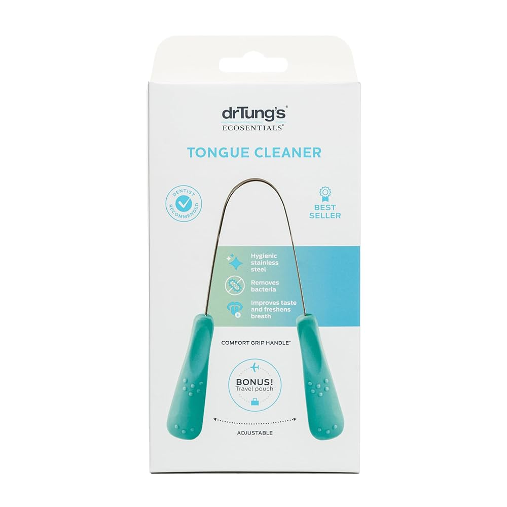
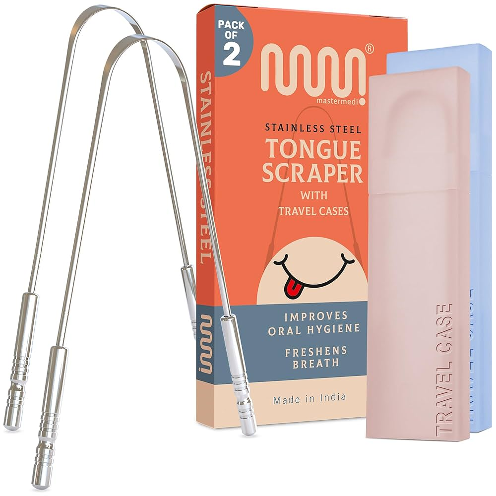
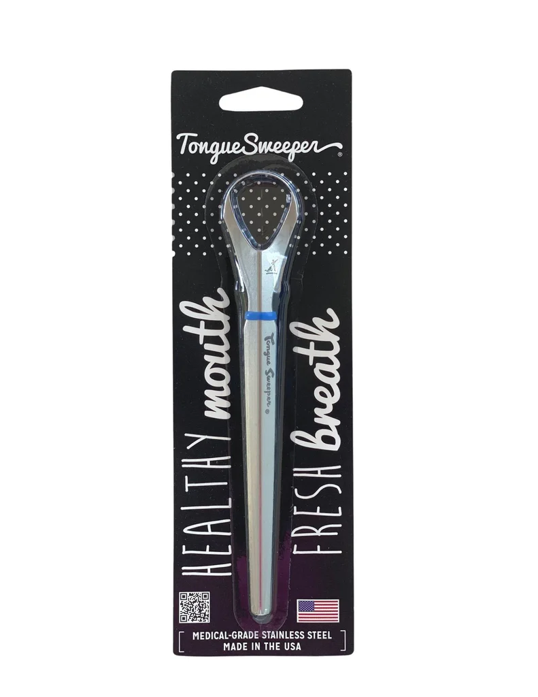

# Tongue Scraper

The goal is to find a tongue scraper that is effective at removing bacterial biofilm, is made from a hygienic and durable material, and is comfortable for daily use.

---

## Phase 1: Researching the Field

### Keywords, Terms and Concepts

1.  **Core Concepts**
    *   **Tongue Coating:** A buildup of bacteria, dead cells, and food debris that accumulates on the tongue's surface. This coating is a primary source of volatile sulfur compounds (VSCs), which cause bad breath.
    *   **Halitosis:** The clinical term for bad breath. While it can have multiple causes, a significant portion originates from bacteria on the tongue.

2.  **Material Types**
    *   **Stainless Steel:** A non-porous metal known for its durability and resistance to bacteria. It's easy to clean and sanitize and does not rust, making it a long-lasting option.
    *   **Copper:** Used in Ayurvedic tradition, copper is naturally antimicrobial and antibacterial. It develops a patina (tarnishes) over time but remains effective.
    *   **Plastic:** A softer, more flexible option. Often recommended for beginners or those with a strong gag reflex. They are less durable than metal and need to be replaced periodically.

3.  **Scraper Shapes**
    *   **U-Shape / V-Shape:** A classic design, often made of metal, that is held with two hands. This design provides even pressure and good control, especially for reaching the back of the tongue.
    *   **Looped / T-Shape:** A design with a long handle, held with one hand. More common for plastic scrapers and sometimes includes bristles or multiple scraping edges.

### Guiding Questions

1.  **What does "effective" mean for a tongue scraper?**
    Effectiveness is measured by the ability to remove the visible tongue coating and reduce the bacteria that cause bad breath. An effective scraper should be firm enough to remove biofilm without causing discomfort or gagging.

2.  **How do the different materials compare for hygiene and longevity?**
    *   **Stainless steel** and **copper** are superior for hygiene as they are less porous and more resistant to bacterial buildup than plastic. They can last for years, if not a lifetime.
    *   **Plastic** is less durable and can harbor bacteria in microscopic scratches over time, requiring replacement every 3-4 months.

3.  **What are the most common complaints or issues?**
    The most common issue is triggering the gag reflex, especially when trying to clean the very back of the tongue. Other complaints include scrapers that are too sharp or too flimsy to be effective.

4.  **What are the best practices for using this item?**
    Use gentle but firm pressure, scraping from the back of the tongue to the front. Rinse the scraper after each pass. This should be done once daily, typically in the morning.

---

## Phase 2: Defining My Needs & Priorities

Now that I understand the landscape, I can clearly define what I'm looking for, with a strong emphasis on health and scientific backing.

1.  **Primary Goal:**
    *   To maintain optimal tongue health by effectively and safely removing the bacterial biofilm, with the secondary benefit of ensuring fresh breath.
2.  **Key Features Needed:**
    1.  **Health & Material Science:**
        *   **Material Integrity:** The material must be non-porous, hygienic, and easy to sterilize. Medical-grade stainless steel or a material with proven antimicrobial properties (like copper) is highly preferred. It must be free from harmful leaching.
        *   **Safety by Design:** The scraper's edge must be firm enough to be effective but smooth enough to not damage the delicate papillae of the tongue.
    2.  **Performance & Efficacy:**
        *   **Proven Method:** The tool's shape and method of use should be based on established best practices for tongue cleaning. A design that allows for even pressure distribution is crucial.
        *   **Gag Reflex Mitigation:** The design should be efficient to minimize the time needed and shaped to reduce the likelihood of gagging.
    3.  **Durability & Sustainability:**
        *   **Longevity:** A "buy-it-for-life" product is strongly preferred over disposable or short-lifespan alternatives.
        *   **Ease of Maintenance:** Must be simple to clean and keep sanitary.
3.  **Nice to Have:**
    *   An included travel case or pouch for hygienic storage.
    *   An ergonomic or aesthetically pleasing design.
4.  **Deal-breakers:**
    *   **Plastic Materials:** Due to their porosity, potential for micro-scratches harboring bacteria, and need for frequent replacement, plastic is not a candidate.
    *   **Flimsy Construction:** The tool must be sturdy and not bend or lose shape with regular use.
    *   **Unverified Claims:** Products making health claims without backing from material science or dental professional consensus will be avoided.
5.  **Budget Range:**
    *   Flexible. The priority is on quality, material safety, and long-term durability, not finding the lowest price.

---

## Phase 3: Comparing & Choosing the Item *Type*

First, I need to decide on the best *type* of [Item] for my needs. Since plastic has been ruled out, the choice is between the two metal options.

### Available Types

#### 1. Stainless Steel

1.  **Pros:**
    *   **Extremely Hygienic & Non-Porous:** Medical-grade stainless steel is the standard in clinical environments because it's easy to sterilize and does not harbor bacteria.
    *   **Inert & Non-Reactive:** It will not tarnish, rust, or react with any substances in the mouth. It's the most straightforward "buy-it-for-life" material.
    *   **Durable:** Very strong and will not bend or break under normal use.
2.  **Cons:**
    *   Lacks the inherent, continuous antimicrobial properties of copper when at rest (though this is a minor point if cleaned properly).

#### 2. Copper

1.  **Pros:**
    *   **Naturally Antimicrobial:** Copper has been scientifically shown to have "contact killing" properties, meaning it actively kills bacteria on its surface. This is a well-documented trait.
    *   **Traditional Practice:** It has a long history of use in Ayurvedic medicine for this purpose.
2.  **Cons:**
    *   **Tarnishes:** Copper naturally develops a patina (tarnish) when exposed to air and moisture. While this doesn't affect its efficacy, it requires occasional polishing to maintain its original shine, adding a minor maintenance step.
    *   **Slightly Softer:** While still very durable, it is a softer metal than stainless steel.

### Comparison Table of Types

| Type              | Hygienic & Non-Porous | Inert & Low-Maintenance | Natural Antimicrobial Action | Overall Match |
|-------------------|:---------------------:|:-----------------------:|:----------------------------:|:-------------:|
| **Stainless Steel** | :white_check_mark:    | :white_check_mark:      |                              | 2 / 2         |
| **Copper**        | :white_check_mark:    | :x:                     | :white_check_mark:           | 2 / 3         |

### Conclusion on Item Type

Based on the research, my strategy is to choose **Stainless Steel**.

**Reasoning:** While copper's natural antimicrobial properties are compelling, stainless steel's inertness, extreme durability, and zero-maintenance nature align more closely with my core requirement for a simple, effective, and scientifically-backed tool for life. It is the gold standard for hygiene in medical applications, which is a powerful endorsement. The risk of tarnish and the need for periodic cleaning make copper slightly less ideal for a "set and forget" daily tool.

---

## Phase 4: Choosing the Specific *Product*

### Product Options

#### 1. Dr. Tung's Stainless Steel Tongue Scraper

1.  **Pros:**
    *   **Reputable Brand:** Dr. Tung's is a pioneer in bringing tongue scraping to the Western market and has a long-standing, trusted reputation.
    *   **Comfort Grip Handles:** Features comfortable, colored rubber grips which can be easier to hold and control than bare stainless steel.
    *   **Adjustable:** The U-shape is flexible, allowing for adjustment to fit different mouth sizes.
2.  **Cons:**
    *   The rubber handles are an additional material that could potentially degrade over a very long time, though this is unlikely with proper care.
3.  **Community Opinion:** Overwhelmingly positive. Users praise its effectiveness, comfortable grip, and durability, with many reporting they've used the same one for years.
4.  **Price:** ~$9-12

#### 2. MasterMedi Tongue Scraper

1.  **Pros:**
    *   **Pure & Simple Design:** Made from 100% medical-grade stainless steel with no additional materials, making it extremely easy to sterilize.
    *   **Highly Rated:** Frequently recommended as a "Best Overall" choice by health publications and dentists.
    *   **Includes Travel Case:** Comes with a convenient case for hygienic storage and travel.
2.  **Cons:**
    *   Bare metal handles might be slightly less comfortable for some users compared to Dr. Tung's rubber grips.
3.  **Community Opinion:** Excellent. Praised for its sturdiness, smooth scraping edge, and the value of including a travel case. It's often cited as the perfect "buy-it-for-life" tool.
4.  **Price:** ~$10-15 (for a 2-pack)

#### 3. Tongue Sweeper Model P

1.  **Pros:**
    *   **Dentist-Designed:** Created and patented by a practicing dentist, focusing on a design that minimizes gag reflex.
    *   **One-Handed Use:** The single-handle, looped design is preferred by those who find the two-handed U-shape awkward.
    *   **Made in the USA:** For those who prioritize products manufactured in the US.
2.  **Cons:**
    *   The one-handed design may offer less precise pressure control compared to the two-handed U-shape models.
    *   Higher price point for a single scraper.
3.  **Community Opinion:** Very positive, especially among users who have a strong gag reflex. Its low-profile head is frequently highlighted as a major benefit.
4.  **Price:** ~$15

### Comparison Table of Products

| Product                  | Design Principle     | Handle Type     | Includes Case | Community Opinion | Price |
|--------------------------|----------------------|-----------------|:-------------:|:-----------------:|:-----:|
| **Dr. Tung's**           | Two-Handed U-Shape   | Rubber Grips    | :x:           | :white_check_mark: | $     |
| **MasterMedi**           | Two-Handed U-Shape   | Bare Steel      | :white_check_mark: | :white_check_mark: | $     |
| **Tongue Sweeper Model P** | One-Handed Looped    | Bare Steel      | :x:           | :white_check_mark: | $$    |

### Conclusion on Specific Product

My choice is the **Dr. Tung's Stainless Steel Tongue Scraper**.

*   **Reasoning:** It represents the best combination of brand reputation, thoughtful design, and effectiveness. As a pioneer in the market, Dr. Tung's has a long-standing reputation for quality. The addition of rubber grips provides a level of comfort and control that seems superior for daily use, and its proven U-shape design is ideal for effective cleaning. While the MasterMedi is a strong contender, the enhanced comfort of the Dr. Tung's handle makes it the preferred choice for a daily routine.
*   **Where to Buy:**
    *   [Dr. Tung's Official Website](https://drtungs.com/products/stainless-steel-tongue-cleaner.html)
    *   [Amazon](https://www.amazon.com/DrTungs-Tongue-Scraper-Stainless-Steel/dp/B000052X80)

---

## Phase 5: Post-Purchase Guide

This section details how to get the most out of the Dr. Tung's Tongue Scraper.

### 1. Unboxing and Initial Setup
*   **Initial Cleaning:** Wash thoroughly with warm water and soap before the first use.

### 2. Daily/Regular Use & Care
*   **Best Practices for Use:**
    1.  In front of a mirror, hold the scraper by both rubber grips.
    2.  Extend your tongue and place the curved edge as far back as is comfortable without gagging.
    3.  Apply gentle, even pressure and pull the scraper forward in one smooth motion.
    4.  Rinse the collected residue off the scraper with warm water.
    5.  Repeat 3-5 times, adjusting the position to cover the entire surface of your tongue.
    6.  After you're finished, rinse your mouth with water.
*   **Cleaning Routine:** After each use, rinse thoroughly with warm water and let it air dry completely before storing.

### 3. Periodic Maintenance
*   **Deep Cleaning:** For a deeper sanitization, the scraper is dishwasher safe. You can also wash it with boiling water. It is made of medical-grade stainless steel and will not rust.

### 4. Long-Term Storage
*   Store the clean, dry scraper in a dry location, like a medicine cabinet or a dedicated holder.

---

## Phase 6: Essential Accessories & Add-Ons

### 1. Travel Case
*   **What to Look For:** Since the Dr. Tung's scraper does not include a case, a simple pouch or a generic hard-shell case designed for travel toothbrushes is a good option. Look for one that is ventilated to allow for air circulation.
*   **Recommendation:** Generic travel cases are widely available on Amazon or at local drugstores.

---

## Sources & Further Reading

*A list of resources I consulted during this research, categorized to ensure a well-rounded perspective.*

### Reputable Organizations & Consumer Information
1.  Health.com: [The 9 Best Tongue Scrapers for a Cleaner Mouth, Backed by Dental Experts](https://www.health.com/condition/oral-health/tongue-scraper)
    *   *Note:* Provided an excellent overview of different types and top-rated products, including dentist recommendations.
2.  WebMD: [Tongue Scraping: What to Know](https://www.webmd.com/oral-health/tongue-scraping)
    *   *Note:* Offered clear, medically reviewed information on the benefits and techniques of tongue scraping.
3.  SELF: [The Best Tongue Scrapers for Bad Breath in 2024](https://www.self.com/story/best-tongue-scraper)
    *   *Note:* Included hands-on reviews and dentist advice, which helped confirm the top product candidates.

### Product Pages
1.  Dr. Tung's: [Stainless Steel Tongue Cleaner](https://drtungs.com/products/stainless-steel-tongue-cleaner.html)
    *   *Note:* Official product information, features, and brand history.
2.  MasterMedi on Amazon: [Tongue Scraper](https://www.amazon.com/MasterMedi-Scraper-Treatment-Stainless-Scrapers/dp/B0B257614L)
    *   *Note:* Used to gather details on a primary competitor.
3.  Tongue Sweeper: [Model P](https://tonguesweeper.com/collections/deluxe-tongue-sweepers/products/tongue-sweeper-model-p-stainless-steel-tongue-cleaner)
    *   *Note:* Used to gather details on the one-handed design alternative.

---

## Join the Conversation

This is an ongoing process for me, and I'd love your input:

*   Have you used a tongue scraper? What material do you prefer?
*   Are there other brands/models of tongue scrapers I should consider?
*   Any tips for making the right choice or for incorporating it into a routine?

---

*Disclaimer: This is a log of my personal research and decision-making process. Product features and prices are subject to change. Opinions are my own based on the information available at the time of writing.* 