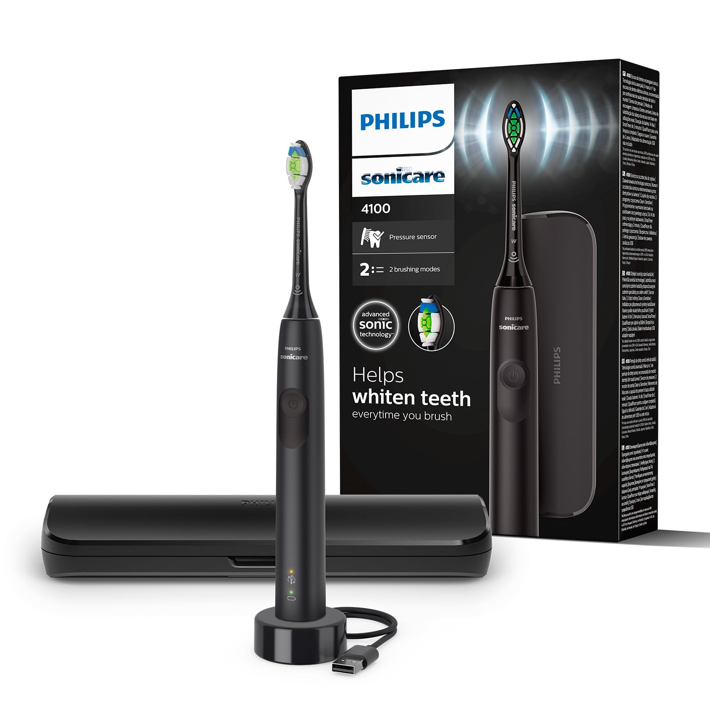
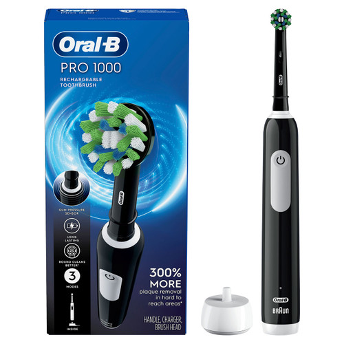
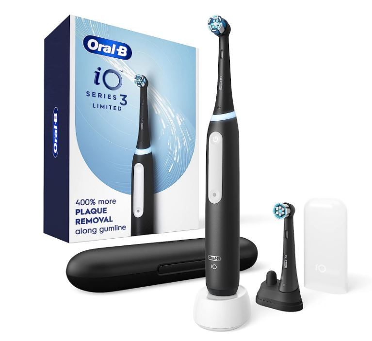
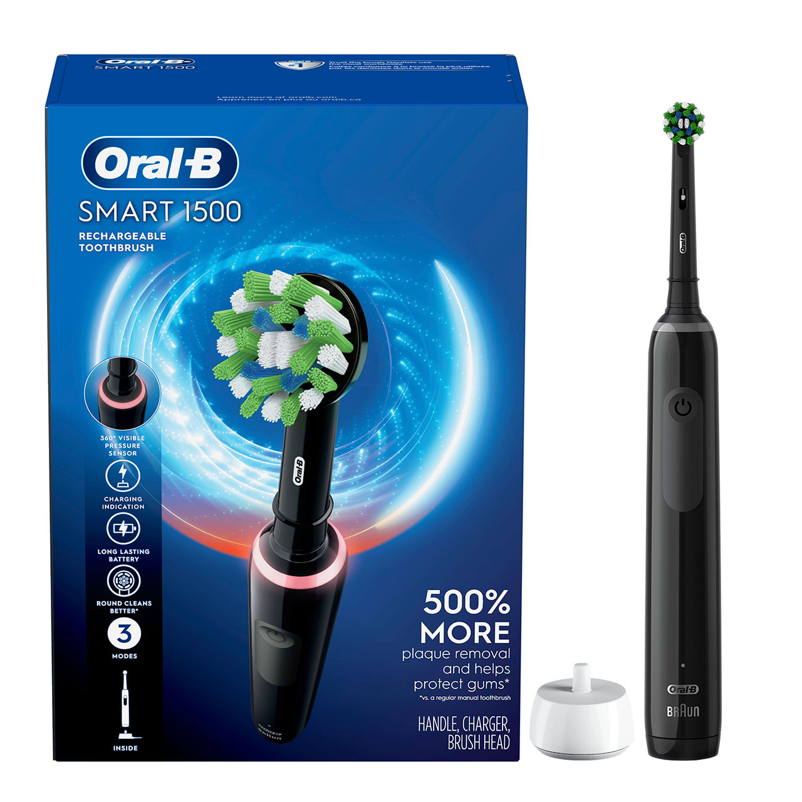

# Toothbrush

The goal is to find a toothbrush that cleans effectively, is gentle on the gums, and encourages good brushing habits without being prohibitively expensive.

---

## Phase 1: Researching the Field

### Keywords, Terms and Concepts

1.  **Brushing Technologies**
    *   **Sonic Technology:** A method where the brush head vibrates at a very high frequency (e.g., 30,000+ strokes per minute). This agitates the fluid in the mouth (saliva, water, toothpaste) to clean beyond where the bristles physically touch, a phenomenon known as fluid dynamics.
    *   **Oscillating-Rotating Technology:** A method where a small, round brush head rotates back and forth rapidly to scrub and polish individual teeth. Newer models add micro-vibrations to this action for enhanced cleaning.

2.  **Key Features & Terms**
    *   **Pressure Sensor:** A crucial feature in electric toothbrushes that warns you (e.g., with a light or vibration change) if you are brushing too hard, which can damage gums and enamel over time.
    *   **Quad-Pacer / 2-Minute Timer:** A timer that buzzes every 30 seconds to prompt you to move to the next quadrant of your mouth, ensuring you brush for the dentist-recommended two minutes.
    *   **Bristle Hardness:** Dentists overwhelmingly recommend "soft" or "extra-soft" bristles to prevent gum damage (recession) and enamel wear.

### Guiding Questions

1.  **Is an electric toothbrush demonstrably better than a manual one?**
    Yes. High-quality systematic reviews, such as those from the Cochrane Collaboration, provide strong evidence that electric toothbrushes consistently remove more plaque and reduce gingivitis more effectively than manual toothbrushes [1]. Their built-in timers and consistent motion also remove much of the user error.

2.  **What's the real difference between Sonic and Oscillating-Rotating?**
    Both are highly effective. Recent systematic reviews suggest a slight statistical edge for oscillating-rotating (Oral-B) in plaque removal [2]. However, community feedback and dental professionals note that sonic (Philips) is often perceived as gentler, and its technique is easier for many users to master, which can lead to better real-world results [3]. The choice often comes down to personal preference on the brushing sensation.

3.  **What features *actually* matter?**
    The core features that dentists and researchers agree on are the **2-minute timer** and the **pressure sensor**. Most other features like multiple cleaning modes (whitening, deep clean) and Bluetooth connectivity are generally considered non-essential "nice-to-haves" that significantly increase cost [4].

---

## Phase 2: Defining My Needs & Priorities

1.  **Primary Use Case(s):**
    *   Daily teeth cleaning with a focus on superior plaque removal and improving long-term gum health.
2.  **Key Features Needed:**
    1.  **Health & Performance:**
        *   Clinically proven plaque removal efficacy.
        *   Pressure Sensor to protect gums from excessive force.
        *   2-Minute Timer with 30-second Quad-Pacer.
    2.  **Convenience & Design:**
        *   Readily available and reasonably priced replacement heads.
    3.  **Feel & Usability:**
        *   A gentle brushing sensation is preferred.
3.  **Nice to Have:**
    *   A simple travel case.
    *   A clean, minimalist design without unnecessary modes or buttons.
4.  **Deal-breakers:**
    *   Gimmicky features (e.g., complex phone apps) that significantly increase the price without improving core cleaning performance.
    *   Extremely expensive or hard-to-find replacement heads.
5.  **Budget Range:** Flexible, but aiming for the best value point (under $75) where core features are present before diminishing returns kick in.

---

## Phase 3: Comparing & Choosing the Item *Type*

### Available Types

#### 1. Manual Toothbrush

1.  **Pros:**
    *   Very inexpensive and widely available.
    *   No charging required, simple to travel with.
2.  **Cons:**
    *   Effectiveness is highly dependent on perfect user technique.
    *   No built-in timer or pressure sensor, leading to inconsistent brushing time and potential for gum damage.
    *   Clinically proven to be less effective at removing plaque than quality electric options.

#### 2. Oscillating-Rotating Electric

1.  **Pros:**
    *   Excellent plaque removal, with some studies showing a slight statistical advantage.
    *   The polishing effect from the round head is preferred by some users.
2.  **Cons:**
    *   The brushing motion can feel more aggressive or "scrubby" to some users.
    *   Requires a more precise tooth-by-tooth technique to be used correctly.
    *   Can be slightly louder than sonic models.

#### 3. Sonic Electric

1.  **Pros:**
    *   Very effective plaque removal, with a fluid dynamics action that cleans slightly beyond where the bristles touch.
    *   Often perceived as gentler on the gums.
    *   The brushing technique is more intuitive for many users, similar to a manual brush but without the manual effort.
2.  **Cons:**
    *   The high-frequency vibration can be ticklish or unpleasant for some new users.

### Comparison Table of Types

| Type                      | Plaque Removal | Gum Gentleness (Perceived) | Ease of Use | Price Est. | Overall Match |
|---------------------------|:--------------:|:--------------------------:|:-----------:|:----------:|:-------------:|
| **Manual**                | :x:            |                            | :x:         | $          | 0 / 3         |
| **Oscillating-Rotating**  | :white_check_mark: |                            |             | $$$        | 1 / 3         |
| **Sonic**                 | :white_check_mark: | :white_check_mark:         | :white_check_mark: | $$         | 3 / 3         |

### Conclusion on Item Type

Based on my priorities, my strategy is to choose an **Electric Toothbrush** over a manual one due to its superior plaque removal and features that encourage good habits. The decision between the two electric types is close, so the best strategy will be to compare the leading value models from both categories in the next phase to determine the best personal fit.

---

## Phase 4: Choosing the Specific *Product*

Now that I've narrowed the choice to electric, I'll compare the leading value products from both the sonic and oscillating-rotating categories to make a final decision.

### Product Options

#### 1. Philips Sonicare 4100

1.  **Pros:**
    *   Contains all essential features: pressure sensor and a 2-minute timer with quad-pacer.
    *   Uses the same core sonic cleaning technology as Philips' top-of-the-line models.
    *   Excellent battery life (2+ weeks).
    *   Widely available and replacement heads are easy to find and reasonably priced.
2.  **Cons:**
    *   Only has one cleaning mode (but this is all that's truly needed).
    *   Does not typically come with a travel case.
3.  **Community Opinion:** Overwhelmingly recommended on community forums and by professional reviewers (like Wirecutter) as the best-value electric toothbrush. It is consistently praised for doing the job perfectly without the expensive, unnecessary frills [4, 5].
4.  **Price:** `~$40 - $50`

#### 2. Oral-B Pro 1000

1.  **Pros:**
    *   An excellent value for an oscillating-rotating model.
    *   Also contains a pressure sensor and 2-minute timer.
    *   Proven cleaning efficacy with its round head.
2.  **Cons:**
    *   Battery life is noticeably shorter than the Sonicare 4100.
    *   Can be louder and feel more aggressive, which does not align with my "gentleness" priority.
3.  **Community Opinion:** Often recommended alongside the Sonicare 4100 as its direct competitor for the best *value* oscillating-rotating brush. A solid choice for those who prefer the O-R motion.
4.  **Price:** `~$40 - $50`

#### 3. Oral-B iO Series 3

1.  **Pros:**
    *   Features Oral-B's latest magnetic iO technology (oscillating-rotating with micro-vibrations) at a budget-friendly price point.
    *   Quieter and smoother operation compared to older Oral-B models like the Pro 1000.
    *   Includes a smart pressure sensor (lights up green for correct pressure, red for too hard).
    *   Comes with a travel case.
2.  **Cons:**
    *   More expensive than the Sonicare 4100 or Pro 1000.
    *   Replacement heads for the iO series are typically more expensive than for the Pro series.
3.  **Community Opinion:** Praised as a major step up from older Oral-B models, bringing premium technology to a more accessible level. Considered a top contender for best overall value.
4.  **Price:** `~$60 - $80`

#### 4. Oral-B Smart 1500

1.  **Pros:**
    *   An excellent mid-range option that includes a hard travel case.
    *   Features 3 cleaning modes (Daily Clean, Sensitive, Whitening), offering more versatility than the Pro 1000.
    *   Upgraded Lithium-Ion battery provides a longer life (~2 weeks) than the Pro 1000.
    *   Uses the same effective and affordable brush heads as the Pro 1000.
2.  **Cons:**
    *   Still uses the older, louder motor technology compared to the iO series.
    *   Typically costs more than the Sonicare 4100 and Pro 1000.
3.  **Community Opinion:** Widely regarded as the "sweet spot" in the traditional Oral-B lineup for those who want a travel case and better battery life without paying the premium for the iO series.
4.  **Price:** `~$50 - $70`

### Comparison Table of Products

| Product                 | Technology           | Pressure Sensor    | Timer/Pacer        | Battery Life | Travel Case        | Price Point |
|-------------------------|----------------------|:------------------:|:------------------:|:------------:|:------------------:|:-----------:|
| **Philips Sonicare 4100** | Sonic                | :white_check_mark: | :white_check_mark: | ~14 Days     | :x:                | $$          |
| **Oral-B Pro 1000**       | Oscillating-Rotating | :white_check_mark: | :white_check_mark: | ~7-10 Days   | :x:                | $$          |
| **Oral-B Smart 1500**     | Oscillating-Rotating | :white_check_mark: | :white_check_mark: | ~14 Days     | :white_check_mark: | $$$         |
| **Oral-B iO Series 3**    | Magnetic iO          | :white_check_mark: | :white_check_mark: | ~14 Days     | :white_check_mark: | $$$$        |

### Conclusion on Specific Product

My choice is the **Oral-B iO Series 3**.

**Reasoning:** While the Philips Sonicare 4100 is the ultimate value pick, the Oral-B iO Series 3 is the best choice for my needs as it represents the most significant technological step-up at a reasonable price. It features the latest magnetic iO technology, which is quieter and gentler than older Oral-B models, and includes the essential smart pressure sensor with clear visual feedback (green for good, red for bad). The inclusion of a travel case meets one of my "nice-to-have" criteria, making it a complete, modern package.

**Where to Buy:**

*   [Oral-B Product Page](https://oralb.com/en-us/products/electric-toothbrushes/oral-b-io-series-3-electric-toothbrush-rechargeable-black/)
*   KSP     - 345 ils   - <https://ksp.co.il/web/item/298126>
*   Ivory   - 345 ils   - <https://www.ivory.co.il/catalog.php?id=91794>
*   Widely available on Amazon, Target, Walmart, and other major retailers.

---

## Phase 5: Post-Purchase Guide

This section details how to get the most out of the chosen toothbrush, taking care of it, and ensuring its longevity and proper performance.

### 1. Unboxing and Initial Setup

*   **Initial Inspection:** Check that the brush handle, charger, iO brush head, and travel case are all included and free of defects.
*   **First-Time Cleaning/Preparation:** Rinse the brush head thoroughly under tap water.
*   **Initial Charging:** The brush may have some charge out of the box, but it is recommended to place it on the magnetic charger for a full charge (approx. 3 hours) to calibrate the battery.

### 2. Daily/Regular Use & Care

*   **Best Practices for Use:** Apply a pea-sized amount of toothpaste. To avoid splatter, guide the brush head to your teeth *before* turning it on. Move the brush head slowly from tooth to tooth, pausing for a couple of seconds on the surface of each one and letting the brush do the work.
*   **Smart Pressure Sensor:** Pay attention to the light ring. White indicates low pressure (you may need to press a bit more), **Green indicates the ideal pressure**, and Red indicates you are brushing too hard.
*   **Cleaning Routine:** After each use, rinse the brush head while it's still on, then turn it off and remove it. Rinse the head and handle separately and wipe them dry.
*   **Replacement:** Replace the iO brush head every 3 months, or when the bristles are visibly frayed.

### 3. Periodic Maintenance

*   The toothbrush is largely maintenance-free. Ensure the charging base is kept clean and dry.

### 4. Long-Term Storage

*   If storing for an extended period, ensure the handle is fully charged, then clean it thoroughly and store it in a cool, dry place away from direct sunlight.

---

## Phase 6: Essential Accessories & Add-Ons

Once the main item is chosen, it's important to consider the necessary accessories for its use, maintenance, and protection.

### 1. Replacement Heads

*   **What to Look For:** The Oral-B iO series uses exclusive iO-specific brush heads that are not compatible with other Oral-B models. The two main types are the **iO Ultimate Clean** (for rigorous cleaning) and the **iO Gentle Care** (for a softer touch, ideal for sensitive gums).
*   **Recommendation:** Oral-B iO Ultimate Clean Replacement Heads.
*   **Where to Buy:** Widely available on Amazon, Target, Walmart, and the official Oral-B website. Multi-packs offer the best value.

### 2. Travel Case

*   **What to Look For:** The Oral-B iO Series 3 comes with a simple and effective hard travel case, so there is no need to purchase a separate one. It holds the handle and up to two brush heads.
*   **Recommendation:** Use the case provided.
*   **Where to Buy:** N/A

---

## Sources & Further Reading

*A list of resources I consulted during this research, categorized to ensure a well-rounded perspective.*

### Scientific Journals & Research Databases

1.  Yaacob M, et al. "Powered versus manual toothbrushing for oral health." *Cochrane Database of Systematic Reviews*, 2014.
    *   *Link:* [https://pubmed.ncbi.nlm.nih.gov/24282870/](https://pubmed.ncbi.nlm.nih.gov/24282870/)
    *   *Note:* The landmark systematic review concluding that powered toothbrushes provide a statistically significant reduction in plaque and gingivitis compared to manual toothbrushes.
2.  Grender J, et al. "The efficacy of an oscillating-rotating power toothbrush compared to a high-frequency sonic power toothbrush on parameters of dental plaque and gingival inflammation: A systematic review and meta-analysis." *International Journal of Dental Hygiene*, 2022.
    *   *Link:* [https://www.dentistry33.com/clinical-cases/oral-hygiene-prevention/2098/comparing-electric-toothbrushes-sonic-power-versus-oscillating-rotating.html](https://www.dentistry33.com/clinical-cases/oral-hygiene-prevention/2098/comparing-electric-toothbrushes-sonic-power-versus-oscillating-rotating.html)
    *   *Note:* A recent meta-analysis finding a small but significant advantage for oscillating-rotating technology in reducing plaque and gingivitis.

### Reputable Organizations & Consumer Information

3.  Sven, Derik J. "The Great Debate: Sonic or Rotating Toothbrush?" *Dentistry with Derik*, 2024.
    *   *Link:* [https://www.dentistrywithderik.com/blog/sonic-or-rotating-toothbrush](https://www.dentistrywithderik.com/blog/sonic-or-rotating-toothbrush)
    *   *Note:* A dental hygienist's breakdown of the practical differences in technique and gentleness between the two technologies.
4.  The New York Times (Wirecutter). "The Best Electric Toothbrush."
    *   *Link:* [https://www.nytimes.com/wirecutter/reviews/best-electric-toothbrush/](https://www.nytimes.com/wirecutter/reviews/best-electric-toothbrush/)
    *   *Note:* In-depth testing that consistently recommends the Philips Sonicare 4100 as the top value pick for its effectiveness and simplicity.

### Community Discussions (for anecdotal experiences)

5.  Reddit (r/DentalHygiene). "What are your opinions on using a sonic or an oscillating toothbrush?"
    *   *Link:* [https://www.reddit.com/r/DentalHygiene/comments/1kjex1l/what_are_your_opinions_on_using_a_sonic_or/](https://www.reddit.com/r/DentalHygiene/comments/1kjex1l/what_are_your_opinions_on_using_a_sonic_or/)
    *   *Note:* A thread of anecdotal experiences from both professionals and users, confirming that preference for gentleness (Sonic) vs. a "deep clean" feeling (Oscillating-Rotating) is a primary deciding factor.
6.  MyPrivateDentist - "Best Electric Toothbrushes 2025"
    *   *Link:* [https://myprivatedentist.com/best-electric-toothbrush/](https://myprivatedentist.com/best-electric-toothbrush/)
    *   *Note:* A dentist-led review that highlights the Oral-B iO3 as a new top-value contender with modern technology.
7.  <https://www.reddit.com/r/BuyItForLife/comments/1j4fvee/best_electric_toothbrush_to_buy_2025/>

### YouTube Videos (for visual guides, reviews, and opinions - cross-reference with scientific sources):
<!-- For visual guides, reviews, and opinions from figures in the industry (to be cross-referenced). -->

1.  <https://youtu.be/UhN0B2XDPRI?si=UDWrmUFbOQOp0gi6>
2.  <https://youtu.be/EzrAArrCL5Q?si=tlVch2GmC4OETcgX>

---

## Join the Conversation

This is an ongoing process for me, and I'd love your input:

*   Have you used any of these toothbrushes? What are your experiences?
*   Are there other value-focused models I should consider?
*   Any tips for getting the most out of a sonic toothbrush?

---

*Disclaimer: This is a log of my personal research and decision-making process. Product features, prices, and scientific consensus are subject to change. Opinions are my own based on the information available at the time of writing.*
