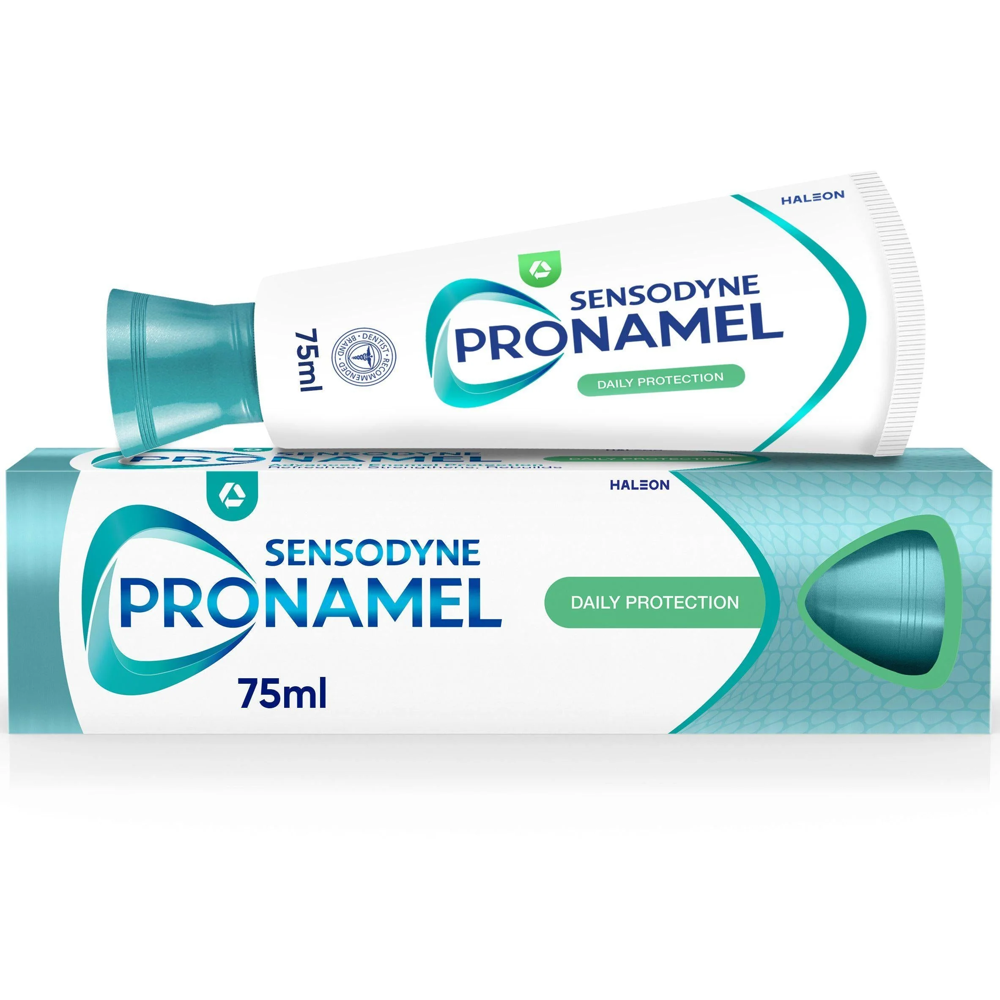
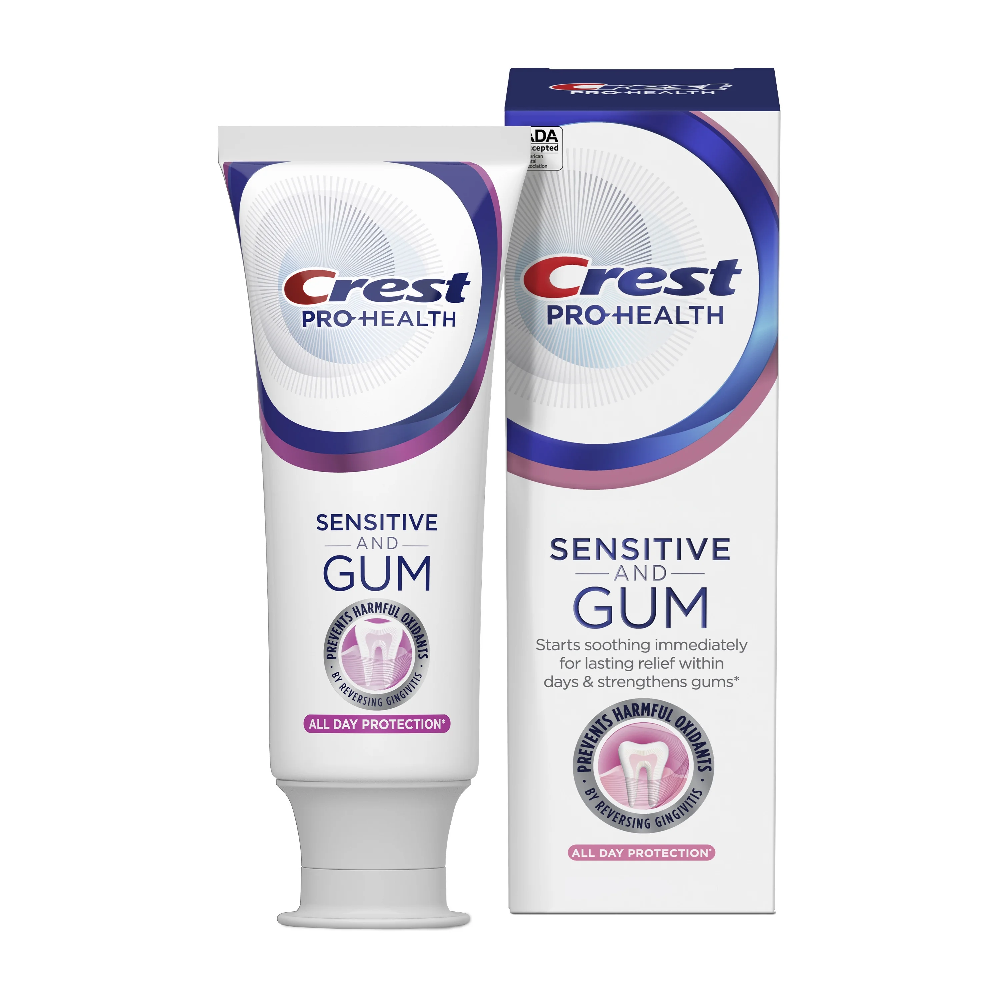
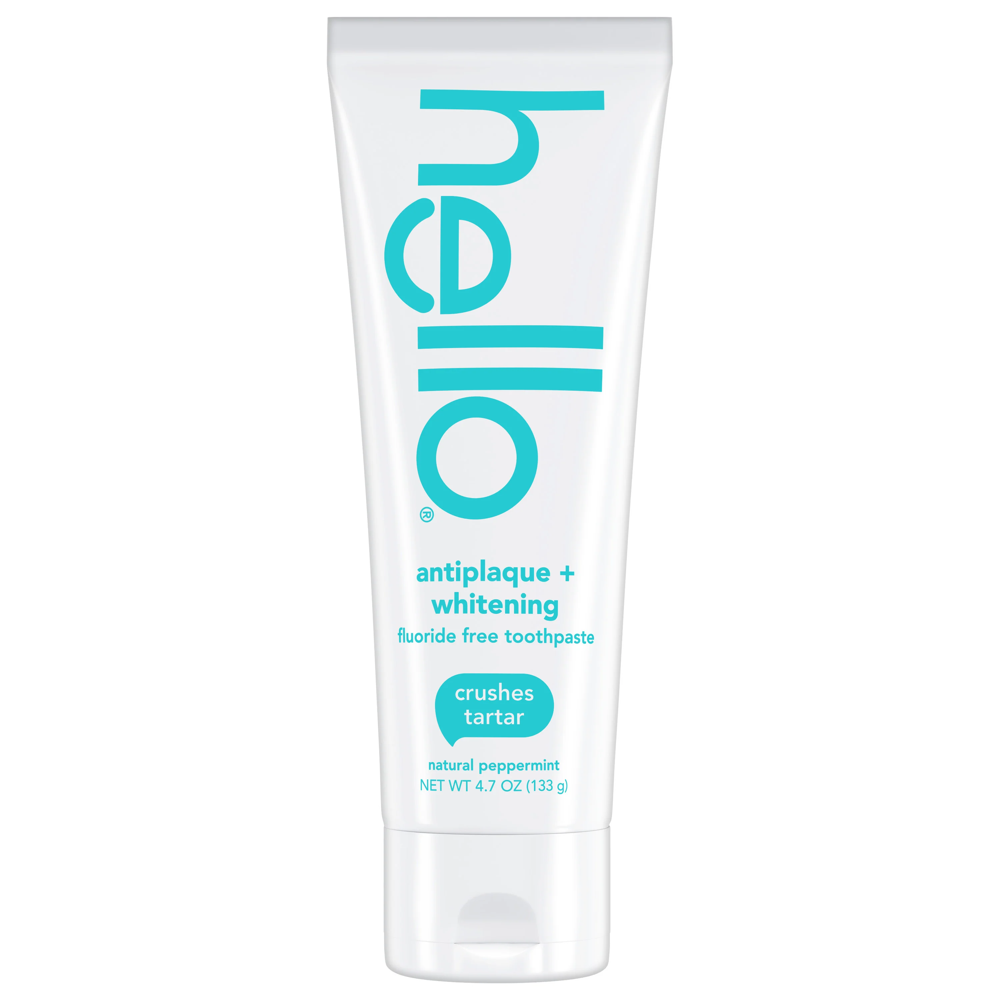
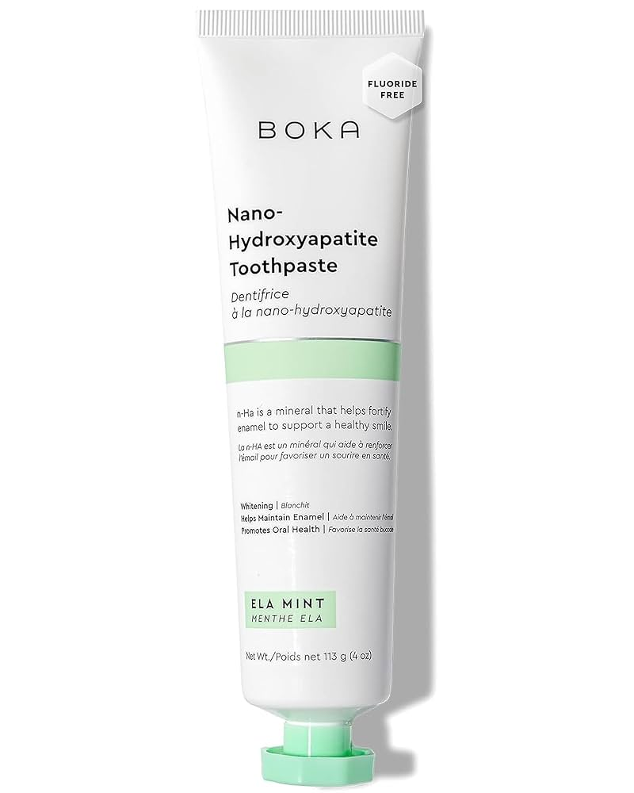
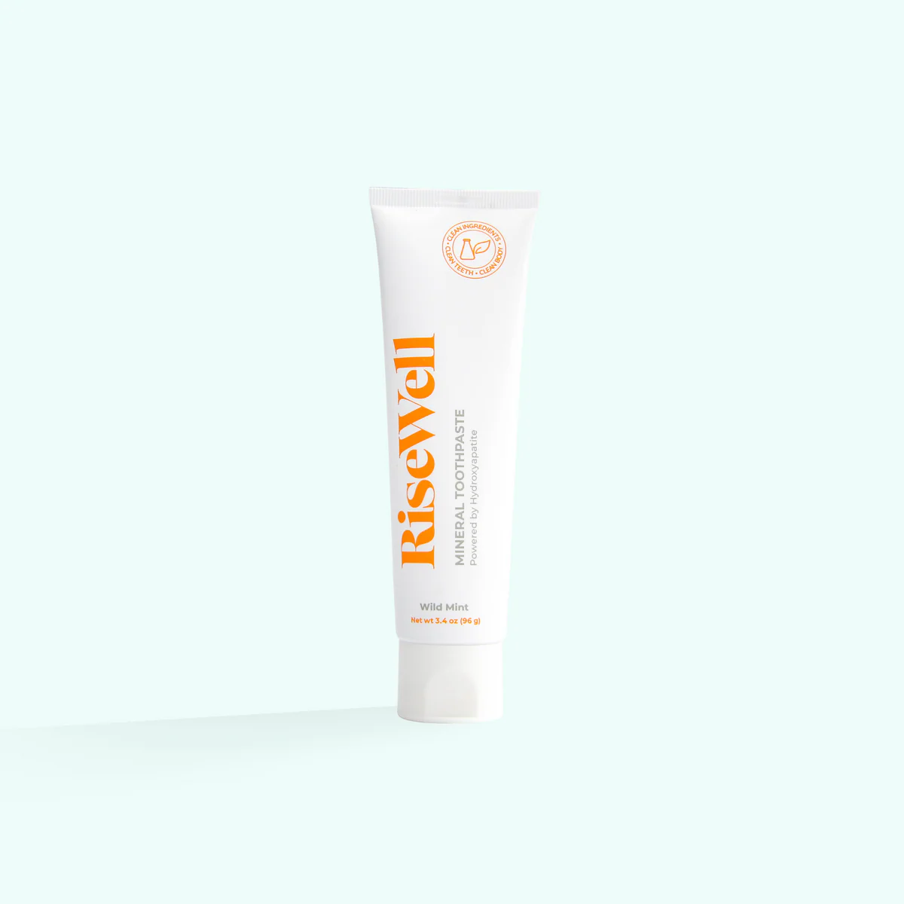
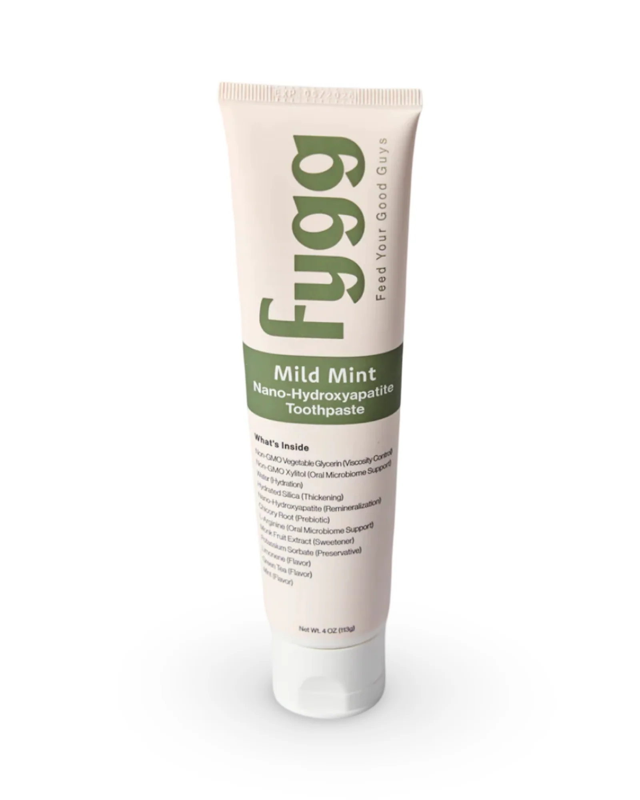

# Toothpaste

The goal is to find a healthy toothpaste that effectively prevents cavities, and supports gum health.

---

## Phase 1: Researching the Field

### Keywords, Terms and Concepts

1.  **Key Active Ingredients & Concepts**
    *   **Fluoride:** A mineral that is the most effective and widely recognized ingredient for preventing tooth decay. It works by strengthening tooth enamel and helping to remineralize areas that have been attacked by acids. The American Dental Association (ADA) only gives its Seal of Acceptance to toothpastes containing fluoride.
    *   **Xylitol:** A sugar alcohol used as a sweetener. In oral care, it's non-fermentable by plaque bacteria, meaning it doesn't produce the acids that cause cavities. Some studies suggest it may also help reduce levels of cavity-causing bacteria.
    *   **Relative Dentin Abrasivity (RDA):** A standardized scale that measures the abrasive effect of a toothpaste on tooth dentin and enamel. A low RDA value is gentler, while a high RDA can be more effective at removing surface stains but may also wear down enamel over time. The ADA recommends an RDA of 250 or less.
    *   **Sodium Lauryl Sulfate (SLS):** A common detergent and foaming agent. It creates the lather we associate with brushing, which helps distribute the toothpaste. However, for some people, SLS can be an irritant, potentially contributing to canker sores or mouth sensitivity.
    *   **Desensitizing Agents:** Ingredients like potassium nitrate or stannous fluoride that work to block pain signals from the tooth surface to the nerve, providing relief for sensitive teeth.

2.  **Common Additives & Marketing Terms**
    *   **Charcoal:** An ingredient used in some toothpastes for its purported whitening benefits. It is highly abrasive and there is little scientific evidence to support its effectiveness or long-term safety; many dentists advise against it due to the risk of enamel erosion.
    *   **Whitening Agents:** These ingredients work in two ways:
        *   **Abrasives:** Physically polish away surface stains (e.g., hydrated silica, calcium carbonate).
        *   **Chemicals:** Bleaching agents like hydrogen peroxide or carbamide peroxide that break down stains.

### Guiding Questions

1.  **Is fluoride good for you in toothpaste?**
    Yes. For the vast majority of the population, fluoride is the single most effective, well-researched, and recommended ingredient for preventing tooth decay. It works by making enamel more resistant to acid attacks and by repairing the enamel in a process called remineralization. While toxicity is possible at extremely high doses (far more than could be ingested from normal toothpaste use), its benefits in topical applications like toothpaste are overwhelmingly supported by decades of scientific evidence and major health organizations.

2.  **What are the alternatives to fluoride?**
    The most prominent alternative is **Hydroxyapatite (HAP)**. As the main mineral component of enamel, the theory is that it can "patch" demineralized areas. While it has shown promise in some studies, it does not yet have the same depth of long-term, large-scale evidence as fluoride, nor does it have the ADA Seal of Acceptance for cavity prevention. Other ingredients like **Xylitol** are beneficial but are not considered direct one-to-one replacements for fluoride's remineralization capabilities.

3.  **How much toothpaste should I use each time?**
    A pea-sized amount is sufficient for adults. For children aged 3-6, a rice-grain-sized amount is recommended. Using more does not improve cleaning efficacy and simply leads to waste.

---

## Phase 2: Defining My Needs & Priorities

1.  **Primary Use Case(s):**
    *   Daily brushing to maintain and improve the health of my teeth, gums, and oral microbiome.
2.  **Key Features Needed:**
    1.  **Health & Safety**
        *   Contains well-researched, safe, and effective ingredients for long-term oral health.
        *   Prioritizes enamel protection and gum health.
    2.  **Performance**
        *   Effectively cleans teeth and supports a healthy oral microbiome.
    3.  **Feel & Usability**
        *   A non-irritating formula.
3.  **Nice to Have:**
    *   SLS-free formula to minimize potential irritation.
    *   Ingredients that are beneficial for the oral microbiome, such as xylitol.
4.  **Deal-breakers:**
    *   Ingredients that are unnecessarily abrasive or lack strong scientific backing for safety and efficacy (e.g., charcoal).
    *   A primary focus on cosmetic effects like whitening at the expense of health.
5.  **Budget Range:** Flexible for a high-quality, effective product.

---

## Phase 3: Comparing & Choosing the Item *Type*

### Available Types

#### 1. Standard Anticavity Toothpaste

1.  **Pros:**
    *   Focuses on the most important job: preventing cavities with fluoride.
    *   Often the most affordable and widely available.
    *   Typically has a low to moderate RDA, making it safe for long-term use.
2.  **Cons:**
    *   Lacks specialized ingredients for issues like whitening or sensitivity.

#### 2. Whitening Toothpaste

1.  **Pros:**
    *   Effective at removing extrinsic (surface) stains from coffee, tea, and food.
2.  **Cons:**
    *   Can have a higher RDA, which may increase enamel wear over time.
    *   May cause or worsen tooth sensitivity for some users.
    *   Does not change the intrinsic color of your teeth like professional treatments.

#### 3. Sensitivity Toothpaste

1.  **Pros:**
    *   Contains active ingredients like potassium nitrate or stannous fluoride that are proven to reduce sensitivity.
    *   Often formulated with lower abrasivity to avoid further irritation.
2.  **Cons:**
    *   May take several weeks of consistent use to become fully effective.
    *   May not have strong whitening capabilities.

#### 4. "All-in-One" or "Total" Toothpaste

1.  **Pros:**
    *   Attempts to address multiple issues at once: cavities, gingivitis, plaque, tartar, and whitening.
    *   Often contains advanced ingredients like stannous fluoride, which helps with sensitivity, cavities, and gum inflammation.
2.  **Cons:**
    *   Complex formulas may have a higher chance of containing an ingredient that is irritating to some users.
    *   Can be more expensive than single-purpose toothpastes.

#### 5. Charcoal Toothpaste

1.  **Pros:**
    *   Has a perception of being "natural" and is marketed heavily for whitening.
2.  **Cons:**
    *   Highly abrasive and can wear down tooth enamel over time, potentially exposing the yellower dentin beneath.
    *   Lack of scientific evidence for safety and efficacy. Not endorsed by the ADA.
    *   The dark particles can sometimes get lodged in gum lines or tooth crevices.

#### 6. Fluoride-Free / Alternative Toothpaste

1.  **Pros:**
    *   Caters to individuals who wish to avoid fluoride for personal or health reasons.
    *   Often contains beneficial ingredients like Xylitol (for plaque control) or Hydroxyapatite (for remineralization).
    *   Frequently formulated without SLS, artificial sweeteners, or colors, appealing to those seeking "natural" products.
2.  **Cons:**
    *   Lacks the robust, extensive, long-term scientific backing that fluoride has for cavity prevention.
    *   Does not receive the ADA Seal of Acceptance for anticavity claims.
    *   Efficacy can vary greatly between brands and formulations (e.g., HAP concentration matters).

### Comparison Table of Types

| Type                  | Cavity Prevention (Fluoride) | Health Focus (Gums, etc.) | Gentleness (Low RDA) | Backed by Science |
|-----------------------|:----------------------------:|:-------------------------:|:--------------------:|:-----------------:|
| **Standard Anticavity** | :white_check_mark:           |                           | :white_check_mark:   | :white_check_mark:|
| **Whitening**         | :white_check_mark:           |                           |                      | :white_check_mark:|
| **Sensitivity**       | :white_check_mark:           | :white_check_mark:        | :white_check_mark:   | :white_check_mark:|
| **All-in-One / Total**  | :white_check_mark:           | :white_check_mark:        |                      | :white_check_mark:|
| **Charcoal**          |                              | :x:                       | :x:                  | :x:               |
| **Fluoride-Free**     | :x:                          | :white_check_mark:        | :white_check_mark:   |                   |

### Conclusion on Item Type

Based on my priorities—a primary focus on health with scientifically-backed ingredients, while also wanting the benefits of newer alternatives—I have decided on a **two-toothpaste strategy.** One in the morning and the second in the evening.

**Reasoning:** This approach allows me to get the best of both worlds. I will use a high-quality **fluoride toothpaste** in the morning for its proven, robust protective benefits against cavities and gingivitis. In the evening, I will use a **fluoride-free alternative with Hydroxyapatite** to gently support enamel repair and the oral microbiome overnight.

---

## Phase 4: Choosing the Specific *Product*

Now that I've decided on the two-toothpaste strategy, I will select a specific product for each role.

### Category 1: Morning Routine (Fluoride Toothpaste)

The goal for the morning is a robust, protective toothpaste that uses fluoride for proven cavity prevention and ideally contains other ingredients for gum health and sensitivity, while also being free of unnecessary irritants like SLS.

#### Product Options

##### 1.  Sensodyne Pronamel Daily Protection

1.  **Pros:**
    *   **SLS-free formulation**, making it gentle and effective for daily use.
    *   Uses both **potassium nitrate** (for sensitivity) and **sodium fluoride** (for cavity prevention) to deliver core protection.
    *   Serves as the foundational, trusted product in the Pronamel line for reliable enamel care.
    *   Often more affordable and available in larger sizes than the specialized versions.
2.  **Cons:**
    *   Does not contain the advanced fluoride-boosting ingredients found in the "Intensive Repair" version.
3.  **Community Opinion:** Considered the go-to, reliable, and cost-effective choice for daily enamel protection without unnecessary extras.
4.  **Price:** `~$6 - $8`

##### 2.  Crest Pro-Health Gum and Sensitivity

1.  **Pros:**
    *   Also uses **stannous fluoride** to target gum health, sensitivity, and cavity prevention simultaneously.
    *   Creates a "shield" against food and drinks that cause sensitivity.
    *   Offers gentle whitening without harsh abrasives that can exacerbate sensitivity.
2.  **Cons:**
    *   Like most "Total" formulas, it has a complex ingredient list that may not suit those with very specific allergies.
3.  **Community Opinion:** Very well-regarded, especially by those who find that improving their gum health directly leads to less sensitivity.
4.  **Price:** `~$7 - $9`

##### 3.  hello Naturally Healthy Antigingivitis Toothpaste

1.  **Pros:**
    *   **SLS-free** and also free from dyes, artificial sweeteners, and parabens.
    *   Uses stannous fluoride for effective cavity and gingivitis prevention.
    *   Contains aloe vera and coconut oil, aligning with a more "natural" formulation philosophy.
2.  **Cons:**
    *   As a smaller brand, it may not be as widely available in all stores as Crest or Sensodyne.
3.  **Community Opinion:** Very popular with ingredient-conscious consumers who want a "cleaner" product that still contains the proven benefits of fluoride.
4.  **Price:** `~$6 - $8`

##### 4.  Colgate Total Gum Protect

1.  **Pros:**
    *   Uses **stannous fluoride** as its active ingredient to fight cavities, gingivitis, and sensitivity.
    *   Many newer versions of Colgate Total, including this one, are **SLS-free**, making them great for avoiding irritation.
    *   As one of the most widely available and affordable "All-in-One" toothpastes, it offers excellent value.
2.  **Cons:**
    *   The "Total" line has many different variations, so it's important to check the packaging to ensure you're getting the desired SLS-free, stannous fluoride version.
3.  **Community Opinion:** A classic and trusted brand that has been modernized with better ingredients. Well-regarded for its effectiveness and accessibility.
4.  **Price:** `~$5 - $7`

#### Comparison Table: Fluoride Toothpastes

| Product                      | Key Active Ingredient   | Health Focus                         | Free of Irritants (SLS) | Price |
|------------------------------|:-----------------------:|:------------------------------------:|:-----------------------:|:-----:|
| **Sensodyne Pronamel Daily** | Potassium Nitrate + NaF | :white_check_mark: (Enamel Protection) | :white_check_mark:      | $     |
| **Crest Gum and Sensitivity**  | Stannous Fluoride       | :white_check_mark: (Gums/Sensitivity)  |                         | $$    |
| **hello Antigingivitis**       | Stannous Fluoride       | :white_check_mark: (Gums/Healthy Ing.) | :white_check_mark:      | $     |
| **Colgate Total Gum Protect**  | Stannous Fluoride       | :white_check_mark: (Gums/All-in-One)   | :white_check_mark:      | $     |

#### Conclusion on Morning Toothpaste

My choice for the morning routine is the **Sensodyne Pronamel Daily Protection**.

**Reasoning:** It provides the proven, science-backed benefits of fluoride for cavity prevention and potassium nitrate for sensitivity, all in a gentle, SLS-free formula. It is a trusted, effective, and cost-efficient foundation for daily oral health.

### Category 2: Evening Routine (Alternative Toothpaste)

The goal for the evening is a gentle, restorative toothpaste that uses alternative ingredients to support the oral microbiome and remineralize enamel overnight without fluoride.

#### Product Options

##### 1.  Boka Nano-Hydroxyapatite Toothpaste

1.  **Pros:**
    *   Features **nano-hydroxyapatite (n-Ha)**, which is scientifically shown to be effective at remineralizing enamel and reducing sensitivity.
    *   **Fluoride-free and SLS-free**, aligning with the goal of using a gentler, more "natural" formula for the evening.
    *   Includes aloe vera and green tea extract, which have soothing and antioxidant properties.
2.  **Cons:**
    *   Higher price point than traditional toothpastes.
    *   As a newer technology, it lacks the decades of longitudinal data that fluoride has.
3.  **Community Opinion:** Highly popular in wellness and bio-hacking communities. Praised for its effectiveness, great taste, and high-quality, non-toxic ingredients.
4.  **Price:** `~$12 - $15`

##### 2.  RiseWell Mineral Toothpaste

1.  **Pros:**
    *   Uses **micro-hydroxyapatite**, a non-nano form that is also proven to remineralize teeth.
    *   Completely free of fluoride, SLS, parabens, and artificial colors/flavors.
    *   Includes Xylitol, which helps inhibit the growth of cavity-causing bacteria.
    *   Flavored with beneficial essential oils like peppermint and tea tree oil.
2.  **Cons:**
    *   Does not foam like traditional toothpaste, which can take some getting used to.
    *   Premium price point.
3.  **Community Opinion:** A favorite among ingredient-conscious consumers and those who prefer a non-nano form of HAP. Valued for its clean formulation and transparency.
4.  **Price:** `~$12`

##### 3.  fygg Nano-Hydroxyapatite Toothpaste

1.  **Pros:**
    *   Uses **nano-hydroxyapatite**, is fluoride-free, and SLS-free.
    *   Specifically formulated with **prebiotics** (Chicory Root) and L-Arginine to nourish the oral microbiome, a key goal.
    *   Founded by functional dentists with a "less is more" philosophy, avoiding emulsifiers and other unnecessary additives.
2.  **Cons:**
    *   As a newer, specialized brand, it has a premium price point and is less widely available.
3.  **Community Opinion:** Very popular within the functional dentistry and wellness communities for its clean, microbiome-focused approach.
4.  **Price:** `~$14`

#### Comparison Table: Alternative Toothpastes

| Product                         | Key Active Ingredient   | Health Focus                         | Free of Irritants (SLS) | Price |
|-------------------------------|:-----------------------:|:------------------------------------:|:-----------------------:|:-----:|
| **Boka n-Ha Toothpaste**      | Nano-Hydroxyapatite     | :white_check_mark: (Remineralization)  | :white_check_mark:      | $$$   |
| **RiseWell Mineral Toothpaste** | Micro-Hydroxyapatite    | :white_check_mark: (Remineralization)  | :white_check_mark:      | $$    |
| **fygg n-Ha Toothpaste**      | Nano-Hydroxyapatite     | :white_check_mark: (Microbiome Health) | :white_check_mark:      | $$$   |

#### Conclusion on Evening Toothpaste

My choice for the evening routine is the **Boka Nano-Hydroxyapatite Toothpaste**.

**Reasoning:** Its n-Ha formula offers a modern, science-supported approach to remineralization that is perfect for an overnight, restorative routine. It is exceptionally gentle and aligns with the goal of supporting long-term enamel health with innovative ingredients.

### Final Conclusion on Products

My final decision is to adopt the two-toothpaste strategy, leveraging the distinct benefits of both fluoride and hydroxyapatite.

*   **For the Morning (Fluoride):** **Sensodyne Pronamel Daily Protection**
*   **For the Evening (Alternative):** **Boka Nano-Hydroxyapatite Toothpaste**

This combination provides proven, robust protection during the day and gentle, targeted remineralization at night, creating a comprehensive system for oral health.

*   **Where to Buy:**
    *   [Sensodyne Pronamel Daily Protection (Official Site)](https://www.pronamel.us/products/daily-protection-mint-essentials/)
    *   [Boka Ela Mint Toothpaste (Official Site)](https://www.boka.com/products/ela-mint-toothpaste)

---

## Phase 5: Post-Purchase Guide

This section details how to get the most out of the chosen toothpaste.

### 1. Best Practices for Use
*   **Amount:** Use only a pea-sized amount of toothpaste for adults. For children aged 3-6, a rice-grain-sized amount is recommended.
*   **Technique:** Brush gently for two full minutes, covering all surfaces of the teeth. Do not "scrub" hard, as this can damage enamel and gums.
*   **After Brushing:** Spit out the excess toothpaste, but do not rinse your mouth with water immediately. Leaving a small amount of fluoride on the teeth allows it to continue working.

---

## Phase 6: Essential Accessories & Add-Ons

1.  toothpaste squeezer

---

## Sources & Further Reading

### Scientific Journals & Research Databases

1.  Amaechi, B. T., et al. (2019). "Remineralization of enamel caries by a toothpaste containing nano-hydroxyapatite." *Journal of Dentistry*.
    *   *Link:* [https://pubmed.ncbi.nlm.nih.gov/31325590/](https://pubmed.ncbi.nlm.nih.gov/31325590/)
    *   *Note:* A key study showing the effectiveness of nano-hydroxyapatite in remineralizing teeth.

### Reputable Organizations & Consumer Information

1.  American Dental Association (ADA) - Toothpaste
    *   *Link:* [https://www.ada.org/en/resources/research/science-and-research-institute/oral-health-topics/toothpastes](https://www.ada.org/en/resources/research/science-and-research-institute/oral-health-topics/toothpastes)
    *   *Note:* The ADA provides comprehensive, science-backed information on toothpaste ingredients and recommendations.

2.  What Is In Toothpaste? Five Ingredients And What They Do - Colgate
    *   *Link:* [https://www.colgate.com/en-us/oral-health/selecting-dental-products/what-is-in-toothpaste-five-ingredients-and-what-they-do](https://www.colgate.com/en-us/oral-health/selecting-dental-products/what-is-in-toothpaste-five-ingredients-and-what-they-do)
    *   *Note:* A good consumer-level overview of the basic components of modern toothpaste.

3.  The 14 best toothpastes for clean, healthy teeth in 2025 - NBC News
    *   *Link:* [https://www.nbcnews.com/select/shopping/best-toothpastes-ncna1294664](https://www.nbcnews.com/select/shopping/best-toothpastes-ncna1294664)
    *   *Note:* Used to identify top-rated fluoride toothpastes and expert opinions on ingredients like stannous fluoride.

4.  The 9 Best Toothpastes to Reduce Sensitive Teeth - Health.com
    *   *Link:* [https://www.health.com/condition/oral-health/best-toothpaste-for-sensitive-teeth](https://www.health.com/condition/oral-health/best-toothpaste-for-sensitive-teeth)
    *   *Note:* Provided excellent recommendations for sensitivity-focused toothpastes, including Crest Gum and Sensitivity.

5.  Risewell Hydroxyapatite Toothpaste Review - I Read Labels For You
    *   *Link:* [https://ireadlabelsforyou.com/hydroxyapatite-toothpaste-review/](https://ireadlabelsforyou.com/hydroxyapatite-toothpaste-review/)
    *   *Note:* An in-depth analysis of RiseWell toothpaste and the science behind micro-hydroxyapatite.

6.  What Is Sodium Lauryl Sulfate (SLS) and Is It Safe? - Healthline
    *   *Link:* [https://www.healthline.com/health/beauty-skin-care/sodium-lauryl-sulfate](https://www.healthline.com/health/beauty-skin-care/sodium-lauryl-sulfate)
    *   *Note:* A detailed overview of SLS, its uses, and why some people choose to avoid it.

### Community Discussions (for anecdotal experiences & product discovery - cross-reference with scientific sources)
<!-- For anecdotal experiences, user feedback, and discovering popular opinions (to be cross-referenced). e.g., Reddit, forums. -->

1.  Best Toothpaste? - /r/askdentists
    *   *Link:* https://www.reddit.com/r/askdentists/comments/1dusx5d/best_toothpaste/
    *   *Note:* General discussion among professionals and users about preferred brands.
2.  What is your favorite toothpaste? - /r/hygiene
    *   *Link:* https://www.reddit.com/r/hygiene/comments/1hg5nmw/what_is_your_favorite_toothpaste/
    *   *Note:* User preferences and experiences with different types.
3.  What toothpaste do you use? - /r/30PlusSkinCare
    *   *Link:* https://www.reddit.com/r/30PlusSkinCare/comments/1fea1g7/what_toothpaste_do_you_use/
    *   *Note:* Focus on ingredient-conscious users.
4.  Dentists of reddit what toothpaste do you... - /r/Frugal
    *   *Link:* https://www.reddit.com/r/Frugal/comments/1arpg4w/dentists_of_reddit_what_toothpaste_do_you/
    *   *Note:* Dentists' opinions on what is essential vs. marketing.

### Product Pages (where to buy from, like manufacturer)
<!-- For official specifications, pricing, and purchase information. -->

1.  Sensodyne Pronamel Daily Protection
    *   *Link:* [https://www.pronamel.us/products/daily-protection-mint-essentials/](https://www.pronamel.us/products/daily-protection-mint-essentials/)
    *   *Note:* Official product page with ingredient details.
2.  Boka Ela Mint Toothpaste
    *   *Link:* [https://www.boka.com/products/ela-mint-toothpaste](https://www.boka.com/products/ela-mint-toothpaste)
    *   *Note:* Official product page for Boka's n-Ha toothpaste.
3.  fygg Nano-Hydroxyapatite Toothpaste
    *   *Link:* [https://fygg.com/products/mild-mint-n-hap-toothpaste](https://fygg.com/products/mild-mint-n-hap-toothpaste)
    *   *Note:* Official product page for fygg's microbiome-focused toothpaste.
4.  Colgate Total Gum Protect
    *   *Link:* [https://www.colgate.com/en-us/products/toothpaste/colgate-total-gum-protect-toothpaste](https://www.colgate.com/en-us/products/toothpaste/colgate-total-gum-protect-toothpaste)
    *   *Note:* Official product page for the SLS-free, stannous fluoride version of Colgate Total.

### YouTube Videos (for visual guides, reviews, and opinions - cross-reference with scientific sources):
<!-- For visual guides, reviews, and opinions from figures in the industry (to be cross-referenced). -->

1.  Dentist Explains the Best Toothpaste - Dr. Derik
    *   *Link:* https://youtu.be/l_GpHjng7OE
    *   *Note:* Expert opinion on what to look for in a toothpaste.
2. https://youtu.be/l_GpHjng7OE?si=9zVA3OuxQodxTrYd

iherb
https://www.reddit.com/r/Frugal/comments/1arpg4w/dentists_of_reddit_what_toothpaste_do_you/
https://afterva.com/davids-toothpaste-review/

---

## Join the Conversation

*   What are your priorities when choosing a toothpaste?
*   Have you found a specific type (whitening, sensitivity) to be particularly effective?

---

*Disclaimer: This is a log of my personal research and decision-making process. Product features and prices are subject to change. Opinions are my own based on the information available at the time of writing.* 