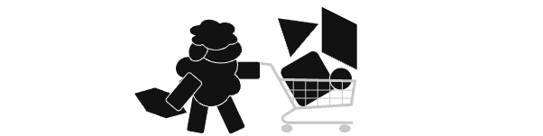

# Bazaar

<figure markdown="span">
  {: .center }
  <figcaption>Needs, comparisons and recommendations of items</figcaption>
</figure>

## Introduction

Explore, review, and recommend products and items that we find valuable, useful, or simply interesting.

## Structure

The Bazaar is organized into several distinct topics, each containing sub-topics and specific item recommendations.

- Health (1)
    - [Air Quality](./health/air_quality/index.md)
    - [Oral Care](./health/oral_care/index.md)
    - [Skin Care](./health/skin_care/index.md)
    - [Household](./health/household/index.md)

- Home Automation (2)
    - [Lighting](./home_automation/lighting/index.md)
    - [Sensors](./home_automation/sensors/index.md)
    - [Control Interfaces](./home_automation/control_interfaces/index.md)

- Kitchenware (3)
    - [Cookware](./kitchenware/cookware/index.md)
    - [Cutlery & Boards](./kitchenware/cutlery_and_boards/index.md)
    - [Baking Tools](./kitchenware/baking_tools/index.md)
    - [Utensils & Accessories](./kitchenware/utensils_and_accessories/index.md)

- Food (4)
    - [Ingredients](./food/ingredients/index.md)

- Safety (5)
    - [Health & Personal Safety](./safety/health_and_personal/index.md)

- Home Decoration (6)
    - [Home Accessories](./home_decoration/home_accessories/index.md)

1.  Recommendations for health, wellness, and personal care products.
2.  A collection of smart devices and gadgets to automate your home.
3.  Essential tools, cookware, and gadgets for your kitchen.
4.  Curated list of high-quality food ingredients.
5.  Products and tools to enhance your personal safety and security.
6.  Items and accessories to beautify your living space. 