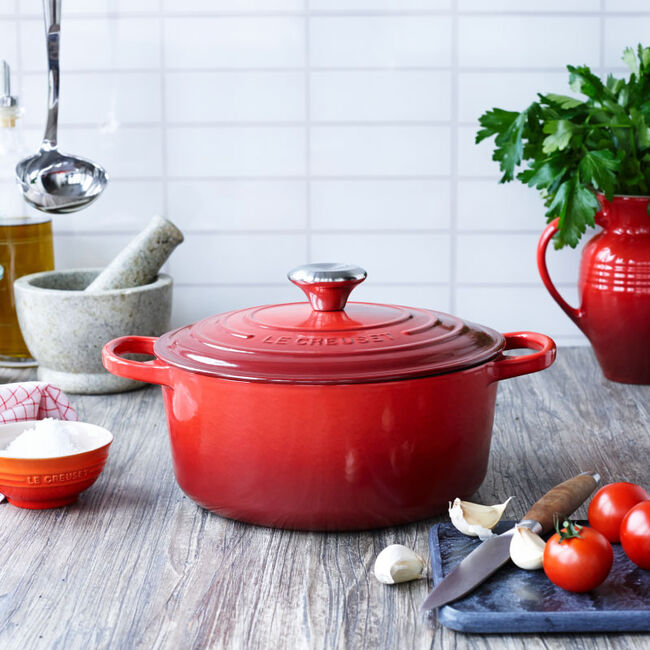
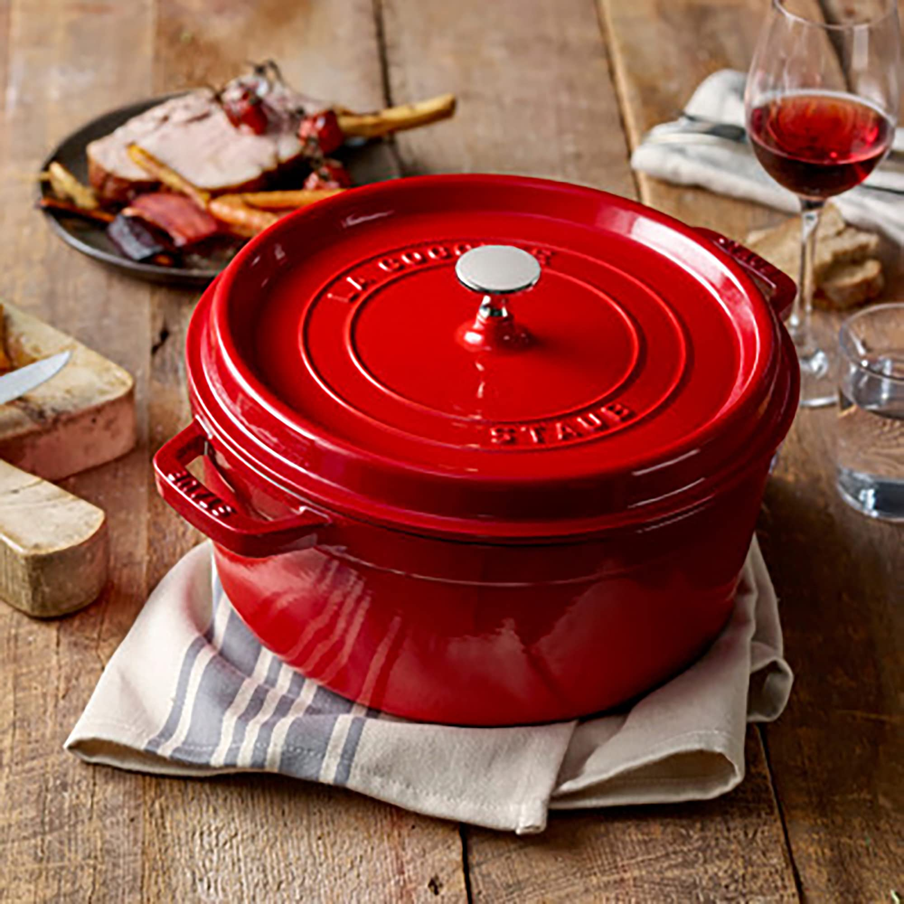

# Pot

A good pot is a kitchen cornerstone, essential for staple foods like soups, rice, and pasta. Because these dishes often involve liquids, long simmering times, and sometimes acidic ingredients (like tomatoes in soup), the material of the pot is critical to ensure that nothing unwanted leaches into the food. This research focuses on finding the healthiest and most effective pot for these specific tasks.

---

## Phase 1: Researching the Field

Understanding the key terms and principles behind cookware for simmering and boiling is essential before choosing a specific product.

### Keywords, Terms and Concepts

1.  **Construction & Materials**
    *   **Clad Construction:** A layered design, crucial for high-quality stainless steel pots. A highly conductive metal core (like aluminum or copper) is sandwiched between layers of durable, non-reactive stainless steel. This construction ensures even heating and prevents hot spots where food can burn.
    *   **Enameled Coating:** A layer of glass fused to a metal base (usually cast iron). It makes the pot non-reactive, easy to clean, and eliminates the need for seasoning. The quality of the enamel is key to ensure it is free of lead/cadmium and resistant to chipping.
    *   **Dutch Oven:** A heavy, thick-walled cooking pot with a tight-fitting lid, typically made of cast iron (either bare or enameled).

2.  **Health & Safety**
    *   **Leaching:** The process where metals from the cookware migrate into food. For pots used for long simmers with acidic ingredients, this is a primary concern. Stainless steel can leach small amounts of nickel and chromium; un-enameled cast iron leaches iron.
    *   **Reactivity:** Certain materials react with acidic foods (e.g., tomatoes, lemon, wine). Bare cast iron and aluminum are reactive, which can alter food's flavor and color and increase metal leaching. Stainless steel and enamel are largely non-reactive and are therefore ideal for these tasks.

### Guiding Questions

1.  **What is the most significant health risk when simmering foods?**
    The biggest risk is chemical leaching, which is accelerated by heat, time, and acidity. The goal is to choose a material that is as inert (non-reactive) as possible. Enameled cast iron is the most inert, followed by high-quality clad stainless steel.

2.  **What makes a pot good for cooking rice and pasta?**
    For rice, a heavy, tight-fitting lid and excellent heat retention are key to creating the even, steamy environment needed for fluffy grains. For pasta, a large capacity and good heat distribution are needed to quickly return water to a boil after adding the pasta.

3.  **What's the difference in performance between enameled cast iron and clad stainless steel?**
    Enameled cast iron has superior heat retention; it stays hot for a long time, making it perfect for holding a steady simmer. Clad stainless steel is more responsive; it heats up and cools down faster, offering more precise temperature control.

4.  **Why is "buy it for life" an important factor for pots?**
    Pots, especially those used for long cooking times, are subject to significant wear. A high-quality pot made from durable materials like thick stainless steel or cast iron will not degrade, warp, or chip easily, ensuring it remains safe and performant for decades.

---

## Phase 2: Defining My Needs & Priorities

Now that I understand the landscape, I can clearly define what I'm looking for.

1.  **Primary Use Case(s):**
    *   Simmering soups and stews for long durations.
    *   Boiling pasta.
    *   Cooking rice.
2.  **Key Features Needed (Health & Safety):**
    *   **Non-Toxic & Non-Reactive:** The material must be as inert as possible, with no risk of leaching harmful chemicals and minimal leaching of metals, even with acidic foods.
    *   **No Unstable Coatings:** The surface must not chip, scratch, or degrade over time.
3.  **Key Features Needed (Performance):**
    *   **Excellent Heat Distribution & Retention:** A thick, heavy base is required to prevent scorching and maintain a steady simmer.
    *   **A Heavy, Tight-Fitting Lid:** Essential for controlling evaporation and trapping steam.
    *   **Size/Capacity:** A versatile size of approximately 5.5-6 quarts (5-6 liters).
4.  **Nice to Have:**
    *   Versatility to go from stovetop to oven.
    *   A reputation for "buy it for life" durability.
5.  **Deal-breakers:**
    *   Any synthetic non-stick coatings (PFOA/PFAS).
    *   Uncoated aluminum.
    *   Materials known for poor durability or significant health concerns under these use cases.
6.  **Budget Range:** Flexible for the best and healthiest long-term option.

---

## Phase 3: Comparing & Choosing the Item *Type*

Based on the primary uses (soups, rice, pasta), three material choices stand out: **Clad Stainless Steel**, **Enameled Cast Iron**, and **Bare Cast Iron**.

### Available Types

#### 1. Clad Stainless Steel Stockpot

*   **Pros:**
    *   Heats up relatively quickly and is responsive.
    *   Non-reactive surface is ideal for all foods.
    *   Relatively lightweight compared to cast iron.
*   **Cons:**
    *   Potential for nickel/chromium leaching is a drawback compared to inert alternatives.
    *   Does not retain heat as well as cast iron.
    *   High-quality, fully-clad versions can be expensive.

#### 2. Enameled Cast Iron (Dutch Oven)

*   **Pros:**
    *   Excellent heat retention is perfect for low-and-slow simmering.
    *   The heavy, tight-fitting lid is ideal for moisture retention and steaming rice.
    *   Completely non-reactive surface is safe for all ingredients.
    *   Extremely durable and versatile (stovetop to oven).
*   **Cons:**
    *   Very heavy, which can make lifting a full pot difficult.
    *   Slower to heat up compared to stainless steel.
    *   Can be very expensive.
    *   Enamel can chip if handled roughly.

#### 3. Bare Cast Iron (Dutch Oven)

*   **Pros:**
    *   Incredible heat retention.
    *   Extremely durable and virtually indestructible.
    *   Very affordable.
*   **Cons:**
    *   Requires regular maintenance and seasoning.
    *   Reactive with acidic foods.
    *   Very heavy.

### Comparison Table of Types

| Type | Non-Reactive | Heat Retention | Low Maintenance | Lightweight | Overall Match |
| --- | :---: | :---: | :---: | :---: | :---: |
| **Clad Stainless Steel** | :white_check_mark: | | :white_check_mark: | :white_check_mark: | 3 / 4 |
| **Enameled Cast Iron** | :white_check_mark: | :white_check_mark: | :white_check_mark: | | 3 / 4 |
| **Bare Cast Iron** | | :white_check_mark: | | | 1 / 4 |

### Conclusion on Item Type

For my specific needs, the **Enameled Cast Iron Dutch Oven** is the superior choice.

*   **Health Priority:** It is the most inert and non-reactive option, completely avoiding the nickel leaching concerns of stainless steel and the iron leaching/reactivity issues of bare cast iron. This makes it the winner on the "Non-Reactive" metric.
*   **Performance Priority:** The combination of superior heat retention and a heavy, tight-fitting lid makes it the perfect vessel for simmering soups and steaming rice, my two primary use cases. This makes it the winner on the "Heat Retention" metric.
*   **Overall Value:** While Clad Stainless Steel also scores highly, Enameled Cast Iron wins on the two most critical features for the job. Its durability, versatility, and exceptional performance align with my goal of a "buy it for life" product.

---

## Phase 4: Choosing the Specific *Product*

With the decision made to pursue an Enameled Cast Iron Dutch Oven, the market is dominated by two legendary French brands—Le Creuset and Staub—but several other manufacturers offer incredible value and performance. The sweet spot for size is around 5.5 to 6 quarts.

### Product Options

#### 1. Le Creuset Signature Round Dutch Oven (5.5 qt)

1.  **Pros:**
    *   The benchmark for quality and design. The light-colored interior makes it very easy to monitor browning (fond) and prevent burning.
    *   Relatively lightweight for cast iron, with large, comfortable handles that are easy to grip.
    *   Time-tested, iconic brand with an excellent reputation and a lifetime warranty. Comes in the widest array of colors.
2.  **Cons:**
    *   Among the most expensive options on the market.
3.  **Community Opinion:** Beloved by home cooks and professionals alike for its reliability and aesthetics. The light interior is frequently cited as a major functional advantage. It's considered an heirloom, "buy it for life" piece.
4.  **Price:** `$$$$$`

#### 2. Staub Round Cocotte (5.5 qt)

1.  **Pros:**
    *   The self-basting spikes on the heavy, tight-fitting lid are highly effective for keeping food moist during long braises.
    *   The matte black, slightly textured interior is excellent for searing meat and developing a fond, plus it resists staining over time.
    *   Extremely durable with a lifetime warranty, favored by many professional chefs for its robust build.
2.  **Cons:**
    *   The dark interior makes it harder to judge browning and spot small bits of food compared to a light interior.
    *   Heavier than the Le Creuset, with smaller handles.
3.  **Community Opinion:** Often praised by chefs and serious cooks. The self-basting lid is seen as a significant performance feature, and many prefer the browning capabilities of the black enamel.
4.  **Price:** `$$$$`

#### 3. Lodge Enameled Cast Iron Dutch Oven (6 qt)

1.  **Pros:**
    *   The undisputed champion of value. It performs nearly as well as the premium French brands for a small fraction of the price.
    *   Good heat distribution and retention, with a light-colored interior for easy monitoring of browning.
    *   Large, comfortable handles make it easy to maneuver.
2.  **Cons:**
    *   The biggest question is long-term durability of the enamel. While it performs well, it is more prone to chipping over time compared to Le Creuset or Staub.
    *   Heavier than a Le Creuset.
3.  **Community Opinion:** Universally recommended as the best budget Dutch oven by Wirecutter, Serious Eats, and countless other reviewers. The go-to choice for anyone who wants excellent performance without the premium price tag.
4.  **Price:** `$`

#### 4. Tramontina Enameled Cast Iron Dutch Oven (5.5 qt)

1.  **Pros:**
    *   Another excellent budget-friendly option that delivers solid performance.
    *   Good searing and braising capabilities with a non-reactive, easy-to-clean surface.
    *   Comes with a lifetime warranty, offering peace of mind.
2.  **Cons:**
    *   Handles are smaller than on other models, which can make it harder to lift when full.
    *   Some reviews mention potential for enamel chipping, similar to other budget-tier options.
3.  **Community Opinion:** Frequently cited as a great value alternative. It's a reliable workhorse that does the job well without breaking the bank.
4.  **Price:** `$`

#### 5. Cuisinart Chef's Classic Enameled Cast Iron (7 qt)

1.  **Pros:**
    *   Offers a larger 7-quart capacity at a budget price point, making it the best value for cooking for a crowd.
    *   Good construction with a light interior for monitoring cooking.
    *   Handles are roomy and easy to grip.
2.  **Cons:**
    *   Significantly heavier due to its larger size, weighing in around 17 lbs.
    *   As with other value-priced options, the long-term durability of the enamel is the primary concern compared to premium brands.
3.  **Community Opinion:** Recommended for those who need a larger pot but don't want to spend hundreds of dollars. It's seen as a dependable, large-format option for big batches of chili, stew, or soup.
4.  **Price:** `$$`

### Comparison Table of Products

| Product | Type | Durability | Ease of Use | Price |
| --- | :---: | :---: | :---: | :---: |
| **Le Creuset** | Premium | :white_check_mark: | :white_check_mark: | `$$$$$` |
| **Staub** | Premium | :white_check_mark: | | `$$$$` |
| **Lodge** | Value | | :white_check_mark: | `$` |
| **Tramontina** | Value | | | `$` |
| **Cuisinart (7 qt)** | Value (Large) | | :white_check_mark: | `$$` |

### Conclusion on Specific Product

All of these are excellent choices, but they serve different priorities.

*   **For the "Buy it for Life," Best-in-Class Experience:** **Le Creuset Signature Round Dutch Oven.** Its combination of performance, user-friendly design (light interior, large handles, manageable weight), and proven long-term durability makes it the top choice if budget is not the primary concern. My main uses are soups, pasta, and rice. For soups, the ability to clearly see the browning of vegetables and aromatics (the fond) on the light-colored bottom of the Le Creuset is a distinct advantage for building flavor. The self-basting feature of the Staub is incredible, but it provides more benefit for long-duration meat braises and roasts than for my stated needs.

*   **For the Best Value:** **Lodge 6-Quart Enameled Dutch Oven.** It offers about 90% of the performance of the premium brands for about 20% of the price. For most people, this is the smartest buy.

**Final Choice:** My choice is the **Le Creuset Signature Round Dutch Oven.** While the Lodge is an incredible value, my priority is a "buy it for life" tool with the most user-friendly features for my specific cooking style (soups and rice), and the Le Creuset's light interior, lighter weight, and proven durability make it the winner for me.

**Where to Buy:**

*   [Le Creuset Signature Round Dutch Oven (5.5 qt) on Amazon](https://www.amazon.com/Le-Creuset-Signature-Enameled-Cast-Iron/dp/B0076NOGPY/)
*   [Staub Cast Iron Round Cocotte (5.5 qt) on Amazon](https://www.amazon.com/Staub-Cast-Iron-5-5-quart-Cocotte/dp/B000I22C6W/)
*   [Lodge 6 Quart Enameled Dutch Oven on Amazon](https://www.amazon.com/Lodge-EC6D33-Enameled-Island-Spice/dp/B000N501BK/)
*   [Tramontina 5.5 Quart Enameled Dutch Oven on Amazon](https://www.amazon.com/Tramontina-80131-075DS-Enameled-Covered/dp/B01N534B2H/)
*   [Cuisinart Chef's Classic 7 Quart Enameled Casserole on Amazon](https://www.amazon.com/Cuisinart-CI770-30CR-Classic-Enameled/dp/B013FIX1C8/)

---

## Phase 5: Post-Purchase Guide

Proper care for your enameled cast iron Dutch oven will protect its finish and ensure it lasts a lifetime. The goal is to protect the enamel coating from chipping and thermal shock.

### 1. Unboxing and Initial Setup

*   **Initial Wash:** Before first use, wash the pot with warm, soapy water and a non-abrasive sponge, then dry thoroughly.
*   **Initial Inspection:** Check for any defects in the enamel finish.

### 2. Daily/Regular Use & Care

*   **Best Practices for Use:**
    *   **Avoid Thermal Shock:** Never place a hot pot into cold water or a cold pot onto a very hot burner. Let it cool down gradually. Avoid heating the pot while empty; always add some oil or liquid first.
    *   **Use Non-Metal Utensils:** Stick to wood, silicone, or nylon utensils to prevent scratching and chipping the enamel surface.
    *   **Lifting:** Always lift the pot; do not slide it across glass or ceramic cooktops.
*   **Cleaning Routine:**
    *   Hand wash with warm, soapy water and a non-abrasive sponge. While many are listed as dishwasher safe, repeated dishwasher use can dull the enamel finish. Hand washing is strongly recommended.
    *   For stubborn food residue, soak the pot in warm water. For tough stains on the light interior, you can use a paste of baking soda and water or a specialized enamel cleaner like Le Creuset's.
    *   Avoid steel wool or other abrasive cleaners.

### 3. Long-Term Storage

*   Ensure the pot is completely clean and dry before storing.
*   Store with the lid slightly ajar to allow air circulation, or use pot protectors between the lid and the pot rim to prevent chipping.

---

## Phase 6: Essential Accessories & Add-Ons

A few accessories help protect your investment and improve the user experience.

### 1. Silicone or Wood Utensil Set

*   **What to Look For:** A set of spatulas, spoons, and turners made from materials that will not scratch the enamel.
*   **Recommendation:** A high-quality set made from silicone with a sturdy core, or from a single piece of wood.
*   **Where to Buy:** Widely available from brands like OXO, GIR, or on Amazon.

### 2. Pot Protectors

*   **What to Look For:** Soft, felt-like dividers that sit between the pot and the lid during storage.
*   **Recommendation:** Any set of felt pan protectors.
*   **Where to Buy:** [Felt Pan Protectors on Amazon](https://www.amazon.com/dp/B078X1P9S4)

### 3. Bar Keepers Friend (Soft Cleanser)

*   **What to Look For:** A non-abrasive powder cleanser that is effective at removing tough stains and metal marks from enamel without scratching.
*   **Recommendation:** Bar Keepers Friend Soft Cleanser.
*   **Where to Buy:** Available at most grocery and hardware stores.

---

## Sources & Further Reading

*A list of resources I consulted during this research, categorized to ensure a well-rounded perspective.*

### Scientific Journals & Research Databases
<!-- For objective data, studies, and material science papers. -->

1.  Assessing Leaching of Potentially Hazardous Elements from Cookware during Cooking. (Sultan, S. A. A., et al., *Toxics*, 2023).
    *   *Link:* <https://www.mdpi.com/2305-6304/11/7/640>
    *   *Note:* A scientific study that analyzes metal leaching from various cookware types, confirming that enameled cast iron is a very stable choice.
2.  Stainless Steel Leaches Nickel and Chromium into Foods During Cooking. (Kamerud, K. L., et al., *Journal of Agricultural and Food Chemistry*, 2013).
    *   *Link:* <https://pubmed.ncbi.nlm.nih.gov/24001026/>
    *   *Note:* A key study highlighting the potential for nickel and chromium leaching from stainless steel, which informed the decision to prioritize enameled cast iron.

### Reputable Organizations & Consumer Information
<!-- For safety standards, consumer advocacy reports, and large-scale reviews. -->

1.  My Chemical-Free House - "Lead-Free Ceramic Cookware"
    *   *Link:* <https://www.mychemicalfreehouse.net/2024/07/lead-free-ceramic-cookware-free-of-cadmium-and-other-toxic-metals.html>
    *   *Note:* While focused on ceramic, this article discusses the importance of sourcing from reputable brands to avoid lead/cadmium in glazes, which is directly applicable to enameled cast iron.
2.  NutritionFacts.org - "Is Stainless Steel or Cast Iron Cookware Best? Is Teflon Safe?"
    *   *Link:* <https://nutritionfacts.org/blog/is-stainless-steel-or-cast-iron-cookware-best-is-teflon-safe/>
    *   *Note:* Discusses iron leaching from cast iron and nickel/chromium from stainless steel, reinforcing the benefits of an inert enamel coating.

### Community Discussions & Product Reviews
<!-- For anecdotal experiences, user feedback, and discovering popular opinions (to be cross-referenced). e.g., Reddit, forums. -->

1.  The New York Times (Wirecutter) - "The Best Dutch Oven"
    *   *Link:* <https://www.nytimes.com/wirecutter/reviews/the-best-dutch-oven/>
    *   *Note:* A comprehensive review and comparison of leading Dutch ovens that heavily influenced the selection of product options, especially the Lodge as a top value pick.
2.  Serious Eats - "Staub vs. Le Creuset: Which Dutch Oven Is Best?"
    *   *Link:* <https://www.seriouseats.com/staub-vs-le-creuset-dutch-oven-review-8414532>
    *   *Note:* A detailed head-to-head comparison of the two top brands that provided key insights into their specific pros and cons.
3.  Bon Appétit - "The Best Dutch Oven for Almost Everything You Cook"
    *   *Link:* <https://www.bonappetit.com/story/best-dutch-oven>
    *   *Note:* Product reviews and recommendations that helped confirm the top contenders in the market.

<https://aharonbros.co.il/%D7%AA%D7%A0%D7%95%D7%A8-%D7%94%D7%95%D7%9C%D7%A0%D7%93%D7%99-%D7%A1%D7%A7%D7%99%D7%A8%D7%94-%D7%9E%D7%9C%D7%90%D7%94-%D7%A2%D7%9D-%D7%94%D7%9E%D7%9C%D7%A6%D7%95%D7%AA-%D7%A9%D7%9C%D7%99-%D7%9C/?srsltid=AfmBOooMkYMAyHXU0OhDrapNc4aYOTtM1zW9B23V6POLegVb97INHG2w>

---

## Join the Conversation

This is an ongoing research process:

*   Do you own a Le Creuset or Staub? What has your experience been?
*   Are there other enameled cast iron brands worth considering?

---

*Disclaimer: This is a log of my personal research. Product features, prices, and safety information are subject to change and require individual verification. Always consult with experts for health advice.*
