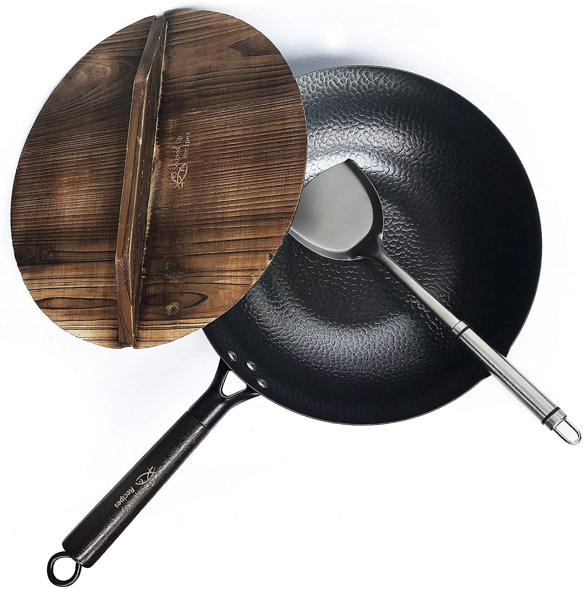
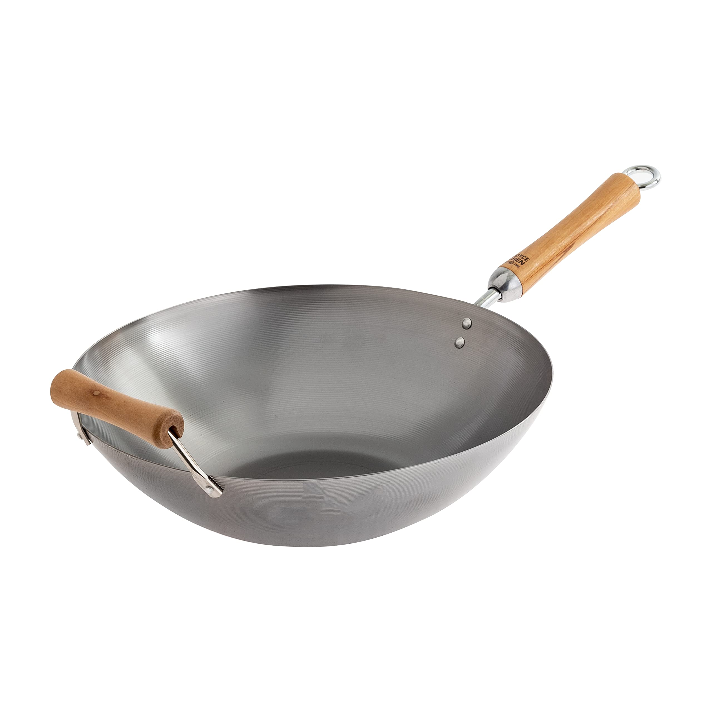

# Wok

A wok is the cornerstone of stir-frying and a uniquely versatile tool for any kitchen. Given its use in high-heat cooking, selecting a wok made from safe, non-toxic materials is critical. This guide provides a research-driven breakdown of wok types to find the best option for stir-frying noodles, sauces, vegetables, and meat, while prioritizing health and authentic performance.

---

## Phase 1: Researching the Field

Understanding the key terms and principles behind wok cooking is essential before choosing a specific product.

### Keywords, Terms and Concepts

1.  **Performance & Technique**
    *   **Wok Hei:** Literally "breath of the wok," this is the complex, smoky flavor imparted to food when stir-frying in a seasoned wok over very high heat. It is the hallmark of authentic stir-fry and is best achieved with materials that can handle intense, responsive heat, like carbon steel.
    *   **Seasoning:** The process of creating a natural, non-stick surface by heating thin layers of oil onto the metal, causing them to polymerize. A well-developed seasoning (patina) protects the wok from rust, prevents food from sticking, and improves with every use.

2.  **Anatomy & Construction**
    *   **Bottom Shape:** Woks come with either a **round bottom** (traditional, for gas stoves, requires a wok ring) or a **flat bottom** (modern, for electric/induction cooktops).
    *   **Handles:** The most common styles are a single, long **pow handle** (for tossing) or two smaller, loop-style **Cantonese handles** (for lifting).
    *   **Gauge:** The thickness of the metal. A lower gauge number means a thicker metal (e.g., 14-gauge is thicker and more durable than 16-gauge). 14-gauge (~2.0mm) is considered a great balance of durability and heat responsiveness.
    *   **Manufacturing:** Woks can be **hand-hammered** (prized for texture that helps food cling to the sides) or **stamped/spun** (machine-made, generally smoother and more uniform).

### Guiding Questions

1.  **What material is best for achieving "wok hei"?**
    Carbon steel is universally recognized as the superior material. Its ability to heat up quickly, respond instantly to temperature changes, and withstand extremely high heat is essential for generating the characteristic smoky aroma and flavor.

2.  **What are the primary health considerations for woks?**
    The main concerns are similar to other cookware: avoiding synthetic non-stick coatings (PTFE/PFAS) that can degrade at high stir-frying temperatures, and minimizing the leaching of unwanted metals. Carbon steel and cast iron are generally considered safe, leaching only small, non-harmful amounts of dietary iron.

3.  **What's more important: heat retention or heat responsiveness?**
    For stir-frying, **heat responsiveness** is generally more critical. The cook needs to be able to rapidly change the temperature, which is a key advantage of lighter-weight carbon steel. Cast iron has excellent heat retention but is slow to heat up and cool down, making it less ideal for dynamic stir-frying.

4.  **Do I need a round-bottom or flat-bottom wok?**
    This depends entirely on your cooktop.
    *   **Gas stove:** A round-bottom wok with a wok ring is the most traditional and effective setup.
    *   **Electric coil, glass, or induction:** A flat-bottom wok is necessary for stability and proper heat contact.

5.  **Is seasoning a wok difficult?**
    It requires an initial effort and some ongoing maintenance, but it is not difficult. The initial process involves thoroughly scrubbing off any factory coating, then heating the wok to a high temperature and applying thin layers of oil until a dark patina forms. Regular use strengthens the seasoning.

---

## Phase 2: Defining My Needs & Priorities

Now that I understand the landscape, I can clearly define what I'm looking for.

1.  **Primary Use Case(s):**
    *   High-heat stir-frying of meats and vegetables.
    *   Making large-volume noodle and rice dishes.
    *   Preparing saucy dishes that require quick, high-heat cooking.
2.  **Key Features Needed (Health & Safety):**
    *   **Material Purity:** Must be free of PFOA, PFAS, lead, cadmium, and other synthetic coatings. The material must be stable at very high temperatures.
3.  **Key Features Needed (Performance):**
    *   **Superior Heat Responsiveness:** Must heat up and cool down quickly for precise temperature control.
    *   **High-Heat Tolerance:** Must withstand temperatures well above 500°F (260°C) without degrading.
    *   **Natural Non-Stick:** Must be able to develop a reliable, seasoned non-stick surface.
    *   **Cooktop Compatibility:** Must have a flat bottom suitable for electric/induction cooktops.
    *   **Ergonomics:** Should be lightweight enough to maneuver, ideally with a long main handle and a smaller helper handle.
4.  **Nice to Have:**
    *   A well-regarded brand with a reputation for quality craftsmanship.
    *   A comfortable wooden handle that stays cool.
5.  **Deal-breakers:**
    *   Any synthetic non-stick coating.
    *   Materials that cannot handle high heat (e.g., most non-stick woks).
    *   Excessive weight that prevents tossing and maneuvering.
    *   A round bottom that would be unstable on my cooktop.
6.  **Budget Range:** Flexible for a high-quality, durable, and healthy wok.

---

## Phase 3: Comparing & Choosing the Item *Type*

First, I need to decide on the best *type* of wok for my needs based on its material.

### Available Types

#### 1. Carbon Steel
*   **Pros:**
    *   Excellent heat responsiveness allows for precise temperature control.
    *   Can handle the very high temperatures needed for authentic stir-frying.
    *   Develops a slick, durable, and natural non-stick patina over time.
    *   Free of PFOA, PFAS, and other synthetic chemicals.
    *   Extremely durable and relatively lightweight.
*   **Cons:**
    *   Requires initial and ongoing seasoning to prevent rust and maintain the non-stick surface.
    *   Reactive with acidic foods, which can strip the seasoning.
    *   Can rust if not dried thoroughly.

#### 2. Cast Iron
*   **Pros:**
    *   Unmatched heat retention, keeping the wok very hot even when food is added.
    *   Extremely durable and can be seasoned to a non-stick surface.
    *   Free of synthetic chemicals.
*   **Cons:**
    *   Very heavy, making tossing and maneuvering difficult.
    *   Slow to heat up and cool down, reducing temperature control.
    *   Requires seasoning and is reactive to acidic foods.

#### 3. Stainless Steel (Clad)
*   **Pros:**
    *   Completely non-reactive, making it safe for all ingredients.
    *   Durable, corrosion-resistant, and requires no seasoning.
*   **Cons:**
    *   Food is very prone to sticking without careful heat management and oil use.
    *   Inferior heat responsiveness compared to carbon steel.
    *   Potential for minimal leaching of nickel/chromium, a concern for sensitive individuals.

#### 4. Non-Stick Coated (PTFE or "Ceramic")
*   **Pros:**
    *   Excellent food release with less oil when the coating is new.
    *   Easy to clean.
*   **Cons:**
    *   Not suited for the high temperatures of traditional wok cooking, which can damage the coating.
    *   Limited durability; coatings can scratch and wear out quickly.
    *   Cannot achieve "wok hei."

### Comparison Table of Types

| Type | High-Heat Performance | Non-Stick Surface | Non-Reactive | Low Maintenance | Overall Match |
|---|:---:|:---:|:---:|:---:|:---:|
| **Carbon Steel** | :white_check_mark: | :white_check_mark: | | | 2 / 4 |
| **Cast Iron** | :white_check_mark: | :white_check_mark: | | | 2 / 4 |
| **Stainless Steel** | | | :white_check_mark: | :white_check_mark: | 2 / 4 |
| **Non-Stick Coated**| :x: | :white_check_mark: | :white_check_mark: | :white_check_mark: | 3 / 4 |

### Conclusion on Item Type

The table above can be misleading if viewed without context. While **Non-Stick Coated** gets a high score on paper, its primary failure (`:x:`) on **High-Heat Performance** is a deal-breaker for the core function of a wok.

The true contest is between Carbon Steel and Cast Iron. For the dynamic, responsive cooking required for stir-frying, **Carbon Steel** is the clear winner. Its ability to heat quickly and be physically maneuvered is paramount.

Therefore, the best strategy is to select a **Flat-Bottom Carbon Steel Wok**, as it perfectly aligns with the high-priority needs for performance and safety on a modern cooktop.

---

## Phase 4: Choosing the Specific *Product*

Now that I've decided on a Flat-Bottom Carbon Steel Wok, I'll compare specific products suitable for an electric cooktop.

### Product Options

#### 1. Yosukata Carbon Steel Wok (13.5-inch Flat Bottom)

1.  **Pros:**
    *   Excellent performance and heat responsiveness.
    *   Durable, often made from high-quality 14-gauge carbon steel.
    *   Comfortable wooden handle that stays cool, plus a helper handle.
2.  **Cons:**
    *   Higher price point compared to entry-level woks.
3.  **Community Opinion:** Very positive feedback across Reddit and YouTube for its out-of-the-box performance, especially on Western stoves. Regarded as a top-tier choice for home cooks.
4.  **Price:** $$

#### 2. Souped Up Recipes Carbon Steel Wok (Flat Bottom)

1.  **Pros:**
    *   Wide flat bottom provides good contact with electric burners.
    *   Often comes pre-seasoned and as a complete kit with a lid and spatula.
    *   Good value for a full package.
2.  **Cons:**
    *   Some users find it slightly heavier than other carbon steel woks of a similar size.
3.  **Community Opinion:** Popular among followers of the YouTube channel and praised for being a complete, well-thought-out kit for beginners. Some experienced users find it a bit heavy.
4.  **Price:** $$

#### 3. Joyce Chen Carbon Steel Wok (Flat Bottom)

1.  **Pros:**
    *   Very affordable, making it a great entry-level option.
    *   Lightweight and easy to handle.
    *   Performs well once a good seasoning is established.
2.  **Cons:**
    *   The factory coating requires thorough scrubbing before the first seasoning.
    *   The thinner metal (often 15 or 16-gauge) may be more prone to warping over time with very high heat on electric stoves.
3.  **Community Opinion:** Often recommended as a reliable, inexpensive "first wok" on forums. The main advice from the community is to be prepared to put some effort into stripping the factory coating and doing a proper initial seasoning.
4.  **Price:** $

### Comparison Table of Products

| Product | Performance | Ease of Use | Build Quality | Community Opinion | Price |
|---|:---:|:---:|:---:|:---:|:---:|
| **Yosukata Wok** | :white_check_mark: | :white_check_mark: | :white_check_mark: | :white_check_mark: | $$ |
| **Souped Up Recipes Wok**| :white_check_mark: | :white_check_mark: | | :white_check_mark: | $$ |
| **Joyce Chen Wok** | :white_check_mark: | | | :white_check_mark: | $ |

### Conclusion on Specific Product

My choice is the **Yosukata Carbon Steel Wok (13.5-inch Flat Bottom)**.

**Reasoning:** It represents the best balance of quality, performance, and design. Reviews consistently praise its durability and heat distribution, even on electric stovetops. The combination of a comfortable wooden handle and a helper handle provides a significant ergonomic advantage. While the other woks are excellent for their respective price points, the Yosukata's superior build quality makes it the best choice for a long-term, buy-it-for-life investment.

**Where to Buy:**
*   [Yosukata 13.5" Carbon Steel Wok Pan on Amazon](https://www.amazon.com/Yosukata-Carbon-Steel-Wok-Pan/dp/B084DQYV8R/)

---

## Phase 5: Post-Purchase Guide

Properly preparing and maintaining your new carbon steel wok is crucial for developing a non-stick surface and ensuring its longevity.

### 1. Unboxing and Initial Setup
*   **Remove Factory Coating:** New carbon steel woks are shipped with a protective coating to prevent rust. This must be removed. Scrub the entire wok, inside and out, with hot, soapy water and a coarse scouring pad or steel wool. Your goal is to get to the bare metal.
*   **Initial Heating (Bluing):** Dry the wok completely. Place it over high heat. The metal will change color, turning from silver to blue and then to a dark grey. This process, known as bluing, opens the pores of the metal to accept the seasoning oil. Ensure you heat all surfaces, including the sides.
*   **Initial Seasoning:** Once the wok is blued and while it's still very hot, carefully apply a very thin layer of a high-smoke-point oil (like grapeseed, canola, or a dedicated seasoning blend) to the entire interior surface with a paper towel held by tongs. Let the oil smoke off for a few minutes until it stops, then wipe away any excess. Repeat this process 3-4 times to build up the initial layers of seasoning.

### 2. Daily/Regular Use & Care
*   **Best Practices for Use:** Always preheat your wok for a minute or two before adding oil. Swirl the oil to coat the sides before adding your ingredients. This helps prevent sticking.
*   **Cleaning Routine:** After cooking, while the wok is still warm, wash it with hot water and a gentle scrubber (like a bamboo wok brush or a non-abrasive sponge). **Avoid soap** if possible, as it can strip the seasoning. For stuck-on food, you can boil a little water in the wok to loosen it.
*   **Drying & Oiling:** **Immediately** after washing, dry the wok thoroughly by hand, then place it back on the stove over low heat for a minute to evaporate all moisture. This is the most critical step to prevent rust. Once dry, wipe a very thin layer of oil onto the interior surface before storing.

### 3. Periodic Maintenance
*   **Deep Cleaning/Stripping:** If your seasoning becomes sticky, uneven, or if rust develops, you may need to strip it and start over. Scrub the wok down to the bare metal with steel wool and repeat the initial setup steps.
*   **Re-seasoning:** If the seasoning looks a bit thin or you accidentally scraped some off, simply perform a "maintenance season" by heating the wok and applying a thin layer of oil as you would after cleaning.

---

## Phase 6: Essential Accessories & Add-Ons

A few specific tools are designed for wok cooking and make the experience much better.

### 1. Wok Spatula (Chuan)
*   **What to Look For:** A long-handled spatula with a curved edge that perfectly matches the contour of the wok. This allows you to get under food and toss it effectively. Stainless steel is the classic choice for carbon steel woks.
*   **Recommendation:** A classic stainless steel wok spatula.
*   **Where to Buy:** [ZhenSanHuan Chinese Wok Spatula on Amazon](https://www.amazon.com/dp/B07D31CC8S)

### 2. Wok Ladle (Hoak)
*   **What to Look For:** A large, deep ladle used for scooping up liquids and sauces from the bottom of the wok. Often paired with the spatula.
*   **Recommendation:** A stainless steel wok ladle.
*   **Where to Buy:** [ZhenSanHuan Chinese Wok Ladle on Amazon](https://www.amazon.com/dp/B07D3228R6)

### 3. Bamboo Wok Brush
*   **What to Look For:** A bundle of split bamboo used for cleaning the wok under running hot water. It's stiff enough to remove food particles without damaging the seasoning.
*   **Recommendation:** A standard 10-inch bamboo wok brush.
*   **Where to Buy:** [Helen's Asian Kitchen Bamboo Wok Brush on Amazon](https://www.amazon.com/dp/B00012K51C)

---

## Sources & Further Reading

This section includes a mix of general cookware safety information and articles/reviews specifically focused on woks.

**Wok-Specific Reviews & Guides:**

1.  Serious Eats - "To Find the Best Woks for Stir Frying and More, We Smoked up Our Kitchen"
    *   *Link:* https://www.seriouseats.com/best-woks-5218113
    *   *Note:* Detailed review of primarily carbon steel woks, discusses why carbon steel is preferred, seasoning, and specific brand recommendations.
2.  Food & Wine - "The 6 Best Woks of 2024, According to Our Tests"
    *   *Link:* https://www.foodandwine.com/best-woks-7973555
    *   *Note:* Reviews various wok types including carbon steel and cast iron, discussing pros, cons, and top picks like Yosukata and Lodge.
3.  America's Test Kitchen - "The Best Woks"
    *   *Link:* https://www.americastestkitchen.com/equipment_reviews/2120-woks
    *   *Note:* Compares carbon steel and lightweight cast iron woks, emphasizing factors like weight, handle design, and seasoning.
4.  Epicurious - "The Best Wok Pans for Stir-Frying at Home, Tested and Reviewed"
    *   *Link:* https://www.epicurious.com/expert-advice/the-best-wok-for-stir-frying-at-home-article
    *   *Note:* Focuses on carbon steel flat-bottom woks and discusses key features for home use.

**General Cookware Health & Safety (from Pan Research - relevant for material understanding):**

5.  Consumer Reports - "You Can't Always Trust Claims on 'Non-Toxic' Cookware"
    *   *Link:* https://www.consumerreports.org/toxic-chemicals-substances/you-cant-always-trust-claims-on-non-toxic-cookware-a4849321487/
    *   *Note:* Discusses PFAS in non-stick pans and the reliability of "PFOA-free" claims.
6.  LeafScore - "Caraway Cookware and Heavy Metals: Which Tests Should We Believe?"
    *   *Link:* https://www.leafscore.com/eco-friendly-kitchen-products/answering-reader-questions-about-caraway-cookware-and-greenwashing/
    *   *Note:* Discusses ceramic coatings (sol-gel) and testing methods.
7.  I'm Plastic Free - "11 Truly Non-Toxic Cookware Brands, Tested & Reviewed"
    *   *Link:* https://www.implasticfree.com/non-toxic-cookware-brands/
    *   *Note:* Reviews various materials including cast iron, stainless steel, carbon steel, glass, and pure ceramic.
8.  NutritionFacts.org - "Is Stainless Steel or Cast Iron Cookware Best? Is Teflon Safe?"
    *   *Link:* https://nutritionfacts.org/blog/is-stainless-steel-or-cast-iron-cookware-best-is-teflon-safe/
    *   *Note:* Discusses iron leaching from cast iron and nickel/chromium from stainless steel.

---

## Join the Conversation

*   What are your experiences with different wok materials?
*   Any favorite brands or specific wok models you recommend for healthy cooking?
*   Tips for seasoning and maintaining a carbon steel or cast iron wok?

---

*Disclaimer: This is a log of my personal research. Product features, prices, and safety information are subject to change and require individual verification. Always consult with experts for health advice.*
