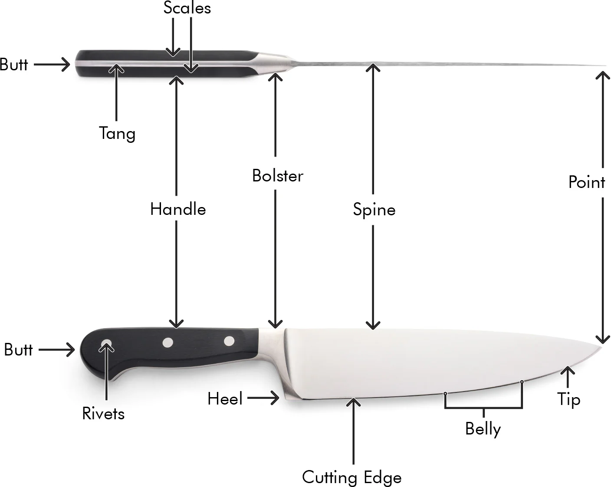

# Kitchen Knife

This guide will go through the key concepts, compare the options, and provide specific recommendations for building a high-quality, long-lasting, and stylish knifes every household needs.

---

## Phase 1: Researching the Field

### Keywords, Terms and Concepts

Understanding the landscape is the first step. This section explains the terminology and concepts needed to make an informed choice.

1. Anatomy of a Knife
    

    *   **Point & Tip:** The point is the very end used for piercing. The tip is the front third of the blade, used for fine, delicate work.
    *   **Edge:** The sharp cutting surface.
    *   **Heel:** The rear part of the edge, used for tasks requiring more force.
    *   **Spine:** The thick, unsharpened top of the blade. A smooth, rounded spine is a mark of quality and comfort.
    *   **Bolster:** The thick junction between the handle and the blade. A **full bolster** runs to the heel, protecting the hand but making sharpening the full edge difficult. A **semi-bolster** or **no bolster** allows use of the entire blade edge.
    *   **Tang:** The part of the steel that extends into the handle. A **full tang**, where the steel runs the entire length and width of the handle, is the most durable construction method.
    *   **Handle (or Scales):** The part you hold, made from various materials.
    *   **Rivets:** Metal pins used to secure the handle to the tang.

2. Styles & Philosophies: German vs. Japanese Knives
    *   **German (Western) Knives:**
        *   **Philosophy:** Robustness and durability. They are kitchen workhorses.
        *   **Steel:** Softer steel (Rockwell hardness of ~56-58 HRC), which is tough and less prone to chipping, but loses its fine edge faster.
        *   **Edge Angle:** Typically a wider angle (18-22 degrees per side), contributing to durability.
        *   **Shape:** Heavier, with a thicker blade and a pronounced curve ("belly"), ideal for a "rocking-chopping" motion.
        *   **Maintenance:** Responds very well to a honing steel for regular edge realignment.
    *   **Japanese Knives:**
        *   **Philosophy:** Precision and sharpness. They are kitchen scalpels.
        *   **Steel:** Harder, more brittle steel (~60-63+ HRC), which holds a razor-sharp edge for a very long time but is more susceptible to chipping.
        *   **Edge Angle:** A more acute angle (12-16 degrees per side), resulting in incredible sharpness.
        *   **Shape:** Lighter, with a thinner blade and a straighter profile, ideal for precise slicing and push-cuts.
        *   **Maintenance:** Harder steel does not respond well to honing (risk of micro-fractures). They require sharpening on whetstones when they eventually dull.

3. Common Knife Types
    *   **Chef's Knife / Gyuto:** The all-purpose hero (typically 8 inches / 20cm). A Gyuto is the Japanese equivalent, often lighter and thinner.
    *   **Paring Knife:** A small knife (3-4 inches) for peeling, coring, and delicate in-hand work.
    *   **Serrated / Bread Knife:** A long knife with a serrated edge, perfect for items with a hard exterior and soft interior (bread, tomatoes).
    *   **Utility / Petty Knife:** A mid-sized knife (4-6 inches) that bridges the gap between a paring and chef's knife. Petty is the Japanese term.
    *   **Santoku:** A popular Japanese all-purpose knife (5-7 inches) with a sheepsfoot tip. Its name means "three virtues" (slicing, dicing, mincing).

4. Blade & Handle Materials
    *   **Blade Steel:**
        *   **High-Carbon Stainless Steel:** The modern standard for quality knives (e.g., German X50CrMoV15, Japanese VG-10/VG-MAX). It combines the sharpness and edge retention of carbon steel with the rust-resistance of stainless steel.
        *   **Carbon Steel:** Prized by professionals for its incredible sharpness. It is highly reactive and will rust if not meticulously cared for.
        *   **Construction (Forged vs. Stamped):** Forged knives are made from a single bar of steel, are generally heavier, and have a bolster. Stamped knives are cut from a sheet of steel, are lighter, and less expensive. A well-made stamped knife can still be an excellent performer.
    *   **Handle Materials:**
        *   **Synthetics (POM, Fibrox):** Extremely durable, waterproof, and low-maintenance. POM (Polyoxymethylene) is a hard, dense thermoplastic used in high-end German knives. Fibrox is the textured, high-grip synthetic used by Victorinox.
        *   **Wood Composites (Pakkawood):** A composite of wood and resin. Offers the beauty of wood with the durability and water-resistance of a synthetic.
        *   **Natural Wood:** Beautiful but requires maintenance (oiling) and can be less sanitary if not cared for.
        *   **G-10:** A high-end fiberglass laminate that is exceptionally tough, lightweight, and stable. Virtually indestructible.

### Guiding Questions

1.  **What makes a knife "good"?**
    It's a combination of steel quality (for edge retention and durability), geometry (a thin blade cuts with less resistance), ergonomics (comfort and balance), and construction (full tang for durability).
2.  **Why do I need more than one knife?**
    Different knives are designed for different tasks. Using an 8-inch chef's knife to peel a garlic clove is clumsy and unsafe, while trying to slice a large loaf of bread with a paring knife is ineffective. The core trio (Chef's, Paring, Serrated) covers over 95% of kitchen tasks efficiently.
3.  **Honing vs. Sharpening: What's the difference?**
    **Honing** is maintenance. It realigns the microscopic teeth of the blade's edge that get bent out of shape with regular use. It should be done frequently (e.g., every few uses). **Sharpening** is repair. It grinds away metal to create a brand new, sharp edge. It is done much less frequently (e.g., every 6-12 months).

---

## Phase 2: Defining My Needs & Priorities

Now that I understand the landscape, I can clearly define what I'm looking for.

*   **Primary Use Case(s):**
    *   Daily home cooking, covering a wide range of tasks from chopping dense vegetables and butchering poultry to delicate slicing and peeling.
    *   The goal is to build a core set of 3-4 knives that can handle over 95% of all kitchen tasks without needing a massive collection.
*   **Key Features Needed:**
    1.  **Performance & Durability (The Non-Negotiables)**
        *   **Steel Quality:** Must use high-quality, high-carbon stainless steel that provides a great balance of long-lasting edge retention and toughness to resist chipping.
        *   **Construction:** Must have a full-tang construction for maximum durability and balance.
        *   **Geometry:** The blade must be ground thin enough to slice effortlessly, without feeling flimsy.
    2.  **Ergonomics & Design**
        *   **Comfortable Handle:** The handle must be comfortable to hold in a pinch grip for extended prep sessions, without causing hotspots or fatigue.
        *   **Balance:** The knife should feel balanced in the hand, neither too blade-heavy nor too handle-heavy.
    3.  **Maintenance**
        *   **Ease of Care:** Must be relatively easy to maintain for a home cook. This means it should respond well to a honing steel for daily upkeep and not require specialist sharpening skills.
        *   **Corrosion Resistance:** The blade must be stainless and not require the meticulous, immediate-dry care of pure carbon steel.
*   **Nice to Have:**
    *   A classic, timeless aesthetic that looks good on a magnetic strip.
    *   A rounded spine for added comfort on the index finger during prolonged use.
*   **Deal-breakers:**
    *   Knives that are overly brittle and prone to chipping (eliminates some ultra-hard Japanese steels for a general-purpose role).
    *   Poor ergonomics, bad balance, or handles that become slippery when wet.
    *   Partial-tang or unsealed wood handles that will not stand up to long-term use.
*   **Budget Range:** Seeking the point of diminishing returns. Willing to invest in a premium "buy it for life" workhorse knife, complemented by high-value support knives. Not looking for the absolute cheapest, but the best performance-for-price ratio.

---

## Phase 3: Comparing & Choosing the Item *Type*

To build an effective set, I first need to decide which *types* of knives are essential. The goal is to cover the maximum number of kitchen tasks with the minimum number of specialized blades.

### Available Types

#### 1. The Chef's Knife (German) / Gyuto (Japanese)

The indispensable all-rounder, typically 8" (20cm) long. This is the primary knife for about 80% of cutting tasks.

1.  **Pros:**
    *   **Versatility:** The curved blade profile excels at the "rock-chopping" motion common in Western kitchens, making it ideal for dicing, mincing, and general chopping.
    *   **Durability:** The German style's softer steel and robust build make it a forgiving workhorse that can handle everything from delicate herbs to dense butternut squash.
2.  **Cons:**
    *   **Less Specialized:** Not as nimble as a paring knife for small tasks, and lacks the "sawing" power of a serrated blade for bread.

#### 2. The Paring Knife

A small, agile knife with a 3-4" blade for in-hand work and fine details.

1.  **Pros:**
    *   **Precision & Control:** Perfect for peeling fruits and vegetables, deveining shrimp, coring tomatoes, and other delicate tasks where a large knife is unsafe or clumsy.
2.  **Cons:**
    *   **Limited Scope:** Its small size makes it unsuitable for chopping or slicing larger items on a cutting board.

#### 3. The Serrated / Bread Knife

A long (10"+) knife with a toothed edge, designed for sawing through food.

1.  **Pros:**
    *   **Handles Specific Textures:** Effortlessly slices through items with a hard crust and soft interior (like bread) or delicate, slippery skins (like tomatoes) without crushing them.
2.  **Cons:**
    *   **Tears, Not Slices:** The serrated edge is aggressive and not suitable for clean, fine cuts on vegetables or meat.
    *   **Difficult to Sharpen:** Requires specialized tools to sharpen at home.

#### 4. The Santoku

A Japanese-style all-purpose knife, typically 5-7" long, with a flatter edge and a "sheepsfoot" tip.

1.  **Pros:**
    *   **Excellent for Slicing:** The flatter profile is ideal for clean, downward push-cuts, making it a favorite for slicing vegetables and boneless proteins. Often features hollow-ground dimples (kullenschliff) to reduce friction.
2.  **Cons:**
    *   **Less Suited for Rock-Chopping:** The straight edge makes the rocking motion less effective than a German Chef's knife.
    *   **Overlaps with Chef's Knife:** For a minimalist set, its role is largely redundant if you already have a Chef's Knife/Gyuto.

### Comparison Table of Types

| Type | General Chopping | Fine/In-Hand Work | Slicing Bread | Precision Slicing | Overall Versatility |
| --- | :---: | :---: | :---: | :---: | :---: |
| **Chef's Knife / Gyuto** | :white_check_mark: | | | :white_check_mark: | 5 / 5 |
| **Paring Knife** | | :white_check_mark: | | | 2 / 5 |
| **Serrated / Bread Knife** | | | :white_check_mark: | | 2 / 5 |
| **Santoku** | :white_check_mark: | | | :white_check_mark: | 4 / 5 |

### Conclusion on Item Type

Based on the goal of creating a minimal yet comprehensive set, the choice is clear. The **Santoku** largely overlaps with the **Chef's Knife**, making it redundant for a core collection.

The most effective strategy is to build a **Core Trio** that covers all bases with no functional overlap:

1.  **A Chef's Knife:** For the vast majority of on-board chopping and slicing.
2.  **A Paring Knife:** For all small, in-hand, and precision tasks.
3.  **A Serrated Knife:** For the specific but common tasks of slicing bread and delicate-skinned fruits.

This trio provides a complete system for any home kitchen. The German (Western) style for the Chef's Knife is chosen for its durability and ease of maintenance, which aligns with the needs defined in Phase 2.

---

### Final Conclusion on Products

My final decision is to adopt a "premium workhorse, value specialists" strategy, which provides the best balance of performance, longevity, and cost-effectiveness. This focuses the investment on the most-used knife while leveraging the incredible value of the market-leading budget options for the supporting roles.

*   **Chef's Knife (The Workhorse):** **Messermeister Meridian Elite 8-Inch Chef's Knife**
    *   **Reasoning:** This is a "buy it for life" investment. It offers the full quality of a top-tier Solingen forged knife but with the practical advantage of a bolsterless design, making it far easier to sharpen and maintain over its lifetime. It represents the point of diminishing returns for a Chef's Knife perfectly.
*   **Paring Knife (The Specialist):** **Victorinox Swiss Classic 3.25-Inch Paring Knife**
    *   **Reasoning:** The benefits of expensive forged steel are minimal in a small paring knife. The Victorinox is absurdly sharp, nimble, and so affordable that it's the undisputed value champion. There is no logical reason to spend more.
*   **Serrated Knife (The Specialist):** **Mercer Culinary Millennia 10-Inch Bread Knife**
    *   **Reasoning:** Serrated knives are difficult and often not cost-effective to sharpen. The Mercer is a workhorse praised by America's Test Kitchen and Wirecutter for its aggressive bite and effectiveness. At its low price, it can be used for years and replaced without a second thought.

This trio provides a complete, high-performance kitchen knife set for under $200 that will last for decades with proper care.

*   **Where to Buy:**
    *   [Messermeister Meridian Elite 8-Inch Chef's Knife](https://www.amazon.com/dp/B00005MEG9)
    *   [Victorinox Swiss Classic 3.25-Inch Paring Knife](https://www.amazon.com/dp/B0019WXPQY)
    *   [Mercer Culinary Millennia 10-Inch Bread Knife](https://www.amazon.com/dp/B000PS1L84)

---

## Phase 4: Choosing the Specific *Product*

Now I'll select specific products for each role in the German-style trio. Each category will present a range from undisputed "buy-it-for-life" options to high-value budget champions.

### 1. The Chef's Knife (Workhorse)

This is the most important knife in the set. The goal is a durable, all-purpose 8-inch forged knife that can handle daily, heavy use.

##### 1. Wüsthof Classic 8-Inch Chef's Knife

*   **Pros:** The benchmark for a German chef's knife. Impeccable build quality, perfect balance, and a durable, easy-to-maintain edge. Forged from a single piece of high-carbon steel with a full tang for stability. A true "buy it for life" tool.
*   **Cons:** Premium price point. The full bolster can make sharpening the entire length of the blade difficult for beginners.
*   **Community Opinion:** Revered as a classic for a reason. The default recommendation for a serious home cook's first "real" knife.
*   **Price:** `$$$` (~$160)

##### 2. Zwilling J.A. Henckels Pro 'S' 8-Inch Chef's Knife

*   **Pros:** Wüsthof's direct competitor from Solingen. Features a very similar forged construction, high-carbon steel, and classic three-rivet design. Many users prefer the slightly different handle ergonomics to the Wüsthof.
*   **Cons:** Also a premium price. The differences between this and the Wüsthof Classic are minimal and often come down to personal preference.
*   **Community Opinion:** Often debated head-to-head with the Wüsthof Classic. Considered an equal in quality and performance.
*   **Price:** `$$$` (~$160)

##### 3. Messermeister Meridian Elite 8-Inch Chef's Knife

*   **Pros:** A cult favorite among knife enthusiasts. Hot-drop forged with a bolsterless heel, making sharpening the entire blade much easier. Praised for its hand-finished quality and slightly thinner blade profile.
*   **Cons:** Less brand recognition and retail availability than Wüsthof or Zwilling. Can feel slightly less hefty to those used to a full bolster.
*   **Community Opinion:** Seen as a top-tier alternative for those who want the quality of a Solingen knife but with features (like the bolsterless design) the big two don't offer.
*   **Price:** `$$$` (~$150)

##### 4. Mercer Culinary Renaissance 8-Inch Chef's Knife

*   **Pros:** Offers a forged German steel blade and full-tang construction at a fraction of the price of the premium brands. An incredible value proposition.
*   **Cons:** Fit and finish are not as refined as the premium German knives. Balance may not be as perfect.
*   **Community Opinion:** Widely recommended as the best "budget forged" knife. The go-to for culinary students or home cooks wanting forged quality without the high price tag.
*   **Price:** `$$` (~$60)

##### 5. Victorinox Fibrox Pro 8-Inch Chef's Knife

*   **Pros:** The undisputed king of value. The stamped blade is incredibly sharp for the price, and the Fibrox handle is famously grippy and non-slip. Used by countless professionals as a "beater" knife.
*   **Cons:** Stamped blade feels less balanced and substantial than a forged one. Utilitarian, non-premium aesthetic. Lacks the long-term edge retention of forged steel.
*   **Community Opinion:** The default recommendation for a first chef's knife, a knife for a professional kitchen, or anyone on a strict budget.
*   **Price:** `$` (~$45)

#### Comparison Table: Chef's Knife

| Product | Style | Construction | Feel & Balance | Price |
| --- | :---: | :---: | :---: | :---: |
| **Wüsthof Classic** | Premium German | Forged, Full Bolster | Heavy, Substantial | `$$$` |
| **Zwilling Pro 'S'** | Premium German | Forged, Full Bolster | Heavy, Substantial | `$$$` |
| **Messermeister Meridian Elite** | Premium German | Forged, No Bolster | Agile, Hand-Finished | `$$$` |
| **Mercer Renaissance** | Value German | Forged, Full Bolster | Good Value, Functional | `$$` |
| **Victorinox Fibrox Pro** | Value Swiss | Stamped, No Bolster | Lightweight, Grippy | `$` |

### 2. The Paring Knife (Precision)

The second most-used knife. Used for all in-hand tasks like peeling, coring, and intricate work. A 3.5-inch blade is ideal.

##### 1. Wüsthof Classic 3.5-Inch Paring Knife

*   **Pros:** Matches the Chef's Knife for a consistent set. Forged blade provides excellent strength for tasks like splitting vanilla beans or coring apples. Perfect balance and feel.
*   **Cons:** Very expensive for a paring knife, where the benefits of forged steel are less pronounced than in a chef's knife.
*   **Community Opinion:** A luxury, "buy it for life" paring knife. Praised for quality but many question the value proposition.
*   **Price:** `$$$` (~$80)

##### 2. MAC Professional Series 3.25-Inch Paring Knife

*   **Pros:** A high-end Japanese alternative. Extremely sharp, hard steel holds an edge for a very long time. Hefty, balanced feel makes it excellent for board work.
*   **Cons:** The razor-sharp heel can feel precarious for in-hand work if you're not careful. High price point.
*   **Community Opinion:** A favorite "upgrade" pick among reviewers for its incredible sharpness and build quality.
*   **Price:** `$$$` (~$70)

##### 3. Tojiro DP 3.5-Inch Paring Knife

*   **Pros:** Excellent Japanese steel (VG-10 core) that is extremely sharp and has great edge retention. A professional-quality tool at a very reasonable price.
*   **Cons:** The blade is more delicate and can be prone to chipping if misused (e.g., on frozen foods or bones). Requires careful hand-washing.
*   **Community Opinion:** Highly regarded as one of the best performance-for-price Japanese knives available.
*   **Price:** `$$` (~$60)

##### 4. Mercer Culinary Genesis 3.5-Inch Paring Knife

*   **Pros:** A forged paring knife at a fantastic price. The German steel is durable and the handle is comfortable and grippy.
*   **Cons:** Edge retention isn't as good as the more expensive options. Lacks the refined feel of premium knives.
*   **Community Opinion:** A solid step-up from the basic stamped knives for those who want a bit more heft and durability.
*   **Price:** `$` (~$18)

##### 5. Victorinox Swiss Classic 3.25-Inch Paring Knife

*   **Pros:** The undisputed best-value paring knife on the market. Incredibly sharp, nimble, and lightweight. The plastic handle is comfortable and grippy. So affordable it's practically disposable.
*   **Cons:** The blade is thin and flexible, which can be a pro or a con. Will not hold an edge as long as more expensive knives.
*   **Community Opinion:** The universal recommendation. A favorite of home cooks and professional chefs alike. Many people own several.
*   **Price:** `$` (~$8)

#### Comparison Table: Paring Knife

| Product | Style | Construction | Feel & Balance | Price |
| --- | :---: | :---: | :---: | :---: |
| **Wüsthof Classic** | Premium German | Forged | Heavy, Substantial | `$$$` |
| **MAC Professional** | Premium Japanese | Forged | Heavy, Sharp | `$$$` |
| **Tojiro DP** | Performance Japanese | Forged (VG-10) | Lightweight, Sharp | `$$` |
| **Mercer Genesis** | Value German | Forged | Good Value, Grippy | `$` |
| **Victorinox Swiss Classic** | Value Swiss | Stamped | Lightweight, Nimble | `$` |

### 3. The Serrated Knife (Specialist)

Used for slicing bread, delicate tomatoes, and other items with a hard exterior and soft interior. A 10-inch blade is preferred for versatility.

##### 1. Wüsthof Classic 10-Inch Super Slicer

*   **Pros:** A premium, forged serrated knife that matches the rest of the Classic line. Incredibly sharp, long blade that can handle large roasts as well as bread. Scalloped serrations create a very smooth cut.
*   **Cons:** Extremely expensive for a knife that is notoriously difficult to sharpen. Many argue that high-end steel is wasted on a serrated edge.
*   **Community Opinion:** A luxury item. Admired for its quality and performance, but most agree a budget serrated knife is sufficient.
*   **Price:** `$$$$` (~$200)

##### 2. Tojiro Bread Slicer 270mm (10.6-inch) F-687

*   **Pros:** An elegant and incredibly sharp Japanese bread knife. The thin, scalloped blade glides through cake, tomatoes, and roasts with almost no effort. A high-quality tool for a reasonable price.
*   **Cons:** The gentle scallops don't bite into very hard, crusty bread as aggressively as pointed serrations.
*   **Community Opinion:** A long-time Wirecutter upgrade pick. Praised for its beauty and exceptional slicing performance on delicate items.
*   **Price:** `$$` (~$72)

##### 3. MAC Superior Bread and Roast Slicer 10.5-Inch

*   **Pros:** Very similar in performance to the Tojiro. Extremely sharp, finely sharpened blade that slices with buttery smoothness. The curved blade provides extra leverage.
*   *Cons:* The rounded serrations can sometimes skid on the hardest crusts before biting in.
*   **Community Opinion:** A top-tier Japanese slicer often compared directly with the Tojiro.
*   **Price:** `$$` (~$80)

##### 4. Mercer Culinary Millennia 10-Inch Bread Knife

*   **Pros:** The undisputed "best value" bread knife. A favorite of America's Test Kitchen and Wirecutter. The sharp, pointed serrations bite aggressively into any crust, and the grippy, comfortable handle and long blade make it incredibly versatile.
*   **Cons:** Lacks the refinement and elegance of the Japanese slicers. The stamped blade is functional but not premium.
*   **Community Opinion:** The industry standard for a workhorse serrated knife. So affordable there's little reason to buy anything else unless you have specific aesthetic or slicing needs.
*   **Price:** `$` (~$25)

##### 5. Victorinox Swiss Army Fibrox Pro 10.25-Inch Bread Knife

*   **Pros:** Another top-tier value option. Long, curved blade with a very comfortable and grippy Fibrox handle. Performs nearly identically to the Mercer Millennia.
*   **Cons:** The serrations are slightly less aggressive than the Mercer, which can be a pro or a con depending on preference.
*   **Community Opinion:** Often recommended alongside the Mercer as a best-in-class budget option. The choice between them usually comes down to handle preference.
*   **Price:** `$` (~$35)

#### Comparison Table: Serrated Knife

| Product | Serration Style | Best For | Feel | Price |
| --- | :---: | :---: | :---: | :---: |
| **Wüsthof Super Slicer** | Scalloped | Roasts, Soft Bread | Heavy, Premium | `$$$$` |
| **Tojiro Bread Slicer** | Scalloped | Delicate Cakes, Tomatoes | Elegant, Agile | `$$` |
| **MAC Superior Slicer** | Rounded | General Slicing | Sharp, Smooth | `$$` |
| **Mercer Millennia** | Pointed | Crusty Bread, All-Purpose | Workhorse, Grippy | `$` |
| **Victorinox Fibrox Pro** | Pointed | Crusty Bread, All-Purpose | Workhorse, Grippy | `$` |

---

## Phase 5: Post-Purchase Guide

Proper care and maintenance are what separate a good knife from a great one, ensuring it lasts a lifetime.

### 1. Unboxing and Initial Setup

*   **Initial Inspection:** Check the knife for any defects from shipping.
*   **First-Time Cleaning:** Wash the new knives thoroughly by hand with warm, soapy water and dry them completely before first use. This removes any factory residue or polishing compounds.

### 2. Daily/Regular Use & Care

*   **Hand-Wash Only:** Never put a quality knife in the dishwasher. The high heat, harsh detergents, and jostling with other items will dull the blade, damage the handle, and can cause rust spots.
*   **Wash and Dry Immediately:** Wash and dry your knife by hand immediately after use, especially after cutting acidic foods like tomatoes or lemons. This prevents corrosion and staining.
*   **Use a Honing Steel:** For the Messermeister Chef's knife, frequent honing is key to maintaining its edge. Gently swipe the blade along a honing steel at a 15-20 degree angle, 3-4 times per side, before every few uses. This realigns the edge, it does *not* sharpen it. **Do not hone the serrated knife.**
*   **Proper Cutting Surface:** Always use a cutting board made of wood or plastic. Cutting on hard surfaces like glass, granite, or ceramic will instantly dull or chip your blade.

### 3. Periodic Maintenance

*   **Sharpening:** Honing only maintains an edge; it doesn't create a new one. When the knife feels dull and no longer responds to honing (typically every 6-12 months for home use), it needs to be sharpened. This can be done with:
    *   **Whetstones:** The traditional and most effective method, though it has a learning curve.
    *   **Manual Pull-Through Sharpeners:** A good option for beginners, but can remove more metal than necessary.
    *   **Professional Sharpening Service:** A great, worry-free option to get a perfect edge.

### 4. Long-Term Storage

*   Never toss knives unprotected into a drawer. This is dangerous and is the fastest way to dull and chip the blades.
*   **Good:** A wooden knife block or in-drawer tray.
*   **Better:** A wall-mounted magnetic strip. It saves counter space, allows air circulation, and makes it easy to see and grab the knife you need.

---

## Phase 6: Essential Accessories & Add-Ons

To protect your investment and keep your knives performing at their best, a few accessories are non-negotiable.

### 1. Honing Steel

*   **What to Look For:** A ceramic honing rod is an excellent all-purpose choice. It is slightly abrasive (finer than a diamond steel) and provides a very fine realignment of the edge, perfect for the German steel of the Messermeister.
*   **Recommendation:** [Idahone Fine Ceramic Honing Rod (12-inch)](https://www.amazon.com/dp/B0018R64E2)
*   **Where to Buy:** Amazon, specialty knife shops.

### 2. Sharpening System

*   **What to Look For:** For a beginner who wants to maintain their own knives without the steep learning curve of whetstones, a quality manual sharpener with angle guides is a great starting point.
*   **Recommendation:** [Chef'sChoice ProntoPro Manual Diamond Hone Sharpener](https://www.amazon.com/dp/B007IV6R42) - It has settings for both 15-degree (Asian) and 20-degree (European) knives and is highly rated.
*   **Where to Buy:** Amazon, Williams Sonoma.

### 3. Storage

*   **What to Look For:** A powerful, wall-mounted magnetic strip made of wood or stainless steel. Ensure it is long enough to hold your core trio with space in between each knife.
*   **Recommendation:** [360KnifeBlock Magnetic Knife Strip](https://www.amazon.com/360KnifeBlock-Magnetic-Holder-Organizer-Utensil/dp/B07S1T1Y7P) - Available in various woods and lengths to suit any kitchen.
*   **Where to Buy:** Amazon, Crate & Barrel.

---

## Phase 7: Sources & Further Reading

A collection of the most helpful articles and discussions used to inform these recommendations.

### Professional Reviews

*   [America's Test Kitchen: The Best Serrated (Bread) Knives](https://www.americastestkitchen.com/equipment_reviews/2497-the-best-serrated-bread-knives)
*   [America's Test Kitchen: The Best Paring Knives](https://www.americastestkitchen.com/equipment_reviews/1800-paring-knives)
*   [Serious Eats: The Best Bread Knives](https://www.seriouseats.com/best-bread-serrated-knives-equipment-review)
*   [Serious Eats: The Best Paring Knives](https://www.seriouseats.com/the-best-paring-knives)
*   [Wirecutter: The Best Serrated Bread Knife](https://www.nytimes.com/wirecutter/reviews/best-serrated-knife/)
*   [Wirecutter: The Best Paring Knife](https://www.nytimes.com/wirecutter/reviews/best-paring-knife/)
*   [Epicurious: The Best Paring Knife](https://www.epicurious.com/expert-advice/best-paring-knife-article)
*   [Prudent Reviews: Wusthof vs. Messermeister](https://prudentreviews.com/wusthof-vs-messermeister/)
*   [Knives & Gear: Mercer vs Victorinox](https://knivesngear.com/mercer-vs-victorinox/)

### Community Discussions

*   [Reddit: Good "bang for the buck" Chef's Knife?](https://www.reddit.com/r/Cooking/comments/186vdl5/good_bang_for_the_buck_chefs_knife/)
*   [rec.knives: Messermeister Knives...how do they compare to Wusthof & Henckels](https://rec.knives.narkive.com/ScXAzBgE/messermeister-knives-how-do-they-compare-to-wusthof-henckels)

<https://www.seriouseats.com/best-bread-serrated-knives-equipment-review>
<https://www.webstaurantstore.com/guide/553/choosing-a-chef-knife.html>
<https://www.kitchenknifeforums.com/threads/best-budget-value-workhorses-for-the-professional-kitchen.78902/>
<https://youtu.be/7R2jIyPvcx0?si=wsU8AQkQKhvkKuug>
<https://www.reddit.com/r/chefknives/comments/gpslh1/whats_the_best_serrated_knife/>
<https://www.sabatier-shop.com/kitchen-knives.html>

---

## Join the Conversation

*   What's in your essential knife kit?
*   Do you prefer German or Japanese style knives, and why?
*   Any tips for keeping your knives razor-sharp?

---

*Disclaimer: This is a log of my personal research and decision-making process. Product features and prices are subject to change. Opinions are my own based on the information available at the time of writing.*
