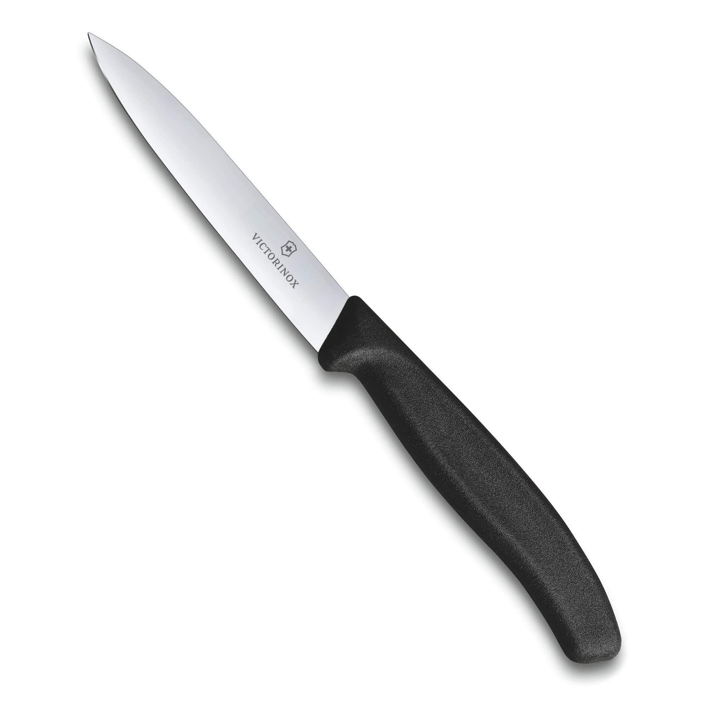

# Kitchen Knife

A good and sharp knife is the most essential tool in any kitchen. I'm cooking at home and I need some good knives for my use cases.
This guide will go through the key concepts, compare the options, and provide specific recommendations for building a high-quality, long-lasting, and stylish knife collection without breaking the bank.

## Defining My Needs & Priorities

Before diving in, let's establish the goals for this research.

*   **Knives Needed:** I listed the things I need a knife for, maybe even a knife for each task:
    1.  A versatile workhorse knife for most tasks like cutting meat and vegetables in the day to day.
    2.  A knife for small, in-hand, and precision tasks.
    3.  A knife for bread, tomatoes, and other soft/hard-skinned items.
*   **Key Features Desired:**
    *   **Performance:** Excellent sharpness and edge retention. Must be a clear upgrade from entry-level knives.
    *   **Maintenance:** Relatively easy to maintain with regular honing and occasional sharpening. No overly delicate or rust-prone materials.
    *   **Ergonomics & Style:** Comfortable to hold and use, with an appealing, stylish aesthetic.
    *   **Health:** Made from safe, high-quality, non-toxic materials.
*   **Budget:** Best-in-class value. Not the cheapest, but the best possible performance for a reasonable price—the point of diminishing returns.

---

## Researching the Field: An In-Depth Guide

Understanding the landscape is the first step. This section explains the terminology and concepts needed to make an informed choice.

### 1. Anatomy of a Knife

Understanding the parts of a knife helps in appreciating its design and function.

*   **Point:** The very tip of the blade, used for piercing.
*   **Tip:** The first third of the blade, used for fine, delicate work.
*   **Edge:** The sharp cutting surface of the blade.
*   **Heel:** The rear part of the edge, used for tasks requiring more force.
*   **Spine:** The thick, unsharpened top of the blade. A smooth, rounded spine is a mark of quality.
*   **Bolster:** The thick junction between the handle and the blade. A full bolster protects the hand but makes sharpening the heel difficult. A semi-bolster or no bolster allows use of the full blade.
*   **Tang:** The part of the steel that extends into the handle. A **full tang** runs the entire length of the handle and is considered the most durable construction.
*   **Handle (or Scales):** The part you hold, made from various materials.
*   **Rivets:** Metal pins used to secure the handle to the tang (on some designs).

### 2. Styles & Philosophies: German vs. Japanese Knives

The two major knife-making traditions offer different approaches to the ideal cutting tool.

*   **German (Western) Knives:**
    *   **Philosophy:** Robustness and durability. They are the workhorses of the kitchen.
    *   **Steel:** Softer steel (Rockwell hardness of 56-58 HRC), which makes them incredibly tough and less prone to chipping. The trade-off is that they lose their edge faster.
    *   **Edge Angle:** Typically sharpened to a 20-22 degree angle per side. This wider angle contributes to its durability.
    *   **Shape:** Heavier, with a thicker blade and a pronounced curve ("belly"), ideal for a "rocking-chopping" motion.
    *   **Maintenance:** The softer steel responds very well to a honing steel for regular realignment of the edge.

*   **Japanese Knives:**
    *   **Philosophy:** Precision and sharpness. They are the scalpels of the kitchen.
    *   **Steel:** Harder, more brittle steel (60-63+ HRC). This allows them to hold a razor-sharp edge for a very long time, but makes them more susceptible to chipping if misused.
    *   **Edge Angle:** Typically sharpened to a much more acute 12-15 degree angle per side, resulting in incredible sharpness.
    *   **Shape:** Lighter, with a thinner blade and a straighter profile, ideal for precise slicing and push cuts.
    *   **Maintenance:** Harder steel does not respond well to honing (it can cause micro-fractures). They require sharpening on whetstones when they eventually dull.

### 3. A Glossary of Common Knife Types

While we are focusing on three primary roles, it's useful to know the broader family of kitchen knives.

*   **Chef's Knife:** The all-purpose hero (6-12 inches). Can handle about 80% of kitchen cutting tasks.
*   **Gyuto:** The Japanese equivalent of the Chef's Knife. Often lighter and thinner, with a flatter profile.
*   **Santoku:** A popular Japanese all-purpose knife (5-7 inches) with a sheepsfoot tip. Its name means "three virtues" (slicing, dicing, mincing).
*   **Paring Knife:** A small knife (2-4 inches) for peeling, coring, and other delicate in-hand work.
*   **Serrated / Bread Knife:** A long knife with a serrated edge, perfect for cutting through items with a hard exterior and soft interior, like bread or tomatoes.
*   **Utility Knife:** A mid-sized knife (4-7 inches) that bridges the gap between a paring knife and a chef's knife, useful for sandwiches or larger vegetables.
*   **Boning Knife:** A thin, flexible blade (5-7 inches) designed to separate meat from bone.
*   **Nakiri:** A Japanese vegetable cleaver with a rectangular blade, designed for straight up-and-down chopping.
*   **Petty Knife:** The Japanese equivalent of a utility knife.

### 4. Blade Materials & Construction

*   **High-Carbon Stainless Steel:** The best of both worlds and the ideal material for this search. It combines the sharpness and edge retention of carbon steel with the rust-resistance and durability of stainless steel (e.g., VG-10, VG-MAX, AEB-L).
*   **Stainless Steel:** Very resistant to rust and corrosion but typically softer and loses its edge faster than high-carbon versions. Common in budget-friendly knives.
*   **Carbon Steel:** Prized by professionals for its incredible sharpness and edge retention. However, it is highly reactive and will rust quickly if not meticulously washed and dried immediately after use. It also develops a `patina` (a non-harmful greyish layer) over time.
*   **Construction: Forged vs. Stamped:**
    *   **Forged:** Made from a single bar of steel, heated and hammered into shape. Usually includes a bolster and is considered higher-end and more durable.
    *   **Stamped:** Cut out from a large sheet of steel, like a cookie cutter. They are lighter, generally less expensive, and do not have a bolster. A well-made stamped knife can still be an excellent performer (our budget picks are stamped).

### 5. Handle Materials

*   **Wood:** Classic and beautiful, but requires maintenance (oiling) and can harbor bacteria if not cared for. Not dishwasher safe.
*   **Pakkawood:** A composite of wood and resin. Offers the beauty of wood with the durability and water-resistance of plastic. An excellent, popular choice.
*   **Synthetics (POM, Fibrox, G-10):** Extremely durable, waterproof, and low-maintenance.
    *   **POM (Polyoxymethylene):** A hard, dense thermoplastic used in many high-quality German knives.
    *   **Fibrox:** The textured, grippy synthetic used by Victorinox. Prized for its non-slip properties.
    *   **G-10:** A high-end fiberglass laminate that is exceptionally tough, lightweight, and stable. Often found on premium knives. It's stylish and virtually indestructible.

---

## Part 1: Choose the Right *Style* of Knife

First, I need to decide on the overarching *style* or philosophy of knifemaking that best suits my preferences.

### Available Styles

#### 1. German (Western) Style

*   **Overview & Key Selling Points:** German knives are the workhorses of the kitchen, built with a philosophy centered on robustness and durability. They are heavier, thicker, and designed to withstand rigorous use.
*   **How it works with my Aspects:**
    *   **Performance:** The softer steel (Rockwell hardness of 56-58 HRC) is incredibly tough and resistant to chipping, but it loses its sharp edge faster than harder steels.
    *   **Ergonomics:** The blade has a more pronounced curve ("belly"), which is ideal for a "rocking-chopping" motion that many home cooks find intuitive.
    *   **Maintenance:** The softer steel responds very well to a honing steel for frequent, easy edge realignment between sharpenings.
*   **Pros:**
    *   Extremely durable and forgiving of rough use.
    *   Easy to maintain on a day-to-day basis with a honing steel.
    *   Weight can feel satisfying and powerful in the hand.
*   **Cons:**
    *   Loses its fine edge more quickly, requiring more frequent sharpening.
    *   The wider cutting angle (20-22 degrees) is less sharp than a Japanese-style knife.
*   **Brands known for this type:** Wüsthof, Zwilling J.A. Henckels, Messermeister.

#### 2. Japanese Style

*   **Overview & Key Selling Points:** Japanese knives are the scalpels of the kitchen, built with a philosophy centered on precision and sharpness. They are lighter, thinner, and designed for effortless, clean cuts.
*   **How it works with my Aspects:**
    *   **Performance:** The harder steel (60-63+ HRC) can be sharpened to a much more acute angle (12-15 degrees), resulting in a surgically sharp edge that lasts for a very long time.
    *   **Ergonomics:** The blade profile is generally straighter, making it ideal for precise slicing and "push-cutting" motions.
    *   **Maintenance:** The hard steel is too brittle for a honing steel (which can cause micro-fractures) and requires sharpening on whetstones when it eventually dulls.
*   **Pros:**
    *   Incredible, long-lasting sharpness.
    *   Thinner blade glides through food with minimal resistance.
    *   Lightweight and nimble, reducing fatigue.
*   **Cons:**
    *   The harder, thinner blade is more prone to chipping if misused (e.g., on bones or frozen food).
    *   Requires more specialized sharpening (whetstones) when it's time to re-sharpen.
*   **Brands known for this type:** Shun, Global, Miyabi, MAC, Misono, Tojiro.

### Comparative Summary of Styles

| Aspect / Style        | German (Western) Style          | Japanese Style                  |
|-----------------------|---------------------------------|---------------------------------|
| **Primary Philosophy**| Durability & Robustness         | Sharpness & Precision           |
| **Steel Hardness**    | Softer (~57 HRC)                | Harder (60+ HRC)                |
| **Edge Angle**        | Wider (~20°)                    | More Acute (~15°)               |
| **Best Cutting Motion** | Rock-Chopping                   | Push-Cuts & Slicing             |
| **Maintenance**       | Easy to hone, sharpens easily   | Needs whetstone sharpening      |
| **Key Pro**           | Very tough and forgiving        | Razor sharp edge retention      |
| **Key Con**           | Dulls faster                    | More brittle, prone to chipping |

### Conclusion on Style

For my stated goals—excellent performance in a knife that is easy to maintain with a honing steel—the **German (Western) Style** is the better fit. The durable, forgiving nature of the blade is ideal for a home kitchen, and the ability to quickly realign the edge with a honing steel makes daily maintenance simple and effective. This is a direct trade-off, sacrificing the extreme, long-lasting sharpness of Japanese steel for toughness and ease of care.

---

## Part 2: Choose the Right *Type* of Knife

Now that I've settled on a style, I need to select the right knife *types* to fulfill the specific tasks I identified.

### Available Types

#### 1. The Workhorse (Chef's Knife / Gyuto)

*   **Overview & Key Selling Points:** This is the most important knife, designed to handle 80% of cutting tasks, from dicing vegetables to slicing meat. The Japanese version is called a Gyuto.
*   **How it fulfills my need:** This directly addresses my need for "a versatile workhorse knife for most tasks like cutting meat and vegetables in the day to day."

#### 2. The Precision Tool (Paring Knife)

*   **Overview & Key Selling Points:** A small knife (2-4 inches) for all in-hand tasks like peeling, coring apples, or trimming fat. Its small size allows for fine control.
*   **How it fulfills my need:** This directly addresses my need for "a knife for small, in-hand, and precision tasks."

#### 3. The Specialist (Serrated / Bread Knife)

*   **Overview & Key Selling Points:** A long knife with "teeth" that excel at cutting through items with a hard, crusty exterior and a soft interior, like a loaf of bread. It also works beautifully on delicate items like ripe tomatoes.
*   **How it fulfills my need:** This directly addresses my need for "a knife for bread, tomatoes, and other soft/hard-skinned items."

### Comparative Summary of Types

| Knife Type        | Primary Use Case                           | Recommended Length | Key Advantage                               |
|-------------------|--------------------------------------------|--------------------|---------------------------------------------|
| **Chef's / Gyuto**| All-purpose chopping, slicing, dicing      | 8 inches (20cm)    | Versatility; the one knife you can't do without. |
| **Paring Knife**  | Peeling, coring, trimming, in-hand work    | 3-4 inches (8-10cm)| Precision and control for small tasks.       |
| **Serrated Knife**| Slicing bread, tomatoes, delicate items    | 9-10 inches (23cm) | Cuts without crushing or tearing.           |

### Conclusion on Item Type

The conclusion is straightforward: to meet my defined needs, I require a set of three distinct knives: an **8-inch Chef's Knife** (as my German-style workhorse), a **3-4 inch Paring Knife**, and a **long Serrated Knife**. This trio will cover virtually every cutting task in a home kitchen.

---

## Part 3: Choose the Right *Material* of the Knife

Now let's examine the materials for both blade and handle.

### Available Materials

#### 1. Blade Material: High-Carbon Stainless Steel

*   **Overview & Key Selling Points:** This is the modern standard for high-quality knives. It blends the benefits of both older material types, combining the superior sharpness and edge retention of carbon steel with the rust-resistance and durability of standard stainless steel.
*   **Pros:** Great edge retention, stays sharp for a long time, highly rust-resistant.
*   **Cons:** Can be more expensive than standard stainless steel.
*   **Examples:** VG-10, VG-MAX, AEB-L, SG2 (Powdered Steel).

#### 2. Blade Material: Forged vs. Stamped Construction

*   **Overview & Key Selling Points:**
    *   **Forged:** Made from a single bar of steel, heated and hammered into shape. Usually includes a bolster and is considered higher-end and more durable.
    *   **Stamped:** Cut out from a large sheet of steel, like a cookie cutter. They are lighter, generally less expensive, and do not have a bolster. A well-made stamped knife can still be an excellent performer.
*   **Pros:** Forged are typically more durable and have better balance; Stamped are more affordable and lighter.
*   **Cons:** Forged are heavier and more expensive; Stamped can feel less substantial.

#### 3. Handle Material: Pakkawood

*   **Overview & Key Selling Points:** A composite of wood veneers and resin, fused under high pressure. It offers the beauty and classic look of real wood with the durability and water-resistance of a synthetic.
*   **Pros:** Beautiful, durable, water-resistant, comfortable grip.
*   **Cons:** Can sometimes be slippery when wet compared to other synthetics.

#### 4. Handle Material: G-10

*   **Overview & Key Selling Points:** A high-end fiberglass laminate that is exceptionally tough, lightweight, and stable. It's virtually indestructible and often found on premium and custom knives.
*   **Pros:** Extremely durable, waterproof, lightweight, and offers a secure grip.
*   **Cons:** Can be more expensive; has a more modern, technical look than wood.

#### 5. Handle Material: Basic Synthetics (POM, Fibrox)

*   **Overview & Key Selling Points:** Extremely durable, waterproof, and low-maintenance thermoplastics. POM (Polyoxymethylene) is a hard, dense plastic used in many German knives. Fibrox is the textured, high-grip synthetic used by Victorinox.
*   **Pros:** Very durable, affordable, excellent grip (especially Fibrox).
*   **Cons:** Utilitarian look that lacks the "premium" aesthetic of Pakkawood or G-10.

### Comparative Summary of Materials

| Material                  | Key Pro                                    | Key Con                                | Best For...                     |
|---------------------------|--------------------------------------------|----------------------------------------|---------------------------------|
| **Blade: HC Stainless**   | Best all-around performance                | Can be more expensive                  | High-quality kitchen knives     |
| **Handle: Pakkawood**     | Beautiful wood look, durable               | Can be slippery when wet               | Achieving a classic, premium look |
| **Handle: G-10**          | Virtually indestructible, great grip     | Modern/technical look, can be pricey   | Ultimate durability and function|
| **Handle: POM / Fibrox**  | Excellent grip, affordable, durable        | Utilitarian aesthetic                  | Budget-conscious workhorse knives|

### Conclusion on Material

For the stated goals—a durable, high-performance, and easy-to-maintain set of knives—the ideal choice is a classic German approach:

*   **Blade Material:** **High-Carbon Stainless Steel** (from a German manufacturer like Wüsthof or Victorinox) is the clear winner, providing the perfect balance of durability, stain resistance, and ease of maintenance.
*   **Handle Material:** A high-quality synthetic like **POM** (for a premium feel) or **Fibrox** (for ultimate grip and value) offers the best combination of durability and low maintenance.

---

## Part 4: Choose the Specific Knives to Buy

Now that I've decided on German-style, high-carbon stainless steel knives in three types, I'll compare specific products for each role to find the best value.

### The Workhorse: Chef's Knife

This is the most important knife in the kitchen. The choice is between a top-tier forged model and the best-value stamped model.

#### Option A (Top Recommendation): Wüsthof Classic 8-Inch Chef's Knife

*   **Overview & Key Selling Points:** The quintessential German chef's knife. It's a fully forged, full-tang workhorse with a POM handle, designed for durability and balance. This is the benchmark for a high-quality, "buy it for life" Western knife.
*   **Pros (based on research):**
    *   Extremely durable and robust, with a satisfying weight and balance.
    *   Responds perfectly to a honing steel for easy, regular maintenance.
    *   The forged bolster provides a comfortable and safe grip.
*   **Cons (based on research):**
    *   Significant price premium over stamped knives.
    *   The full bolster makes sharpening the very end of the blade difficult.
*   **Price Range:** `~$160`
*   **Community Says:** Revered as a classic for a reason. Many users report having and loving theirs for decades. It's the definition of a reliable kitchen tool.
*   **How it Measures Up (against my needs):** Perfectly meets the need for a durable, easy-to-maintain, high-performance upgrade.

#### Option B (Best Value): Victorinox Fibrox Pro 8-Inch Chef's Knife

*   **Overview & Key Selling Points:** The undisputed king of value. Used by countless professionals for its low cost and high performance. The stamped blade is incredibly sharp for the price, and the Fibrox handle is famously grippy.
*   **Pros (based on research):**
    *   Incredible performance for its very low price.
    *   Durable and lightweight. Responds perfectly to a honing steel.
*   **Cons (based on research):**
    *   Stamped blade feels less balanced than a forged one. Utilitarian, non-premium aesthetic.
*   **Price Range:** `~$45`
*   **Community Says:** The default recommendation for a first chef's knife or a professional beater. Praised for being a no-frills workhorse.
*   **How it Measures Up (against my needs):** A perfect fit for the "easy to maintain" and "performance" goals, but the Wüsthof better fits the "premium upgrade" feel.

#### Conclusion on Chef's Knife

My choice is the **Wüsthof Classic 8-Inch Chef's Knife**. While the Victorinox offers unbeatable value, the Wüsthof provides the true "buy it for life," premium upgrade experience with the satisfying heft and balance of a forged knife, which aligns with the core goal of this research.

### The Precision Tool: Paring Knife

For small, in-hand tasks where spending a lot of money yields diminishing returns.

#### Option A (Top Recommendation): Victorinox Swiss Classic 3.25-inch Paring Knife

*   **Overview & Key Selling Points:** The undisputed best-value paring knife. It's incredibly cheap, phenomenally sharp, and perfectly designed for its job.
*   **Pros (based on research):**
    *   Extremely inexpensive and widely available.
    *   Razor-sharp and perfect for delicate tasks. Lightweight Fibrox handle.
*   **Cons (based on research):**
    *   The aesthetic is purely functional, not "premium".
*   **Price Range:** `~$10`
*   **Community Says:** It's the default, go-to recommendation on every cooking forum. Universally loved.
*   **How it Measures Up (against my needs):** Perfectly meets the need for a precision tool at an unbeatable price.

#### Option B (Premium Option): Wüsthof Classic Paring Knife

*   **Overview & Key Selling Points:** A beautiful, high-performance German paring knife, forged from the same steel as its larger sibling, with the same durable POM handle.
*   **Pros (based on research):**
    *   Excellent durability and will match the chef's knife perfectly.
*   **Cons (based on research):**
    *   Very expensive for a paring knife, offering no significant practical advantage over the Victorinox for most tasks.
*   **Price Range:** `~$80`
*   **Community Says:** A great knife, but most agree it's an unnecessary luxury when the Victorinox exists.
*   **How it Measures Up (against my needs):** Exceeds all needs, but at a price that doesn't align with the "best value" goal.

#### Conclusion on Paring Knife

My choice is the **Victorinox Swiss Classic 3.25-inch Paring Knife**. For a tool like a paring knife, which is often used for tasks that can damage a blade, the massive price increase for a premium model is not justified. The Victorinox is the undisputed king of value.

### The Specialist: Serrated / Bread Knife

For bread, tomatoes, and other tricky items. A long, sharp blade is key.

#### Option A (Top Recommendation): Mercer Millennia Wide Wavy Edge Bread Knife

*   **Overview & Key Selling Points:** A tough, no-nonsense workhorse with a very sharp, aggressive edge that bites into the crustiest of breads. The handle is grippy and comfortable. Consistently rated a top pick by reviewers like Wirecutter.
*   **Pros (based on research):**
    *   Excellent performance, especially on hard crusts, for a very low price.
    *   Durable and comfortable, with great knuckle clearance.
*   **Cons (based on research):**
    *   The more aggressive serrations can be less gentle on very delicate items. Utilitarian aesthetic.
*   **Price Range:** `~$20`
*   **Community Says:** A top pick on Wirecutter and a favorite in many forums for its raw power and value.
*   **How it Measures Up (against my needs):** Perfectly meets all needs for this role at an incredible price.

#### Option B (Premium Option): Wüsthof Classic 10-Inch Bread Knife

*   **Overview & Key Selling Points:** A beautiful, forged bread knife with very sharp, scalloped serrations. It matches the chef's knife and has a substantial, balanced feel.
*   **Pros (based on research):**
    *   Excellent, sharp serrations provide clean cuts.
    *   Durable, forged construction with a premium feel.
*   **Cons (based on research):**
    *   Very expensive for a serrated knife, which is difficult to sharpen and often considered semi-disposable.
*   **Price Range:** `~$150`
*   **Community Says:** Owners love it, but many argue that since serrated knives are hard to sharpen, a high-end model is a poor investment compared to cheaper, high-performing alternatives.
*   **How it Measures Up (against my needs):** A great performer, but the price is too high for its role, making the Mercer a much better value.

#### Conclusion on Serrated Knife

My choice is the **Mercer Millennia Wide Wavy Edge Bread Knife**. It offers top-tier performance at a fraction of the cost of the premium German models. Since serrated knives are difficult for a home user to sharpen, it makes more sense to buy a high-value, lower-cost option.

### Final Conclusion on Specific Knives

My choice is the following trio, which prioritizes ease of maintenance and durability:

1.  **Workhorse:** **Wüsthof Classic 8-Inch Chef's Knife**
2.  **Precision:** **Victorinox Swiss Classic 3.25-inch Paring Knife**
3.  **Specialist:** **Mercer Millennia Wide Wavy Edge Bread Knife**

*   **Reasoning:** This set provides the absolute best tools for a user who values easy maintenance with a honing steel. It combines a premium, "buy it for life" forged chef's knife—the most important tool—with two exceptionally high-performing but budget-friendly support knives. This perfectly aligns with the goal of getting a high-quality, durable, and easy-to-care-for kitchen knife set.
*   **Where to Buy:** These can be found on major online retailers or specialty culinary stores.

---

## Sources & Further Reading

### Primary Reviews & Recommendations

1.  **Serious Eats - "The Best Chef's Knives"**
    *   *Link:* [https://www.seriouseats.com/the-best-chefs-knives](https://www.seriouseats.com/the-best-chefs-knives)
    *   *Note:* A comprehensive, hands-on test of 34 knives. This was a primary source for the Mac MTH-80 and Victorinox recommendations and the German vs. Japanese knife comparison.

2.  **NYT Wirecutter - "The Best Paring Knife"**
    *   *Link:* [https://www.nytimes.com/wirecutter/reviews/best-paring-knife/](https://www.nytimes.com/wirecutter/reviews/best-paring-knife/)
    *   *Note:* The definitive review that establishes the Victorinox paring knife as the undisputed best-value choice.

3.  **Serious Eats - "The Best Bread Knives"**
    *   *Link:* [https://www.seriouseats.com/best-bread-serrated-knives-equipment-review](https://www.seriouseats.com/best-bread-serrated-knives-equipment-review)
    *   *Note:* Provided the top recommendation for the Tojiro bread slicer, praising its lightweight and sharp blade.

4.  **NYT Wirecutter - "The Best Serrated Bread Knife"**
    *   *Link:* [https://www.nytimes.com/wirecutter/reviews/best-serrated-knife/](https://www.nytimes.com/wirecutter/reviews/best-serrated-knife/)
    *   *Note:* Recommends the Mercer Millennia as the top pick for its toughness and versatility, providing a great budget alternative.

### Technical & Community Insights

5.  **WebstaurantStore - "How to Choose the Best Chef Knife"**
    *   *Link:* [https://www.webstaurantstore.com/guide/553/choosing-a-chef-knife.html](https://www.webstaurantstore.com/guide/553/choosing-a-chef-knife.html)
    *   *Note:* Used for foundational knowledge, especially on knife anatomy, tang, and bolster types.

6.  **Kitchen Knife Forums - "Best Budget Value workhorses"**
    *   *Link:* [https://www.kitchenknifeforums.com/threads/best-budget-value-workhorses-for-the-professional-kitchen.78902/](https://www.kitchenknifeforums.com/threads/best-budget-value-workhorses-for-the-professional-kitchen.78902/)
    *   *Note:* Provided real-world professional context, confirming the popularity and respect for brands like Victorinox and Mercer in working kitchens.

    https://youtu.be/7R2jIyPvcx0?si=wsU8AQkQKhvkKuug
    https://www.reddit.com/r/chefknives/comments/gpslh1/whats_the_best_serrated_knife/
    https://www.sabatier-shop.com/kitchen-knives.html

---

## Join the Conversation

This is an ongoing process for me, and I'd love your input:

*   Have you used any of these [Item]? What are your experiences?
*   Are there other brands/models of [Item] I should consider for [your specific need]?
*   Any tips for making the right choice?

---

*Disclaimer: This is a log of my personal research and decision-making process. Product features and prices are subject to change. Opinions are my own based on the information available at the time of writing.* 