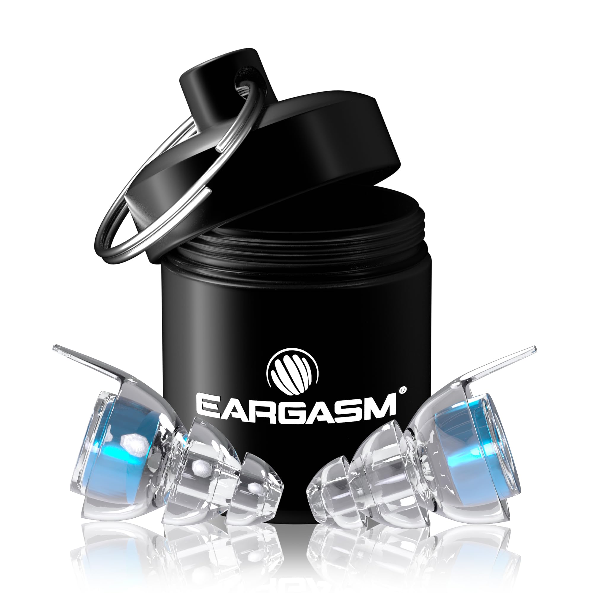
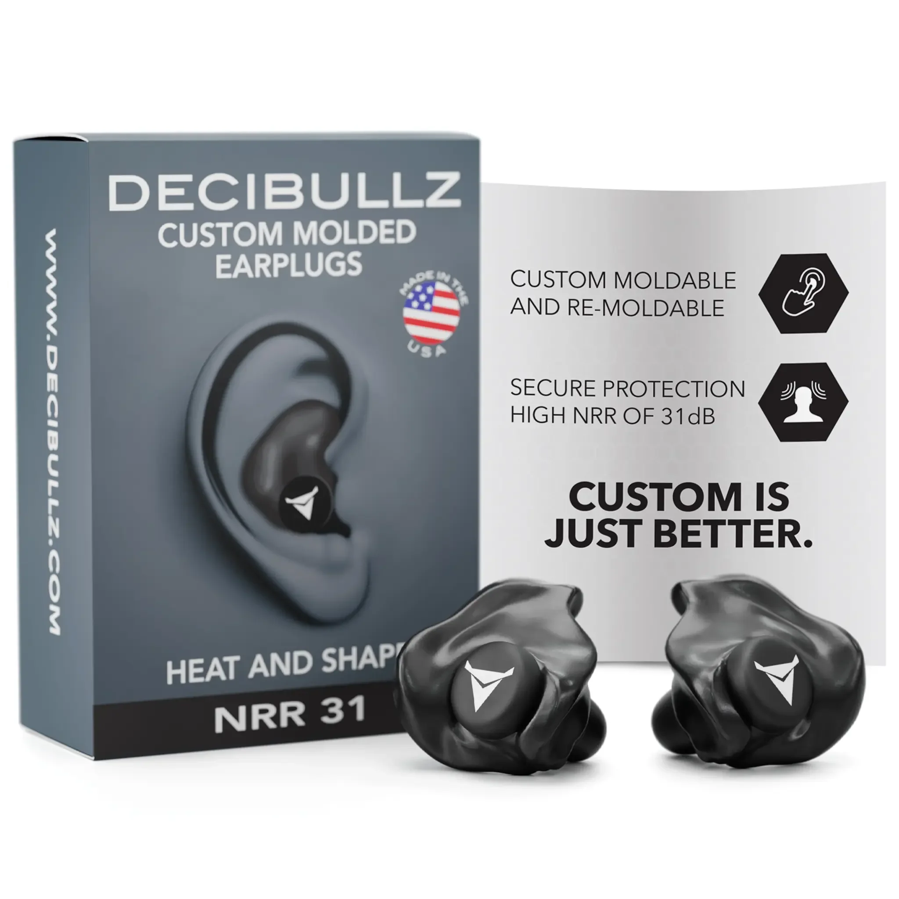
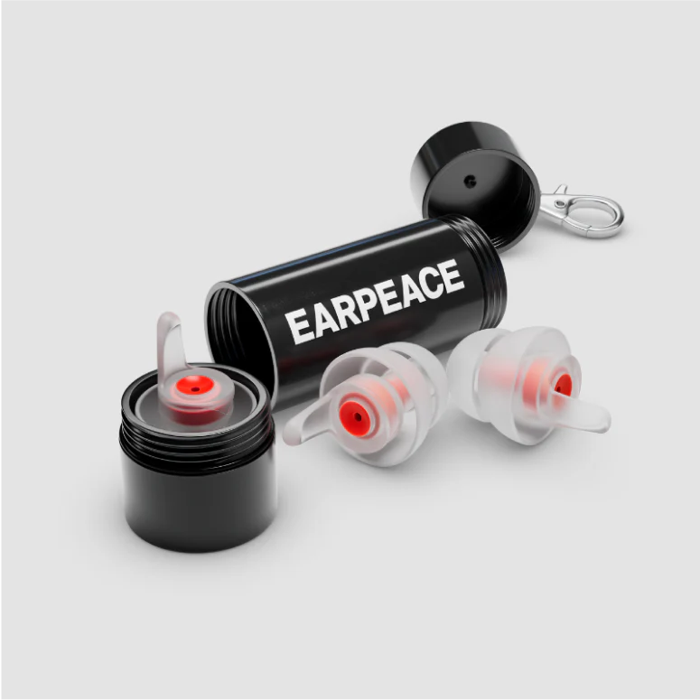

# Earplugs

I was at a wedding a couple of weeks ago, and I remembered I'm not a fan of overwhelmingly loud music.  
A party-savvy friend of mine recommended me concert earplugs that are used exactly for these situations.

My number one priority is protecting my hearing. If I can find a pair of reusable earplugs, maybe something I can even hook onto my keychain, that keeps my ears safe, I'll be a happy wedding guest. Everything else – like good sound quality – is just a bonus.

## Defining My Needs & Priorities: What Makes a Good Ear-Saver?

Before I get lost in a sea of brands and decibel ratings, here's what I'm looking for:

*   **Primary Use Case(s):** Shielding my ears at loud social gatherings. 
*   **Key Features Needed (or to learn about):**
    *   **Serious Noise Reduction:** I need to understand what Noise Reduction Rating (NRR) or Single Number Rating (SNR) is truly effective for hearing protection in these environments. Aiming for something that can bring very loud (100-115dB+) environments to a safer ~85dB level.
    *   **Comfort is King:** They need to be comfortable for potentially several hours.
    *   **Portability:** Something small, with a case, ideally keychain-attachable and durable.
    *   **Reusability:** Must be durable and cleanable for long-term use.
    *   **Durability:** They should last a good while.
    *   **Ease of Use:** Simple to pop in and out.
    *   *(Low Priority)* **Music Fidelity:** While I don't want everything to sound like mud, I'll gladly trade some audio clarity for better ear protection.
*   **Budget Range:** I'm thinking around **$60** (including potential add-on filters), but I'm willing to peek at pricier options if they offer something truly special or teach me more about what's possible.
*   **Deal-breakers (Things I want to avoid):** None explicitly right now, but I'm wary of anything notoriously uncomfortable, flimsy, or with a case that won't last on a keychain.

## Researching the Field

To make an informed decision, it's essential to understand the key terms and concepts related to hearing protection and earplugs.

*   **Noise Reduction Rating (NRR):** This is the standard rating used in the United States to estimate the level of sound protection an earplug provides. It's a single number (e.g., NRR 25) that represents the average decibel reduction you can expect in a laboratory setting. A higher NRR means more protection. However, real-world protection is often about half of the lab-tested NRR [2].
*   **Single Number Rating (SNR):** The European equivalent of NRR. SNR values tend to be slightly higher than NRR for the same product because of different testing methods [2].
*   **Attenuation:** This refers to the reduction of sound intensity. High-fidelity earplugs are often designed for "flat" or "even" attenuation, meaning they reduce the volume of all frequencies (low, mid, high) by a similar amount. This preserves the clarity of music and speech, just at a lower volume, avoiding the muffled sound of standard foam earplugs.
*   **Music Fidelity:** This describes how accurately an earplug preserves the original quality and balance of music. High-fidelity earplugs use special filters to achieve even attenuation, so music sounds clear and natural, not distorted or muffled.
*   **Occlusion Effect:** This is the boomy, hollow sound of your own voice that you hear when your ear canals are blocked. It's caused by bone-conducted vibrations reverberating in your closed-off ear canal. Some earplugs, especially those that insert deeply, can minimize this effect.
*   **Keywords:** `earplugs`, `hearing protection`, `concert earplugs`, `high-fidelity earplugs`, `musician earplugs`, `NRR`, `noise cancelling`, `reusable earplugs`.

---

## Part 1: Choosing the Right *Type* of Earplug

First, I need to decide on the best *type* of earplug for my needs.

### Available Types

#### 1. Disposable Foam Earplugs

*   **Overview & Key Selling Points:** Made from memory foam, these are designed to be compressed, inserted, and then expand to fill the ear canal. They offer the highest NRR values available.
*   **Pros:**
    *   Highest level of noise reduction (often NRR 30-33dB).
    *   Very inexpensive and widely available.
*   **Cons:**
    *   Significantly muffle and distort sound, making music and conversations unclear.
    *   Designed for single use, not reusable or hygienic for long-term use.
    *   Can be uncomfortable for some or difficult to insert correctly.
*   **Brands known for this type:** Mack's, Howard Leight, 3M.

#### 2. Reusable High-Fidelity Earplugs (Pre-molded)

*   **Overview & Key Selling Points:** These are designed for preserving sound quality while reducing volume. They typically use a flanged silicone or thermoplastic design with a special acoustic filter inside.
*   **Pros:**
    *   Provide "flat attenuation" to keep music and speech clear.
    *   Reusable, durable, and easy to clean.
    *   Often come with carrying cases, some keychain-friendly.
*   **Cons:**
    *   Lower NRR than foam plugs (typically 9-20dB).
    *   Fit can be hit-or-miss depending on ear shape.
    *   Can be more expensive than foam plugs.
*   **Brands known for this type:** Eargasm, Etymotic, EarPeace, Downbeats.

#### 3. Filter-Based Earplugs (Loop-style)

*   **Overview & Key Selling Points:** A subtype of high-fidelity earplugs, these often have a unique ring-shaped design that sits visibly in the ear. They use an acoustic channel and filter to reduce sound. Many offer accessory inserts to boost noise reduction.
*   **Pros:**
    *   Stylish and discreet design.
    *   Comfortable for long wear.
    *   Modular, with options to add more sound-blocking with accessories (e.g., Loop Mute).
*   **Cons:**
    *   NRR can be on the lower end without accessories.
    *   Sound quality can be more muffled than other high-fidelity options, especially with the extra blockers.
*   **Brands known for this type:** Loop.

#### 4. Custom-Molded Earplugs

*   **Overview & Key Selling Points:** These are created from a custom mold of the user's ear canal. They can be professionally made by an audiologist or created at home with a DIY kit.
*   **Pros:**
    *   Perfect fit, offering maximum comfort and a secure seal.
    *   Excellent sound isolation and consistent noise reduction.
    *   Can be fitted with high-fidelity filters.
*   **Cons:**
    *   DIY kits can be fiddly and may result in a poor fit if not done correctly.
    *   Professionally molded plugs are very expensive.
*   **Brands known for this type:** Decibullz (DIY), audiologist-provided custom plugs.

### Comparative Summary of Types

| Aspect / Type        | Disposable Foam | Reusable High-Fidelity | Filter-Based (Loop-style) | Custom-Molded (DIY) |
|----------------------|-----------------|------------------------|---------------------------|---------------------|
| **Primary Use Fit**  | Max Protection  | Music Clarity          | Style & Versatility       | Secure Fit, Comfort |
| **Protection (NRR)** | Highest (30+)   | Medium (9-20)          | Low-Medium (7-17)         | High (26+)          |
| **Sound Fidelity**   | Very Low        | High                   | Medium                    | High (if filtered)  |
| **Price Est.**       | $               | $$                     | $$                        | $$ - $$$            |
| **Key Pro**          | Max NRR         | Clear Sound            | Comfort, Style            | Perfect Fit         |
| **Key Con**          | Muffled Sound   | Lower NRR              | Lower NRR                 | Fiddly to Make      |

### Conclusion on Earplug Type

Based on my primary need for hearing protection at loud social events *without* sacrificing too much sound clarity, **Reusable High-Fidelity Earplugs** are the best category for me. They offer a good balance of protection, reusability, and music fidelity. Disposable foam earplugs offer more protection but would make socializing impossible. Custom-molded earplugs are an interesting option (especially the Decibullz Contour for high NRR), but I will start with pre-molded high-fidelity types first to see if they meet my needs.

---

## Part 2: Choosing the Specific Earplug to Buy

Now that I've decided on the item type, I'll compare specific products within the Reusable High-Fidelity category.

### Product Options

#### 1. Loop Earplugs

These seem to pop up everywhere and are highly rated. They have a distinct look, which is kinda cool.

*   **Overview & Key Selling Points:** Stylish design, focus on different "experiences." The **Loop Experience Plus** (which includes "Mute" silicone inserts for extra reduction) is frequently recommended [1, 3].
*   **Relevant Model(s) I'm Considering:**
    *   Loop Experience 2 / Experience Plus (NRR for Experience is often cited around 7-12dB, but with the **Loop Mute** accessory, this is boosted by an additional 5dB, leading to an effective NRR of ~12-17dB, or an overall reduction of ~23dB in some tests).
    *   Loop Switch (Adjustable NRR, typically 7-14dB).
    *   Loop Quiet 2 (Higher NRR ~14dB, for maximum noise blocking, less for social events).
*   **Pros (based on research):**
    *   Comfortable for extended wear, multiple tip sizes (silicone and sometimes foam).
    *   Stylish and relatively discreet.
    *   Keychain-friendly case (though some find the plastic loop less durable).
    *   "Mute" inserts provide a good boost in protection for the Experience model.
*   **Cons (based on research):**
    *   Sound can be more muffled than custom earplugs, especially with Mutes.
    *   Tips need regular replacement.
    *   NRR values can be confusing across sources; focus on *effective* reduction with Mutes.
    *   Plastic case loop might be a weak point for keychain attachment.
*   **Price Range:**
    *   Loop Experience Plus (includes Mutes): Around $45.
    *   Loop Switch: Around $55 - $65.
*   **Community Says:** Generally positive. Liked for comfort and the added protection from Mutes. Some debates on sound clarity vs. other high-fidelity options. Case durability is a minor concern for some [7, 8].
*   **How it Measures Up (against my needs):** [Placeholder for my thoughts after more research]

#### 2. Eargasm High Fidelity Earplugs

Another name that comes up frequently, especially in musician circles [1, 3, 10]. They seem to have a strong focus on protection with optional enhancers.

*   **Overview & Key Selling Points:** Aim for clear sound with good protection. Their standard High Fidelity earplugs are popular, and they offer a **"High dB Filter"** (sometimes called "Additional Attenuation Filters") for increased noise reduction.
*   **Relevant Model(s) Considered:**
    *   Eargasm High Fidelity Earplugs (Base NRR ~16dB, with an "expected average" reduction often cited higher, around -21dB).
    *   With **High dB Filter** add-on: This filter reportedly adds another -6dB to -9dB of reduction, potentially bringing total expected reduction to ~27-30dB.
*   **Pros (based on research):**
    *   Good sound quality, aims for uniform attenuation with base filters.
    *   Durable metal keychain carrying case is a big plus.
    *   Multiple ear tip sizes included; flanged design can offer a secure seal for many.
    *   The optional High dB Filter makes them very competitive for max protection.
*   **Cons (based on research):**
    *   Some users find the "pine-tree"/flanged shape less comfortable than dome-shaped tips or difficult to fit correctly.
    *   Small removal tab can be tricky for some.
    *   High dB Filter is an additional purchase, increasing total cost.
*   **Price Range:**
    *   High Fidelity Earplugs: Around $40 - $50.
    *   High dB Filter Add-on: Around $20 - $25. (Total ~$60 - $75 with filter).
*   **Community Says:** Many swear by them for concerts. The metal case is widely praised. Fit can be hit-or-miss for some, but those who get a good seal report excellent protection, especially with the extra filter [8, 10].
*   **How it Measures Up (against my needs):** [Placeholder for my thoughts after more research]

#### 3. Decibullz Custom Molded Earplugs

These offer a custom moldable design at a lower price than professionally molded custom earplugs [1]. Intriguing for comfort and secure fit.

*   **Overview & Key Selling Points:** Users mold the thermoplastic earpieces in hot water for a custom fit. They offer "High Fidelity" and also "Contour" (non-filtered, higher NRR) versions.
*   **Relevant Model(s) Considered:**
    *   Decibullz Professional High Fidelity Earplugs (NRR often cited around 7-12dB - *this might be low for my primary goal*).
    *   Decibullz Contour Earplugs (NRR 26-31dB - *much higher protection, but not "high-fidelity"*).
*   **Pros (based on research):**
    *   Excellent secure fit once molded, great for active use or unusual ear shapes.
    *   Comfortable for long wear if molded correctly.
    *   Contour version offers very high NRR.
*   **Cons (based on research):**
    *   Setup requires boiling and molding, which can be fiddly.
    *   High Fidelity version has a relatively low NRR for very loud events.
    *   Contour version will significantly muffle sound.
    *   Carrying case is often a pouch, less robust for keychains than some others.
*   **Price Range:** Around $25 - $30 for Contour, $80 - $100 for Professional High Fidelity.
*   **Community Says:** People who get the molding process right love the fit and security. The high NRR of the Contour model is appreciated for very loud environments (shooting, etc.), but audiophiles might not like the sound quality for music.
*   **How it Measures Up (against my needs):** [Placeholder for my thoughts after more research]

#### 4. EarPeace Music Earplugs

Mentioned as a solid alternative, especially if discreetness is key [1, 2]. They offer different filter levels.

*   **Overview & Key Selling Points:** Soft, malleable silicone, flush fit. Offer different filter sets (e.g., "Music Pro" with Medium, High, Max protection filters).
*   **Relevant Model(s) Considered:** EarPeace Music Pro (or similar models that come with interchangeable filters, NRR can range from ~9dB to ~19dB or higher depending on the filter).
*   **Pros (based on research):**
    *   Very comfortable for many users.
    *   Flush fit, less noticeable.
    *   Interchangeable filters allow adjusting protection levels.
    *   Durable metal keychain case often included.
*   **Cons (based on research):**
    *   Can have fewer tip sizes than some competitors.
    *   Small pull tab might be difficult for some.
    *   Highest protection filters might muffle sound more.
*   **Price Range:** Around $30 - $45, depending on the model and filter sets.
*   **Community Says:** Liked for comfort and the filter options. The metal case is a plus. Some find them very effective for concerts while maintaining decent sound clarity with appropriate filters.
*   **How it Measures Up (against my needs):** [Placeholder for my thoughts after more research]

#### 5. Etymotic Research Earplugs

A long-standing name in high-fidelity earplugs, praised for sound quality and value, though fit can be polarizing [1, 2, 11].

*   **Overview & Key Selling Points:** Known for their "flat" attenuation. The ER20XS is a popular model.
*   **Relevant Model(s) Considered:** ER20XS (NRR around 12-13dB). They also have higher-end musician series like the ER•25, ER•15.
*   **Pros (based on research):**
    *   Excellent sound quality and uniform attenuation for the price (ER20XS).
    *   Low cost for the ER20XS.
    *   Lower perception of occlusion (your own voice sounding boomy).
*   **Cons (based on research):**
    *   Deep triple-flange insertion may be uncomfortable or difficult for some users.
    *   ER20XS typically comes with one main size, though different tip options exist.
    *   NRR of ER20XS might be on the lower side for very loud events without doubling up protection.
*   **Price Range:** ER20XS around $20 - $30. Higher-end models $100+.
*   **Community Says:** Audiophiles often recommend Etymotic for sound fidelity. The deep fit is love-it-or-hate-it. For pure protection in very loud settings, the ER20XS alone might not be enough for some, but they are great for moderate loudness or when sound clarity is key.
*   **How it Measures Up (against my needs):** [Placeholder for my thoughts after more research]

#### 6. Downbeats Earplugs

These came up in a review for metal concerts, noted for good protection and comfort [5].

*   **Overview & Key Selling Points (from initial research):** Reusable high-fidelity earplugs, advertise around 18dB noise reduction.
*   **Relevant Model(s) Considered:** Standard Downbeats model.
*   **Pros (based on research):**
    *   Reportedly comfortable for long wear (5+ hours at a metal show).
    *   Stayed in securely during active use (moshing).
    *   Inconspicuous design.
    *   Included metal carrying case.
    *   Good balance of protection and sound clarity for loud music.
*   **Cons (based on research):**
    *   18dB reduction might be slightly less than some competitors with add-on filters.
    *   Can make conversation difficult at loud events (common for most earplugs).
*   **Price Range:** Around $15 - $25.
*   **Community Says:** Positive review from a metal concertgoer. Praised for doing the job well at a reasonable price [5].
*   **How it Measures Up (against my needs):** [Placeholder for my thoughts after more research]

---

### Comparative Summary of Products

| Feature/Aspect        | Loop Experience + Mute | Eargasm Hi-Fi + Filter | Decibullz Contour | EarPeace Music Pro (High Filter) | Etymotic ER20XS | Downbeats       |
|-----------------------|------------------------|------------------------|-------------------|--------------------------------|-----------------|-----------------|
| **Primary Use Fit**   | Concerts, Social       | Max Protection, Music  | Max Protection    | Versatile Protection           | Music Fidelity  | Concerts, Value |
| **Comfort (Est.)**    | High                   | Medium-High (flange)   | V.High (molded)   | High                           | Medium (deep)   | High            |
| **Protection (NRR)**  | ~12-17dB (effective)   | ~22-27dB (effective)   | ~26-31dB          | ~19dB (varies)                 | ~12-13dB        | ~18dB           |
| **Keychain Case?**    | Yes (plastic loop)     | Yes (metal)            | Pouch (often)     | Yes (metal)                    | Pouch (often)   | Yes (metal)     |
| **Price (Approx.)**   | $45                    | $65 - $75                | $25 - $30           | $35 - $45                        | $20 - $30         | $15 - $25       |
| **Key Pro**           | Comfort, Style, Mute   | High Protection, Case  | Custom Fit, V.High NRR | Filter Options, Case        | Sound, Price    | Comfort, Case   |
| **Key Con**           | Case Loop, NRR clarify | Flange Fit, Cost       | Fidelity (Contour) | Fewer Tip Sizes              | Deep Fit, NRR   | NRR vs some     |

*(Note: NRR values are estimates based on available data and can vary significantly. "Effective" refers to potential with add-ons. This table is a rough guide based on sources [1-11].)*

### Conclusion on Specific Product

Based on lab tests and community feedback [2, 3, 8], the **Eargasm High Fidelity with the additional High dB Filter** is looking like a strong contender for maximum reusable protection, thanks to that potential ~27-30dB reduction and the sturdy metal case. The **Loop Experience Plus with Mutes** is also very appealing for its reported comfort and decent protection boost.

**Downbeats** and **EarPeace Music Pro** (with high protection filters) are excellent value propositions if their NRR is sufficient. The **Decibullz Contour** offers amazing NRR if I decide a custom mold is the way to go and I'm okay with less sound fidelity (which I mostly am). **Etymotic ER20XS** remains a benchmark for sound quality at a low price, but the NRR might be a bit low for my main goal without other considerations.

The crucial next step is to really nail down what level of NRR translates to "safe" in the environments I frequent and then see which of these comfortable, keychain-friendly options gets me there most reliably.

---

## Sources & Further Reading

### Key Reviews & Lab Tests
1.  NYT Wirecutter - Best Earplugs for Concerts
    *   *Link:* https://www.nytimes.com/wirecutter/reviews/best-earplugs-for-concerts/
    *   *Note:* A good starting point for general recommendations.
2.  HearingTracker - Best Earplugs for Concerts (Lab Tested)
    *   *Link:* https://www.hearingtracker.com/earplugs
    *   *Note:* Excellent resource for NRR explanation and real-world protection estimates.
3.  Unearthed.com - Earplug Comparison (Loop vs. Eargasm at Metal Show)
    *   *Link:* https://unearthed.com/product-reviews/earplug-comparison-eargasm-high-fidelity-vs-loop-experience-plus-vs-airpods-pro-2/
    *   *Note:* Real-world comparison in a very loud environment.
4.  MakeThatLouder.com - Best Ear Plugs for Concerts (2023)
    *   *Link:* https://makethatlouder.com/best-ear-plugs-for-concerts/
    *   *Note:* General review roundup.
5.  Medium - Downbeats Reusable High Fidelity Hearing Protection Review
    *   *Link:* https://medium.com/audiophilia-music-and-headphones/downbeats-reusable-high-fidelity-hearing-protection-review-379179d39887
    *   *Note:* Specific, in-depth review of the Downbeats model.
6.  HearAdvisor - Earplug Rankings
    *   *Link:* https://www.hearadvisor.com/earplug-rankings
    *   *Note:* Data-driven rankings.

### Community Discussions (for anecdotal experiences & product discovery - cross-reference with scientific sources)
7.  r/Techno - What earplugs you use?
    *   *Link:* https://www.reddit.com/r/Techno/comments/1dvulda/what_earplugs_you_use_any_recommendations/
    *   *Note:* Discussion on various brands used in electronic music settings.
8.  r/GoosetheBand - Best concert earplugs?
    *   *Link:* https://www.reddit.com/r/GoosetheBand/comments/13ms2ch/best_concert_earplugs/
    *   *Note:* User recommendations and feedback.
9.  r/Music - Ear plugs that block out the most sound?
    *   *Link:* https://www.reddit.com/r/Music/comments/15q3ami/ear_plugs_that_block_out_the_most_sound/
    *   *Note:* General discussion about maximum protection.
10. r/metalmusicians - Which earplugs for concert?
    *   *Link:* https://www.reddit.com/r/metalmusicians/comments/1e3ahch/which_earplugs_for_concert/
    *   *Note:* Recommendations from musicians in loud environments.
11. r/audiophile - Best concert ear plugs in 2024 (links to HearingTracker)
    *   *Link:* https://www.reddit.com/r/audiophile/comments/1eblho9/best_concert_ear_plugs_in_2024_lab_tested/
    *   *Note:* Community discussion pointing towards lab-tested data.

### Product Pages (where to buy from, like manufacturer)
12. Loop Earplugs Official Site
    *   *Link:* https://www.loopearplugs.com/
    *   *Note:* Official product information and purchasing.
13. Eargasm Earplugs Official Site
    *   *Link:* https://eargasm.com/
    *   *Note:* Official product information and purchasing.
14. Decibullz Official Site
    *   *Link:* https://www.decibullz.com/
    *   *Note:* Official product information and purchasing.
15. EarPeace Official Site
    *   *Link:* https://www.earpeace.com/
    *   *Note:* Official product information and purchasing.
16. Etymotic Official Site
    *   *Link:* https://www.etymotic.com/
    *   *Note:* Official product information and purchasing.
17. Downbeats Official Site
    *   *Link:* https://downbeats.com/
    *   *Note:* Official product information and purchasing.

---

## Join the Conversation

This is an ongoing process for me, and I'd love your input:

*   Have you used any of these earplugs, especially with their higher-protection filters? What was your real-world experience at loud parties or concerts?
*   Did I miss any critical details about the NRR or comfort of these models?
*   Any tips for a newbie trying to choose the right earplugs for noise protection without feeling totally isolated? How do you balance protection with still being able to hear *something* (even if it's not perfect fidelity)?

---

*Disclaimer: This is a log of my personal research and decision-making process. Product features and prices are subject to change. Opinions are my own based on information available at the time of writing.*

