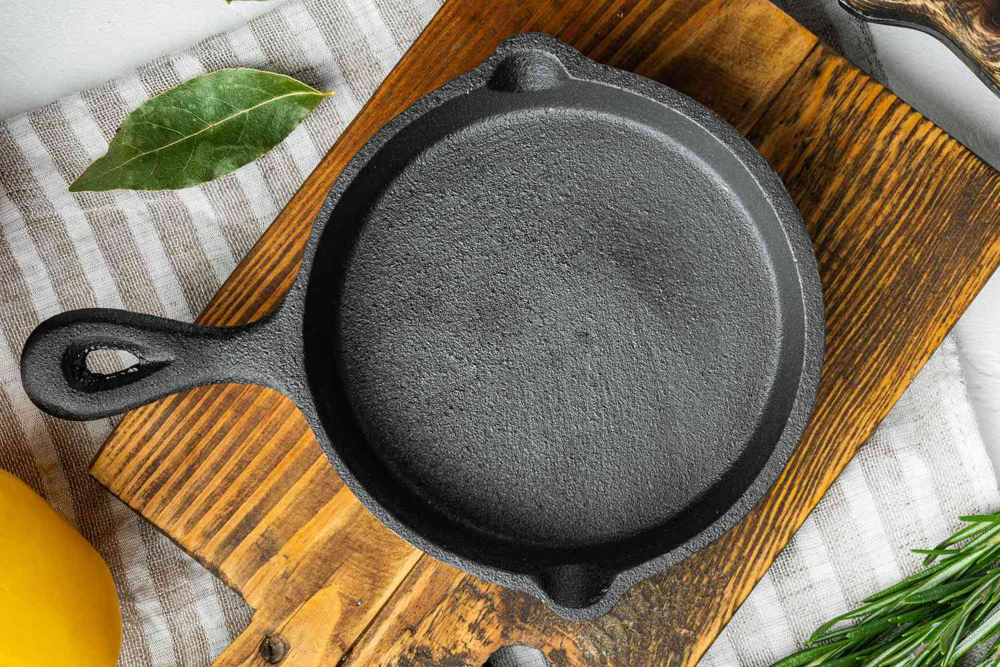
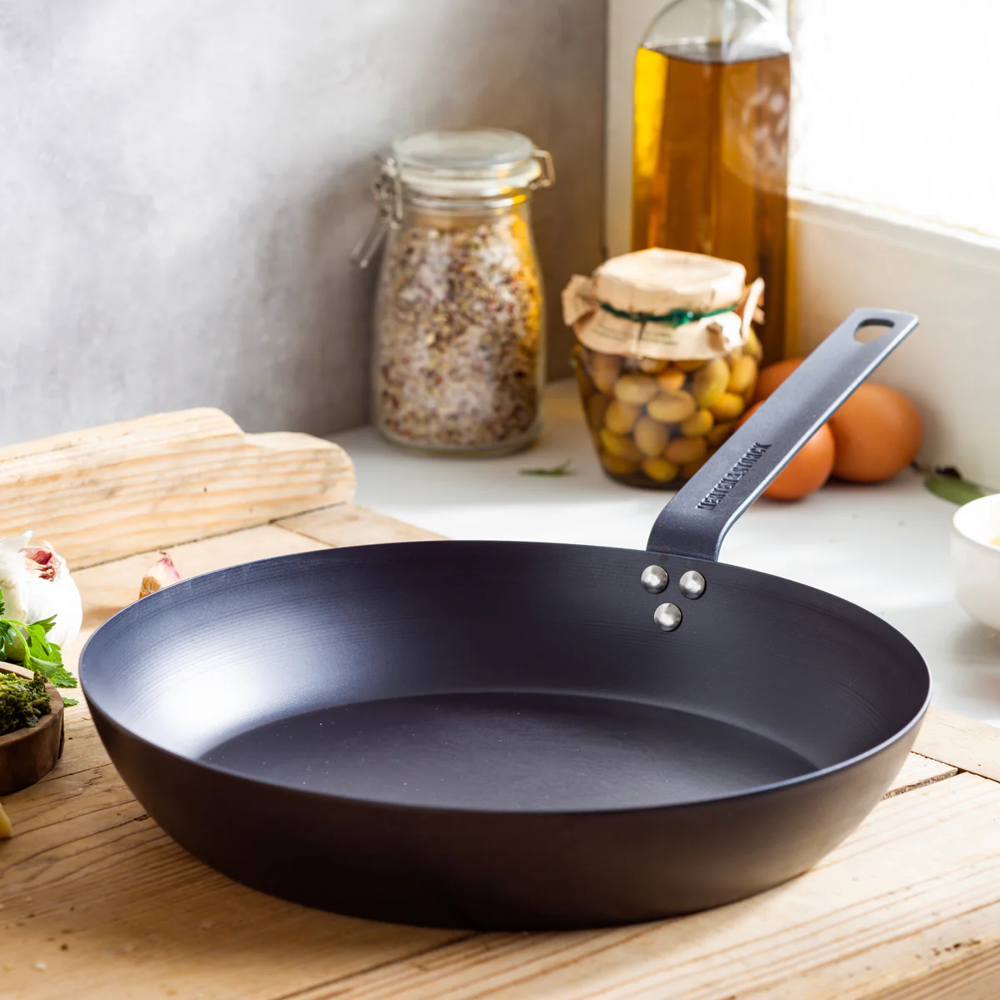
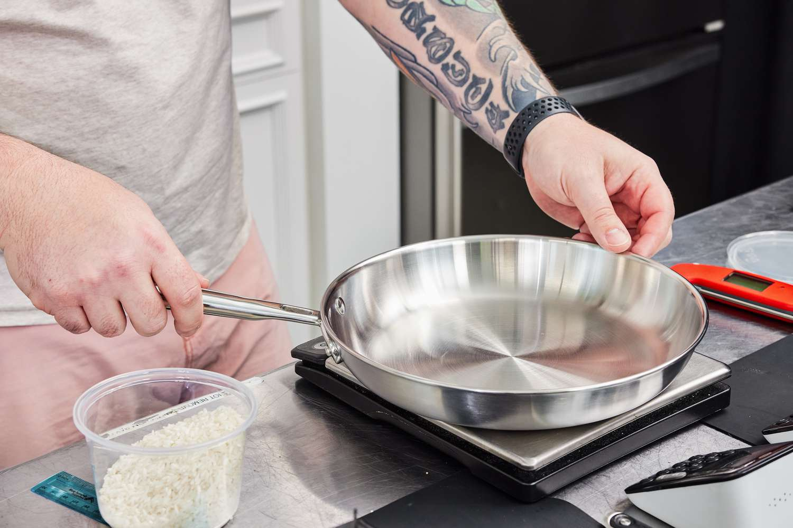
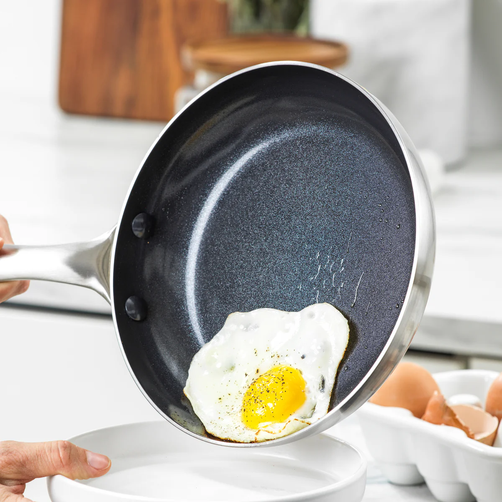
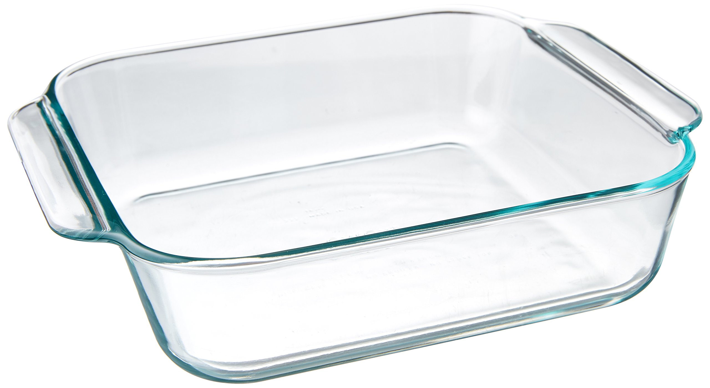
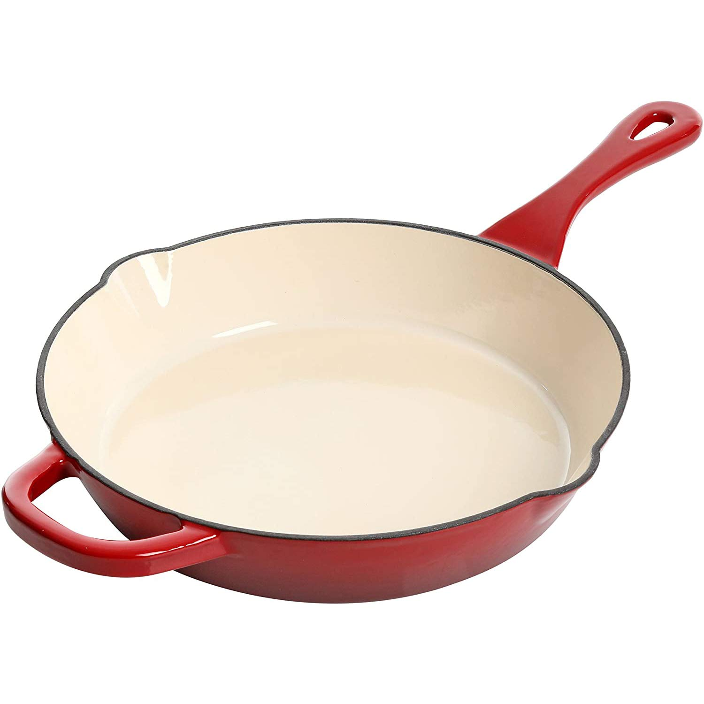

# Choosing the Right Pan

Pans are used daily for everything from a quick breakfast scramble to searing meats and simmering sauces. Given how frequently they contact our food, ensuring they are made from safe, non-toxic materials is a top priority in my quest for a healthier kitchen. For my specific uses, I'll be focusing on pans suitable for cooking eggs, pancakes, meat, and noodles.

## Defining My Needs & Priorities for Healthy Pans

Before diving into specific materials and brands, here's what I'm looking for:

*   **Primary Use Case(s):** General-purpose frying, sautéing, searing. Also considering saucepans and specialty pans if different materials are better suited.
*   **Key Health & Safety Features Needed:**
    *   **Non-Toxic Materials:** Avoids leaching harmful chemicals (e.g., PFOA, PFAS, lead, cadmium, nickel/chromium in high amounts for sensitive individuals) into food at cooking temperatures.
    *   **Material Stability:** Doesn't degrade or chip easily, releasing particles into food.
    *   **Heat Conductance & Retention:** Performs well for cooking, even if it means slightly more effort (e.g., seasoning cast iron).
    *   **Durability:** A long-lasting pan is more sustainable and often indicates better quality materials.
*   **Budget Range:** Flexible for truly healthy and durable options. I'll compare based on value within safe material categories.
*   **Deal-breakers (Things I want to avoid):** Known toxic coatings, materials that scratch or damage very easily leading to exposure of reactive undersides (e.g., some poorly made non-sticks or aluminum pans).

---

## Pan Materials: A Closer Look at Health Implications

Here are the main material options I'll be researching:

### 1. Cast Iron (Uncoated)

*   **Overview & Key Selling Points:** Venerable material, known for heat retention and longevity. Properly seasoned, it develops excellent non-stick properties. Can add dietary iron to food.
*   **Health & Safety Profile:**
    *   **Material Purity:** Generally considered very safe as it's primarily iron, with no synthetic coatings or added chemicals.
    *   **Iron Leaching:** Cast iron cookware leaches iron into food. This can be beneficial for individuals with iron deficiency anemia, as studies have shown it can increase hemoglobin levels and the iron content of meals.
    *   **Risk of Iron Overload:** For individuals with conditions like hemochromatosis, or those who already consume sufficient or excess iron, the additional iron from cookware can contribute to iron overload, which has its own health risks (iron is a pro-oxidant).
    *   **Seasoning:** Requires proper seasoning – a layer of polymerized fat. This layer protects the pan, creates a non-stick surface, and can reduce iron leaching compared to an unseasoned or poorly seasoned pan. The seasoning itself is generally considered non-toxic.
    *   **Acidic Foods:** Cooking highly acidic foods (e.g., tomato sauces, lemon juice, wine-braised dishes) for extended periods can strip the seasoning and increase iron leaching, potentially imparting a metallic taste to the food. It's best to use well-seasoned pans for acidic foods and limit very long cooking times.
    *   **Rust:** Can rust if not properly dried and maintained. Rust itself isn't inherently toxic in small amounts but is undesirable.
*   **Pros (from a health perspective):**
    *   No PFOA, PFAS, lead, cadmium, or other synthetic chemicals typically found in some non-stick coatings.
    *   Can contribute to dietary iron intake, which is beneficial for those prone to iron deficiency.
    *   Extremely durable and long-lasting when cared for, reducing the need for frequent replacement and potential exposure to manufacturing chemicals from new pans.
*   **Cons (from a health perspective):**
    *   Potential for excessive iron leaching, a concern for individuals at risk of iron overload.
    *   Requires diligent seasoning and maintenance to prevent rust and minimize excessive iron transfer.
    *   Interaction with acidic foods can increase iron leaching and affect food taste.
*   **Brands to Research:** Lodge (widely available, affordable), Field Company, Stargazer, Butter Pat, Smithey Ironware (often focus on smoother finishes, higher price), vintage (Wagner, Griswold - often prized for their smooth cooking surfaces).
*   **Where to Buy Considerations:** Specialty kitchen stores, online retailers.

### 2. Carbon Steel

*   **Overview & Key Selling Points:** Composed of about 99% iron and 1% carbon, it's like a lighter, more responsive cousin to cast iron. Popular in professional kitchens for its heat responsiveness and durability. Requires seasoning to build a natural non-stick surface.
*   **Health & Safety Profile:**
    *   **Material Purity:** Very similar to cast iron; it contains no synthetic coatings, PFOA, PFAS, lead, or cadmium.
    *   **Iron Leaching:** Leaches small amounts of iron into food, especially when new or cooking acidic ingredients. This can be beneficial for those needing more iron but a consideration for those with iron overload conditions.
    *   **Seasoning:** Essential for performance and rust prevention. A well-maintained seasoning layer is non-toxic and enhances non-stick properties, also reducing iron transfer.
    *   **Acidic Foods:** Like cast iron, prolonged cooking of acidic foods can strip seasoning and increase iron leaching.
    *   **Rust:** Susceptible to rust if not kept seasoned and dry.
*   **Pros (from a health perspective):**
    *   No PFOA, PFAS, or other synthetic chemical coatings.
    *   Durable and can last a lifetime with proper care.
    *   Lighter than cast iron, making it easier to handle, yet offers similar benefits of being a pure metal cooking surface.
    *   Can contribute small amounts of dietary iron.
*   **Cons (from a health perspective):**
    *   Requires seasoning and ongoing maintenance to prevent rust and maintain the non-stick surface.
    *   Potential for iron leaching with acidic foods or if seasoning is compromised, which can be a concern for individuals with iron sensitivities/overload.
*   **Brands to Research:** de Buyer (Mineral B, Blue Carbon Steel), Matfer Bourgeat, Mauviel (M'Steel), Made In, Lodge, Vollrath, OXO Obsidian. (Note: A 2024 EU recall for specific Matfer carbon steel pans due to metal leaching under extreme acidic testing conditions on unseasoned pans has been noted; Matfer is appealing. Ensuring good seasoning is key for any carbon steel pan.)
*   **Where to Buy Considerations:** Restaurant supply stores, online.

### 3. Stainless Steel (Clad)

*   **Overview & Key Selling Points:** Durable, versatile, and non-reactive with most foods. "Clad" cookware typically has a core of aluminum or copper sandwiched between layers of stainless steel for improved heat conduction. Common grades include 18/8 and 18/10 (chromium % / nickel %).
*   **Health & Safety Profile:**
    *   **Material Purity:** The stainless steel cooking surface itself is generally stable. Core materials like aluminum or copper are not in direct contact with food in undamaged, well-constructed pans.
    *   **Metal Leaching (Nickel & Chromium):** Studies confirm that stainless steel can leach small amounts of nickel and chromium into food. This is more pronounced with:
        *   New cookware (leaching decreases and stabilizes after several uses, typically around the 6th-10th cooking cycle).
        *   Acidic foods (e.g., tomato sauce, citrus).
        *   Longer cooking times.
        *   The amounts leached can be significant for individuals with nickel sensitivity (around 10-20% of people). Doses as low as 67 µg of nickel can trigger dermatitis, and cooking in stainless steel can exceed this.
        *   For the general population, these leached amounts are usually below the Tolerable Upper Intake Level for nickel (1000 µg/day) and below problematic levels for chromium.
    *   **Core Material Safety:** The aluminum or copper core in clad cookware is considered safe as long as the stainless steel layers remain intact and undamaged. High-quality construction ensures these layers are well-bonded.
    *   **Reactivity:** Generally non-reactive, making it suitable for a wide range of ingredients.
    *   **Nickel-Free Options:** For those with high nickel sensitivity, nickel-free stainless steel (e.g., 18/0, 21/0, or 430 grade) is available.
*   **Pros (from a health perspective):**
    *   No PFOA, PFAS, or other synthetic chemical coatings.
    *   Durable and resistant to scratches, rust, and corrosion (high-quality versions).
    *   Generally non-reactive surface.
    *   Cladding provides good heat distribution without direct food contact with core metals like aluminum or copper.
*   **Cons (from a health perspective):**
    *   Leaching of nickel and chromium is a documented concern, primarily for individuals with sensitivities to these metals. Even for others, it contributes to overall dietary intake.
    *   Poor quality or damaged pans could theoretically expose core materials, though this is rare with reputable brands and proper care.
*   **Brands to Research:** All-Clad, Made In, Demeyere, Calphalon, Cuisinart, Tramontina. For nickel-free: HOMI CHEF, Chantal.
*   **Where to Buy Considerations:** Widely available from kitchenware stores to department stores and online.
*   **Tips to Minimize Leaching (especially if sensitive):**
    *   Consider "breaking in" new pans: Some sources suggest boiling a 50/50 water/vinegar solution multiple times.
    *   Avoid prolonged storage of food in stainless steel cookware.
    *   Minimize long cooking times for highly acidic foods if leaching is a concern.
    *   Opt for nickel-free stainless steel if you have a known sensitivity.

### 4. Ceramic Non-Stick (Sol-Gel Coatings, PFOA/PFAS-Free)

*   **Overview & Key Selling Points:** Marketed as a safer alternative to traditional PTFE-based non-stick, these pans typically have an aluminum base coated with a sol-gel ceramic non-stick layer derived from sand (silica). They are PFOA and PFAS-free.
*   **Health & Safety Profile:**
    *   **Coating Composition:** The sol-gel ceramic coating itself is made without PFOA, PFAS, lead, or cadmium (in reputable brands).
    *   **Coating Durability & Breakdown:** This is the primary concern. The ceramic non-stick coating is prone to degrading over time (typically 1-2 years with regular use). Durability is affected by:
        *   **Heat:** High heat (generally above 500°F / 260°C) can cause the coating to decompose, losing its non-stick properties and potentially becoming gritty. Not ideal for high-heat searing.
        *   **Utensils:** Metal utensils will scratch and damage the coating. Silicone, wood, or nylon utensils are recommended.
        *   **Cleaning:** Abrasive scrubbers or harsh detergents can damage the coating. Dishwasher use is often discouraged as it can accelerate degradation.
    *   **Nanoparticle Release:** While there have been some discussions about potential nanoparticle release from certain types of ceramic coatings, current information suggests that quality sol-gel coatings, when used as intended (avoiding overheating and scratching), do not pose a significant risk in this regard. However, a degraded or scratched coating is undesirable.
    *   **Underlying Material (Usually Aluminum):** The core is often aluminum for good heat conductivity. If the ceramic coating is compromised by deep scratches or significant degradation, the aluminum can be exposed to food, potentially leading to leaching, especially with acidic ingredients.
*   **Pros (from a health perspective):**
    *   Free of PFOA, PFAS, lead, and cadmium (when sourced from reputable manufacturers).
    *   Offers non-stick properties without the use of traditional fluoropolymer chemistries.
*   **Cons (from a health perspective):**
    *   **Limited Lifespan:** The non-stick coating is not very durable compared to other cookware types. Its degradation is a key concern, as a compromised coating negates its benefits and can expose the aluminum core.
    *   **Potential for Aluminum Exposure:** If the coating is scratched or worn through, the underlying aluminum may leach into food.
    *   **Restrictions on Use:** Requires careful use—lower heat, no metal utensils, gentle cleaning—to preserve the coating.
*   **Brands to Research:** GreenPan (Thermolon), Caraway, Made In (CeramiClad™), Our Place (Thermakind®), Alva Cookware, Zwilling (CeraForce line).
*   **Where to Buy Considerations:** Widely available, but important to choose reputable brands that are transparent about their coating composition and testing.
*   **Note on "Pure Ceramic" Cookware:** Brands like Xtrema offer 100% pure ceramic cookware (no metal core, no coatings, but a ceramic glaze). This is a different category with different properties (excellent heat retention, very safe, but not inherently "non-stick" in the same way as coated pans and better for slow cooking).

### 5. Glass

*   **Overview & Key Selling Points:** Glass cookware (typically for baking, e.g., Pyrex-style dishes) is non-reactive, allows you to see food as it cooks, and doesn't absorb odors or flavors. Borosilicate glass is favored for its superior thermal shock resistance.
*   **Health & Safety Profile:**
    *   **Material Purity:** High-quality, clear, undecorated glass (especially borosilicate or soda-lime glass from reputable manufacturers) is generally inert and does not leach harmful chemicals into food.
    *   **Lead and Cadmium:** The primary concern with glass is the potential for lead or cadmium, particularly in:
        *   Older, vintage glassware (especially pre-1970s).
        *   Highly decorated or colored glassware where the pigments/glazes might contain these metals.
        *   Lead crystal (which is different from standard cookware glass).
        *   Modern, clear cookware from reputable brands is generally free of lead and cadmium.
    *   **Thermal Shock:** Glass can shatter if exposed to sudden extreme temperature changes (e.g., a hot dish on a cold, wet surface). Borosilicate glass offers much better resistance than standard soda-lime glass, but care should still be taken.
    *   **Breakability:** Glass can break if dropped or impacted.
    *   **BPA/Coatings:** Generally, glass cookware itself is not coated. If lids are plastic, ensure they are BPA-free if that's a concern.
*   **Pros (from a health perspective):**
    *   Highly inert and non-reactive; does not leach chemicals or absorb food odors/flavors.
    *   Free of PFOA, PFAS, and other synthetic coatings.
    *   Easy to clean and allows for visual monitoring of cooking.
*   **Cons (from a health perspective):**
    *   Risk of lead or cadmium leaching from older, decorated, or improperly manufactured glass.
    *   Susceptible to thermal shock and breakage if mishandled.
*   **Brands to Research:** Pyrex (note: newer Pyrex in the US is often tempered soda-lime glass, while older US Pyrex and European Pyrex may be borosilicate; check product details), Anchor Hocking, OXO (often borosilicate for bakeware), Luminarc.
*   **Where to Buy Considerations:** Widely available. For bakeware intended for oven use, look for borosilicate glass if possible, or ensure it's rated for oven temperatures.

### 6. Enameled Cast Iron

*   **Overview & Key Selling Points:** Combines the excellent heat retention and distribution of cast iron with a smooth, non-reactive enamel (glass-based) coating. This eliminates the need for seasoning and prevents the iron from reacting with acidic foods. Popular for its durability and often vibrant colors.
*   **Health & Safety Profile:**
    *   **Enamel Coating Safety:** The enamel surface is essentially a type of glass, making it inert and non-reactive with food. It does not contain PFOA or PFAS.
    *   **Lead and Cadmium:** Reputable manufacturers produce enameled cast iron that is free of lead and cadmium, complying with safety regulations (e.g., FDA standards in the US). Cheaper, unregulated imports could potentially contain these metals in the enamel. It is crucial to buy from trusted brands.
    *   **Chipping:** The enamel can chip if the cookware is dropped, hit with hard objects, or subjected to extreme thermal shock. Using non-metal utensils (wood, silicone, nylon) and gradual temperature changes helps prevent this. If significant chipping occurs on the cooking surface, there's a risk of enamel particles getting into food, and the exposed cast iron would then require care like unseasoned cast iron.
    *   **Cast Iron Core:** The underlying cast iron is a safe cooking material. If the enamel were to be compromised, the cast iron itself poses no inherent health risk beyond the potential for iron leaching (see Cast Iron section).
*   **Pros (from a health perspective):**
    *   Non-reactive surface due to the enamel, suitable for all types of food including acidic ingredients.
    *   No need for seasoning, unlike bare cast iron.
    *   Does not leach iron (unless the enamel is significantly damaged), which is a benefit for those not needing extra dietary iron.
    *   Free from PFOA, PFAS, and other synthetic coatings.
    *   Durable and long-lasting when cared for properly.
*   **Cons (from a health perspective):**
    *   Potential for lead or cadmium in the enamel of low-quality, unregulated products.
    *   Chipping of the enamel can be a concern if it occurs on the cooking surface, potentially introducing small particles into food (though this is mainly an issue with improper use or very old/damaged pans).
    *   Heavy, which can be a handling challenge for some users.
*   **Brands to Research:** Le Creuset, Staub, Lodge (enameled line), Caraway (enameled cast iron line).
*   **Where to Buy Considerations:** Available from department stores, kitchen specialty shops, and online. Prioritize well-known brands with a good reputation for quality and safety compliance.

<!-- Add more material sections as needed (e.g., Titanium, Hard Anodized Aluminum with specific notes on coatings) -->

---

## Comparative Summary (To be developed)

| Feature/Material    | Key Health Pros                                   | Key Health Cons/Concerns                                  | Durability/Longevity Est. | Price Range Est. |
|---------------------|---------------------------------------------------|-----------------------------------------------------------|---------------------------|------------------|
| **Cast Iron**       | No synthetic chemicals, adds iron                 | Heavy, needs seasoning, potential iron overload (rare)    | Decades+                  | $ - $$           |
| **Carbon Steel**    | No synthetic chemicals, adds iron                 | Needs seasoning, can rust                                 | Decades+                  | $ - $$           |
| **Stainless Steel** | No coatings, stable                               | Potential nickel/chromium leaching (sensitivities)      | Decades+                  | $$ - $$$         |
| **Ceramic Non-Stick**| PFOA/PFAS-free                                  | Coating durability varies, less long-term research on some| 1-5 years (coating)       | $$ - $$$         |
| **Enameled Cast Iron**| Non-reactive coating, no seasoning              | Heavy, expensive, potential for chipping (rare)         | Decades+                  | $$$ - $$$$       |
| **Glass**           | Completely inert                                  | Can break with thermal shock                              | Variable (breakage risk)  | $$ - $$$         |

## Leaning Towards / Preliminary Conclusion: My Personalized Pan Choice

Based on the detailed research above and my specific priorities, here's how I'm approaching my pan selection:

**My Key Priorities Recap:**

*   **Nickel Leaching:** While I'm not sensitive, minimizing nickel exposure is preferred.
*   **Iron Overload:** Not a current concern.
*   **Maintenance Willingness:** High; I'm happy to season and properly care for pans.
*   **Common Cooking Tasks:** Eggs, pancakes, meat, noodles, and general sautéing.
*   **Budget:** Flexible for high-quality, healthy, and durable options.
*   **Toxicity Concerns:** A strong desire to avoid PFOA, PFAS, lead, and cadmium is paramount.

**Top Recommendations for My Needs:**

1.  **Seasoned Carbon Steel Pan:**
    *   **Why it fits best:**
        *   *Health:* Excellent profile – just iron and carbon, so it's free from PFOA, PFAS, lead, and cadmium. Iron leaching is acceptable (and potentially beneficial) for me, and there's no nickel.
        *   *Performance:* Heats quickly and evenly, can achieve a very slick non-stick surface with proper seasoning, making it great for eggs, pancakes, and searing meat. Lighter than cast iron.
        *   *Durability & Maintenance:* Extremely durable. I'm willing to do the initial seasoning and ongoing maintenance required.
    *   **Considerations:** Requires commitment to seasoning. Not ideal for very acidic long-simmered dishes until exceptionally well-seasoned.
    *   **Likely Choice For:** Primary everyday frying pan.

2.  **Seasoned Cast Iron Pan:**
    *   **Why it's a strong contender:**
        *   *Health:* Similar excellent health profile to carbon steel (PFOA, PFAS, lead, cadmium-free). Iron leaching is acceptable.
        *   *Performance:* Unbeatable heat retention, great for searing and can go from stovetop to oven. Develops a good non-stick surface.
        *   *Durability & Maintenance:* Extremely durable, and I'm fine with the maintenance.
    *   **Considerations:** Heavier than carbon steel. Slower to heat up and cool down. Also reactive with acidic foods until very well seasoned.
    *   **Likely Choice For:** Searing, baking (cornbread, pizza), and when high heat retention is key. Might be a secondary pan to complement carbon steel.

3.  **High-Quality Enameled Cast Iron (for specific tasks):**
    *   **Why it has a place:**
        *   *Health:* The enamel coating (from a reputable brand) is inert, non-reactive, and doesn't leach, making it ideal for acidic foods like tomato sauces or wine-based braises. Free of PFOA/PFAS.
        *   *Performance:* Excellent heat retention and distribution. No seasoning required.
    *   **Considerations:** More expensive. The enamel can chip if mishandled. Doesn't offer the same seasoned non-stick surface as bare cast iron/carbon steel.
    *   **Likely Choice For:** Dutch oven or braiser for soups, stews, acidic sauces, and baking bread. Not as a primary frying pan for my listed tasks.

4.  **High-Quality Stainless Steel (Clad) (with a caveat):**
    *   **Why it's an option:**
        *   *Health:* No synthetic coatings. Durable.
        *   *Performance:* Versatile, good for searing and deglazing.
    *   **Considerations:** Nickel leaching is a factor. While I'm not sensitive, minimizing it is a goal. Sticking can be an issue if not used correctly (proper preheating and fat). Nickel-free options exist but might be harder to find or have slightly different performance.
    *   **Likely Choice For:** Potentially for saucepans or if a non-reactive pan for quick, non-delicate tasks is needed, but lower priority than carbon/cast iron for frying due to the nickel aspect and my willingness to maintain seasoned pans.

**Materials I'll Likely Avoid for Primary Frying Pans:**

*   **Ceramic Non-Stick (Sol-Gel):** While PFOA/PFAS-free, the concerns about coating durability and potential exposure to the underlying aluminum if scratched make this less appealing for a workhorse pan, despite the initial non-stick convenience. If I were to get one, it would be for very specific, occasional use for ultra-delicate items, knowing its lifespan is limited.
*   **Traditional PTFE Non-Stick:** Due to concerns about PFAS.

**Next Steps:**

My focus will be on acquiring a high-quality carbon steel pan first, followed by a cast iron skillet. I will research specific brands for carbon steel and cast iron that are known for quality manufacturing and smooth finishes where applicable.

---

## Sources & Further Reading

This section includes a mix of scientific studies, articles from reputable consumer advocacy and health-focused organizations, and relevant discussions.

**Scientific Journals & Research Databases:**

*   **Assessing Leaching of Potentially Hazardous Elements from Cookware during Cooking: A Serious Public Health Concern.** (Sultan, S. A. A., et al., *Toxics*, 2023).
    *   *Link:* `https://www.mdpi.com/2305-6304/11/7/640`
    *   *Note:* This study investigates metal leaching from various cookware types (including aluminum, steel, copper) under different pH conditions and in contact with food, highlighting public health risks in regions using cookware made from contaminated metal scraps.
*   **Stainless Steel Leaches Nickel and Chromium into Foods During Cooking.** (Kamerud, K. L., et al., *Journal of Agricultural and Food Chemistry*, 2013 - though the provided PMC link is to a different article discussing this phenomenon: `https://pmc.ncbi.nlm.nih.gov/articles/PMC4284091/`).
    *   *Link to general search for article:* `https://scholar.google.com/scholar?q=Stainless+Steel+Leaches+Nickel+and+Chromium+into+Foods+During+Cooking+Kamerud`
    *   *Note:* The PMC link (`https://pmc.ncbi.nlm.nih.gov/articles/PMC4284091/`) itself is a study titled "Metallic Contamination of Food During Preparation and Storage: A Review" which discusses leaching from various metals including stainless steel.
*   **Raman imaging for the identification of Teflon microplastics and nanoplastics released from non-stick cookware.** (Yang, C., et al., *Science of The Total Environment*, 2022).
    *   *Link:* `https://www.sciencedirect.com/science/article/abs/pii/S004896972205392X`
    *   *Note:* This study highlights the release of microplastics and nanoplastics from damaged PTFE (Teflon) coatings.
*   **Migration of 18 trace elements from ceramic food contact material: Influence of pigment, pH, nature of acid and temperature.** (Demont, M., et al., *Food and Chemical Toxicology*, 2012).
    *   *Link:* `https://pubmed.ncbi.nlm.nih.gov/22326592/`
    *   *Note:* Investigates leaching from ceramic materials, relevant for understanding potential migration from ceramic cookware or glazes.

**Reputable Organizations & Consumer Information:**

*   **Consumer Reports - "You Can't Always Trust Claims on 'Non-Toxic' Cookware"**
    *   *Link:* `https://www.consumerreports.org/toxic-chemicals-substances/you-cant-always-trust-claims-on-non-toxic-cookware-a4849321487/`
    *   *Note:* Discusses PFAS in non-stick pans and the reliability of "PFOA-free" claims, recommending ceramic PTFE-free pans or uncoated options.
*   **LeafScore - "Caraway Cookware and Heavy Metals: Which Tests Should We Believe?"**
    *   *Link:* `https://www.leafscore.com/eco-friendly-kitchen-products/answering-reader-questions-about-caraway-cookware-and-greenwashing/`
    *   *Note:* A deep dive into Caraway's claims, ceramic coatings (sol-gel), and XRF testing vs. lab leaching tests.
*   **I'm Plastic Free - "11 Truly Non-Toxic Cookware Brands, Tested & Reviewed"**
    *   *Link:* `https://www.implasticfree.com/non-toxic-cookware-brands/`
    *   *Note:* Reviews various materials like cast iron, stainless steel, carbon steel, glass, and pure ceramic, advocating for coating-free options. Critiques "ceramic" coatings.
*   **My Chemical-Free House - "Lead-Free Ceramic Cookware (Free of Cadmium And Other Toxic Metals)"**
    *   *Link:* `https://www.mychemicalfreehouse.net/2024/07/lead-free-ceramic-cookware-free-of-cadmium-and-other-toxic-metals.html`
    *   *Note:* Analyzes ceramic and ceramic-coated cookware using independent and company testing for lead, cadmium, and other metals.
*   **AARP - "Is Your Cookware Poisoning You? A Guide to Safe Pots and Pans"**
    *   *Link:* `https://www.aarp.org/home-family/your-home/info-2021/pots-and-pans-safety-guide.html`
    *   *Note:* General overview of different cookware materials and their safety profiles.
*   **NutritionFacts.org - "Is Stainless Steel or Cast Iron Cookware Best? Is Teflon Safe?"**
    *   *Link:* `https://nutritionfacts.org/blog/is-stainless-steel-or-cast-iron-cookware-best-is-teflon-safe/`
    *   *Note:* Discusses iron leaching from cast iron and nickel/chromium from stainless steel, with a brief mention of Teflon.
*   **Food & Wine - "The Best Stainless Steel Cookware Sets, According to Our Tests"**
    *   *Link:* `https://www.foodandwine.com/lifestyle/kitchen/best-stainless-steel-cookware-sets`
    *   *Note:* Reviews and recommends stainless steel cookware sets.
*   **Food & Wine - "The 8 Best Non-Toxic Cookware Sets of 2024, Tested and Reviewed"**
    *   *Link:* `https://www.foodandwine.com/lifestyle/kitchen/best-non-toxic-cookware`
    *   *Note:* Reviews and recommends various non-toxic cookware sets.
*   **Organic Authority - "The Only Non-Toxic Cookware Brands You Need to Keep Chemicals Out of Your Food"**
    *   *Link:* `https://www.organicauthority.com/organic-food-recipes/non-toxic-cookware-brands-to-keep-chemicals-out-of-your-food`
    *   *Note:* Guide to non-toxic cookware brands.

**Community Discussions (for anecdotal experiences & product discovery - cross-reference with scientific sources):**

*   **Reddit r/cookingforbeginners - "What pans should I buy?"**
    *   *Link:* `https://www.reddit.com/r/cookingforbeginners/comments/rbtduo/what_pans_should_i_buy/`
*   **Reddit r/ZeroWaste - "Not sure if this is the right place but for the love of god, what pan am I supposed to buy?"**
    *   *Link:* `https://www.reddit.com/r/ZeroWaste/comments/11fd7oh/not_sure_if_this_is_the_right_place_but_for_the/`
*   **Reddit r/cookware - "Best type of cookware for healthy cooking?"**
    *   *Link:* `https://www.reddit.com/r/cookware/comments/1agkegz/best_type_of_cookware_for_healthy_cooking/`
    *   *Note:* Community discussion on healthy cookware choices.

**YouTube Videos (for visual guides, reviews, and opinions - cross-reference with scientific sources):**

*   **The Future of Cookware Is... Carbon Steel? (Serious Eats)**
    *   *Link:* `https://youtu.be/EpkVegTcwbo?si=2xKsSJDfijdvmtCH`
    *   *Note:* Video discussing the benefits and uses of carbon steel cookware.
*   **Why I Only Use Carbon Steel Pans (Ethan Chlebowski)**
    *   *Link:* `https://youtu.be/6iW3iXcdZqU?si=75la7RhjQx7QdPab`
    *   *Note:* Personal perspective and guide on using carbon steel pans.

---

## Join the Conversation

This is an ongoing research process:

*   What are your experiences with these pan materials in terms of health and cooking performance?
*   Are there specific brands you trust or avoid for health reasons?
*   Any crucial studies or resources I should look into?

---

*Disclaimer: This is a log of my personal research. Product features, prices, and safety information are subject to change and require individual verification. Always consult with experts for health advice.*
