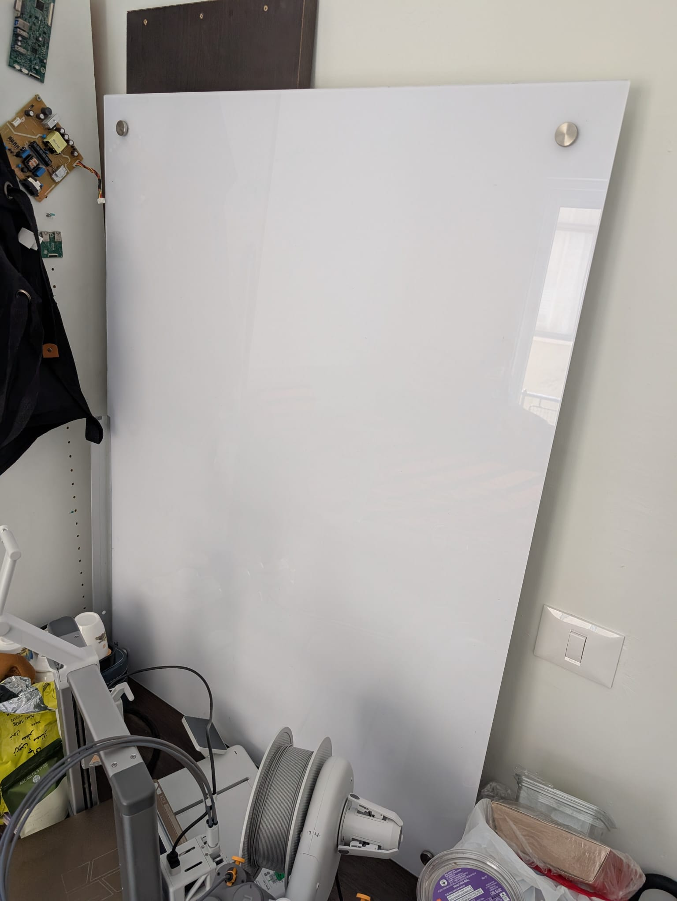
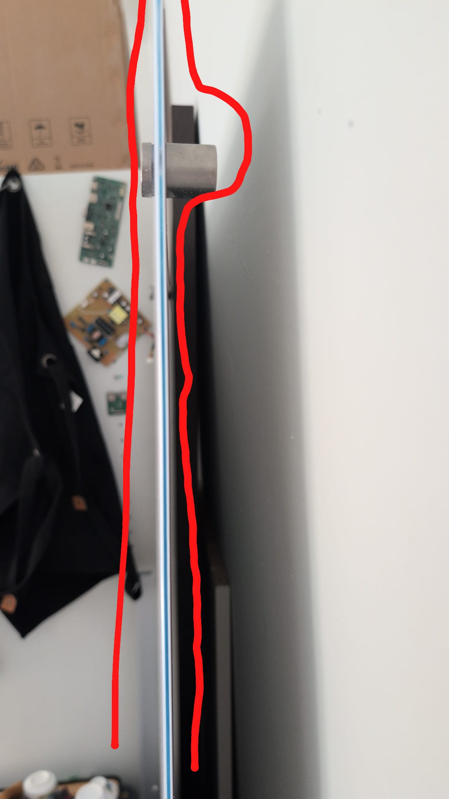
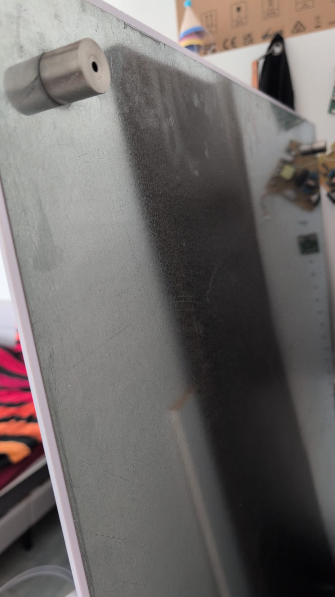

# Portable Whiteboard

This project aims to convert a fixed wall-mounted whiteboard (90 cm height × 120 cm width) into a mobile whiteboard unit with a sturdy wooden frame and lockable wheels. The goal is to make the whiteboard portable for flexible use in various rooms, while keeping it stable and ergonomic.

## Project Goals

Detach and reuse the existing glass whiteboard

Create a custom wooden frame that supports the whiteboard securely

Design foldable or compact legs with locking caster wheels

Ensure safe support and stability, minimizing any wobbling or tipping risk

Allow for easy disassembly or repair if needed

Keep a clean and functional design that integrates well in a workspace

## Designs

## Components

1.  Whitebord (already have)

90 cm height × 120 cm width
~3-4 mm thick
has 4 metal wall mounts with a hight of 2.5 cm and distance from each near wall of 5 cm from the center of it to the wall.
likely weight - ~26 kg.

2.  Wooden Frame - Outer Rectangle (required)
Material: Plywood or solid pine (18–25 mm thick)

Frame Dimensions:

2 vertical side bars: 90 cm height each

2 horizontal bars (top and bottom): 124 cm each (2 cm overlap on both sides for mounting clearance)

Mounting Gap: Add a 0.5–1 cm inner lip or groove for whiteboard to rest in

3. Legs & Base (Required)
Design: A-frame or T-style base

Leg Height: 70–75 cm (adjust to center whiteboard at ~140–150 cm eye level)

Crossbars:

Bottom base: 60–70 cm width

Reinforcement brace between legs: 40–50 cm

Wood Specs: 4×4 cm or 5×5 cm for legs

## Hardware

| Component      | Specs                               |
| -------------- | ----------------------------------- |
| Wood screws    | 25 mm and 50 mm length              |
| Metal brackets | 90° angle brackets for corners      |
| Mounting clips | To attach the whiteboard at corners |
| Washers & nuts | For wheel and bracket mounting      |
| Caster wheels  | 4 pcs (2 lockable), 2"–3" diameter  |

## Tools Required

| Tool                        | Purpose                        |
| --------------------------- | ------------------------------ |
| Electric drill              | For wood drilling and assembly |
| Screwdriver (manual or bit) | Mounting brackets/screws       |
| Circular saw or hand saw    | Cutting wood to exact sizes    |
| Measuring tape              | Accurate dimensioning          |
| Level                       | Ensure alignment & balance     |
| Clamps                      | Holding wood while drilling    |
| Sandpaper or sander         | Smoothing wood surfaces        |
| Wood glue (optional)        | Reinforce joints               |
| Pencil + Square Ruler       | Precise marking for cuts       |

# Sources 

1. https://youtu.be/OzZgYhIypns?si=70djSObWHxv9rhqV
