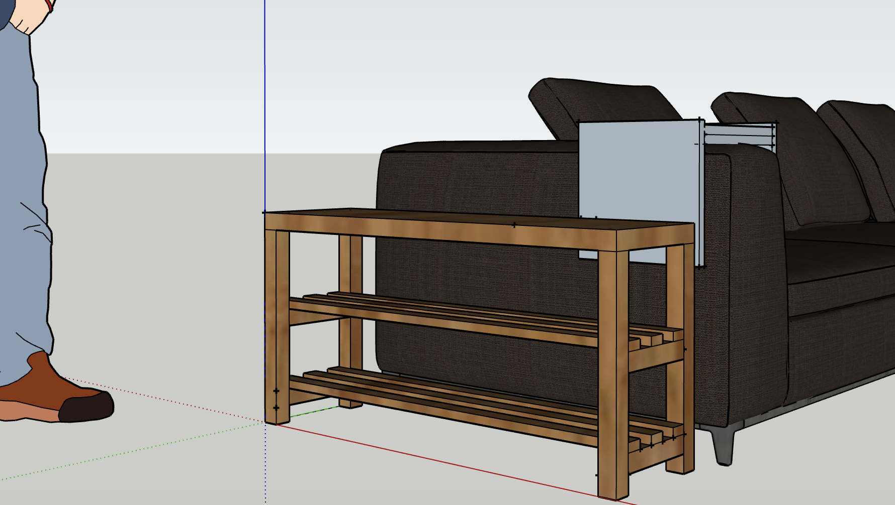
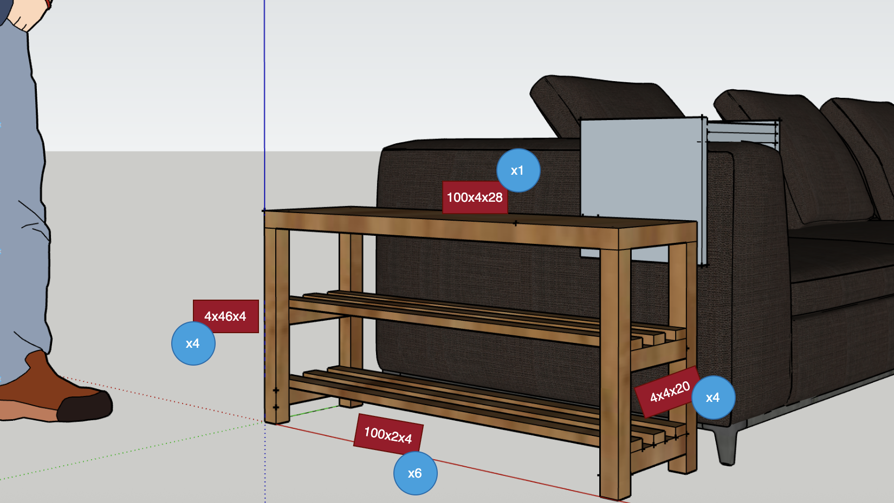
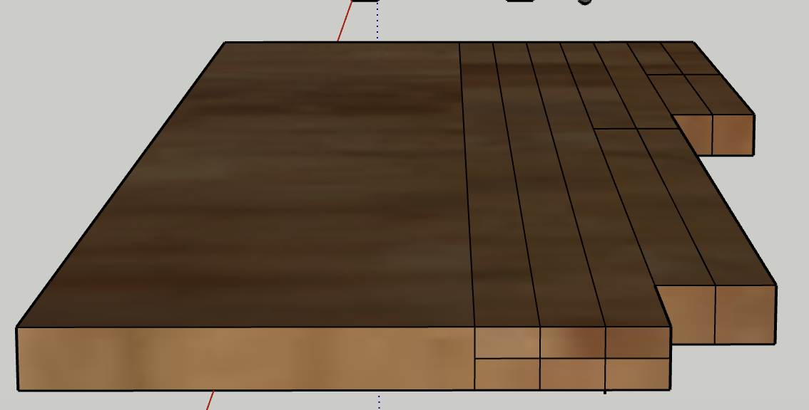

# Shoe Bench

I want to build a shoe bench that you can sit on and store shoes in. The shoe bench will be located between the door and the sofa (in the living room), so the size should be tailored to this specific space.

## Measurements

1. Length - should align with the depth of the sofa                                     - 100 cm
2. Hight - standard for objects that you can sit on comfortably, and that shoes fit in  - 50 cm
3. Depth - should be maximum the distance between an open door and the sofa             - 28 cm

## Sketch

Here is a sketch of the shoe bench:

## Parts List

Here is the list of all the parts we need:

| Length x Hight x Depth (cm) | Amount | Purpose 
|:---:|:---:|:---:|
| 4x46x4 | 4 | Legs |
| 4x4x20 | 4 | Aprons |
| 100x2x4 | 6 | Shoes Shelves |
| 100x4x28 | 1 | Sit |

## Parts map

## Steps

get your hands on some wooden plates and follow these steps:

### Phase 1: Design & Planning

1.  Measure your space – Determine the available room for the shoe cabinet.
2.  Decide on storage capacity – How many shoe pairs? Adult or child sizes?
3.  Sketch the cabinet design – Draw all sides: front, back, sides, shelves, top, bottom, and doors (if any).
4.  Make a cut list – List all parts with exact dimensions.
5.  Choose a style – Open or closed? With legs? Wall-mounted or freestanding?

### Phase 2: Disassembly, Cleaning & Surfacing the Wood

1.  Inspect the pallet – Check for signs of rot, mold, cracks, or heavily rusted nails.
2.  Disassemble the pallet – Use a pry bar, hammer, or pallet buster to separate the boards carefully.
3.  Remove all nails, staples, and screws – Absolutely essential before using any power tools like the planer or jointer.
4.  Joint one face (using jointer) – Run each board flat-side down to create one perfectly flat face.
5.  Joint one edge (using jointer) – Rotate the board and square up one edge to the jointed face (creating a perfect 90° corner).
7.  Plane the opposite face (using planer) – With one flat face as reference, use the planer to achieve even thickness across the entire board.
8.  Plane the remaining edge (optional) – For precise board width if needed.
9.  Square one end (optional, using table saw or miter saw) – If the board ends are uneven, cut a clean 90° edge.

### Phase 3: Cutting the Wood

1.  Mark and measure your boards – Use a square, tape measure, and pencil.
2.  Cut to size – Using a table saw, circular saw, or miter saw, depending on your tools.
3.  Label each piece – Helps keep everything organized for assembly.
4.  Sand all surfaces – Use finer grit sandpaper (e.g., 120–180) to smooth edges and faces.

### Phasae 4: Assembly

1.  Drill pilot holes – To prevent splitting the wood when screwing.
2.  Assemble the main box (carcass) – Attach sides, bottom, and top using wood glue and screws or nails.
3.  Install shelves – Level them properly according to shoe height.

### Phase 5: Finishing

1.  Final sanding – Smooth out corners, round edges, and clean any glue residue.
2.  Apply finish – Paint, stain, wood oil, or clear varnish depending on the look and durability you want.
3.  Let it dry thoroughly – At least 24 hours in a well-ventilated space.
4.  Install hardware – Hinges, knobs, handles, etc. if needed.
5.  Inspect and clean – Make sure all joints are secure and surfaces clean before use.