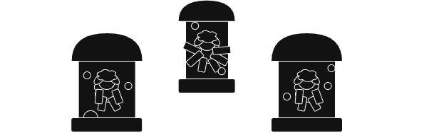

# Incubator

{: .center }

## Introduction

Welcome to the Incubator – our workshop for bringing ideas to life! This is where we showcase and actively develop projects, turning concepts into tangible outcomes.

Explore active projects and ideas brewing within our community. 

## Structure

the projects are grouped into different themes.

-   [**Food**](./food/index.en.md)

    ---

    A collection of food-related projects, focusing on from-scratch recipes and techniques.

    - [Sourdough](./food/sourdough_starter.en.md)

-   [**Furniture**](./furniture/index.en.md)

    ---
    
    Custom-designed and DIY furniture projects for modern living spaces.

    - [Closet Storage Wall](./furniture/closet_storage_wall.en.md)
    - [Coffee Desk](./furniture/coffee_desk.en.md)
    - [Desk Helping Hand](./furniture/desk_helping_hand.en.md)
    - ...

-   [**Plants**](./plants/index.en.md)

    ---

    Projects related to indoor plants and creating green spaces.

    - [Bedroom Plants](./plants/bedroom_plants.en.md)

-   [**Tech**](./tech/index.en.md)

    ---

    Exploring electronics, home automation, and other tech-based DIY projects.

    - [Anti-pigeon](./tech/anti-pigeon.en.md)
    - [Flying Dog](./tech/flying_dog.en.md)
    - [Smart Home Automation](./tech/smart-home-automation.en.md)

-   [**Other**](./other/index.en.md)

    ---

    A collection of miscellaneous projects that don't fit into other categories.

    - [DIY Air Purifier](./other/diy_air_purifier.en.md)
    - [Workout Plan](./other/workout_plan.en.md)

