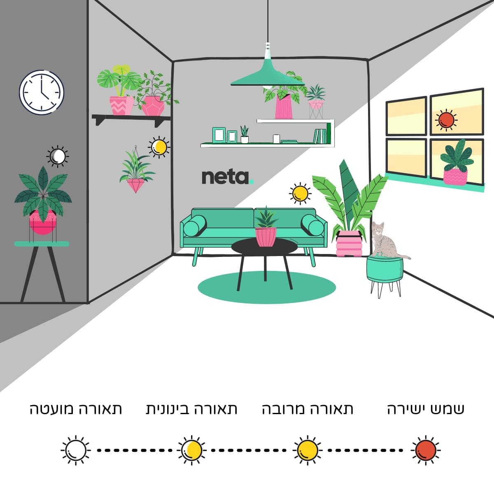

I want the healthiest plants for my bedroom

# Plant List

1. Aloe vera
2. Variegated Sansevieria
3. Variegated white pothos
4. Red syngonium
5. Fiddler's Ficus
6. Peace lilies (?)

# Categories / Parameters

1. Light Requirements
    
    1.  low indirect light
    2.  medium indirect light 
    3.  high indirect light
    4.  direct light
2. Watering
    1.  
3. Temperature Range
4. Humidity
5. Soil Type & Fertilization
6. Routine Notes & Tips

# Comparing Different Sources

1.  Aloe vera
    1.  light
        *   neta - bright indirect light
    2.  watering
        *   neta - not a lot
2. Variegated Sansevieria
    1.  light
        *   neta - can live without indirect light
    2. watering
        *   neta - not a lot
3. Variegated white pothos
4. Red syngonium
    1.  light
        *   neta - medium indirect light 
5. Fiddler's Ficus

# Plant Care Table

| **Plant** | **Light Requirements** | **Watering** | **Temperature Range (°C)** | **Humidity** | **Soil & Fertilization** | **Routine & Tips (Israel Climate)** | **Botanist's Note** |
| :--- | :--- | :--- | :--- | :--- | :--- | :--- | :--- |
| **Aloe vera** | Bright, indirect light for 4-6 hours. A south-facing window with a sheer curtain is ideal. Can tolerate some direct morning sun, but intense afternoon sun will scorch its leaves, causing them to turn yellow. | Water deeply but infrequently. Use the "soak and dry" method: water thoroughly until it drains from the bottom, then wait for the soil to dry out completely. In a hot Israeli summer, this could be every 2 weeks; in winter, reduce to every 3-4 weeks. | **Ideal: 13-27°C**. It's quite heat-tolerant and can handle hotter temperatures, but growth will slow. Protect from frost. | Prefers dry conditions (30-40%). No need for misting; high humidity can promote fungal diseases. Excellent for dry indoor air. | Use a fast-draining cactus/succulent mix. Amend standard potting soil with perlite or coarse sand (1:1 ratio). Fertilize with a balanced, low-nitrogen liquid fertilizer diluted to half-strength, only once in the spring and once in late summer. | Rotate the plant monthly for even growth. Wipe leaves with a damp cloth if they get dusty. Yellowing leaves can signal overwatering or sunburn. | Aloe's fleshy leaves (succulence) are adaptations for water storage in arid environments. The gel inside, primarily composed of water, is protected by a waxy cuticle that minimizes evapotranspiration. Overwatering leads to root rot because the roots are not adapted to constant moisture. |
| **Variegated Sansevieria (Snake Plant)** | Highly adaptable. Thrives in medium to bright, indirect light. Can tolerate low light, but variegation will be less pronounced. Direct sun can burn the leaves. An east-facing window is great. | Extremely drought-tolerant. Let the soil dry out completely between waterings. Water every 2-4 weeks in summer, and as little as once every 6-8 weeks in winter. Always check soil moisture first. | **Ideal: 18-29°C**. Can tolerate up to 35°C, but keep it out of direct, intense sunlight to prevent leaf scorch. | Adaptable to a wide range of humidity levels (30-60%), making it very resilient. Average household humidity is perfectly fine. | Use a well-draining potting mix. A mix of potting soil, perlite, and sand is effective. Avoid heavy soils. Fertilize with a balanced houseplant fertilizer at half-strength once a month during spring and summer. | Root rot is the biggest risk. Err on the side of underwatering. Clean the leaves with a damp cloth every few months to aid photosynthesis and keep them looking sharp. | Sansevieria performs Crassulacean Acid Metabolism (CAM) photosynthesis, an adaptation to arid conditions. It opens its stomata (pores) at night to take in CO2, minimizing water loss during the hot day. This makes it exceptionally water-efficient. |
| **Variegated Pothos (e.g., 'Marble Queen')** | Bright, indirect light is essential to maintain the white variegation. Insufficient light will cause the white parts to revert to green. Avoid direct sunlight, which can burn the delicate variegated sections. | Water when the top 3-5 cm of soil feels dry. This might be weekly in summer and every 10-14 days in winter. Pothos will droop slightly when thirsty, which is a good visual cue. | **Ideal: 18-30°C**. It's a tropical plant and appreciates warmth. Keep away from cold drafts and AC units. | Prefers moderate to high humidity (50-60%). In dry Israeli summers, consider grouping it with other plants or using a pebble tray to increase local humidity. | Use a well-aerated, fast-draining potting soil. Fertilize with a balanced liquid fertilizer every 4-6 weeks during the growing season (spring/summer). Reduce in winter. | Prune leggy vines to encourage a fuller, bushier plant. The cuttings can be easily propagated in water. The variegated parts of the leaves lack chlorophyll and are more susceptible to sunburn. | The white patches on variegated leaves lack chlorophyll, the pigment necessary for photosynthesis. This means the plant has less 'machinery' to convert light into energy, making bright, indirect light crucial to support the green, working parts of the leaf without scorching the sensitive white areas. |
| **Red Syngonium** | Medium to bright, indirect light to maintain its vibrant red-pink coloration. Low light will cause the color to fade and the plant to become leggy. Keep out of direct sun. | Keep the soil consistently moist but not waterlogged. Water thoroughly when the top 2-3 cm of soil is dry. This is typically every 5-7 days in summer and every 10-14 days in winter. | **Ideal: 18-27°C**. Does not like cold and is sensitive to temperatures below 15°C. | Loves high humidity (60-70%). This is the most humidity-loving plant on your list. Misting daily, using a humidifier, or placing it in a bathroom would be beneficial, especially during dry heatwaves. | A rich, well-draining soil is best. A peat-based mix with perlite is a good choice. Feed with a balanced fertilizer every 4 weeks during the growing season. | Rotate the plant regularly to ensure all sides receive light. You can let it trail or provide a small trellis for it to climb, which mimics its natural growth habit. | The arrow-shaped leaves are a characteristic of its juvenile stage. As the plant matures and begins to climb, the leaf structure changes to a lobed, more complex shape. Maintaining high humidity mimics its native tropical rainforest understory environment. |
| **Fiddle Leaf Fig (Ficus lyrata)** | Bright, consistent, indirect light is non-negotiable. It loves a spot near a window where it can get several hours of bright, filtered light (e.g., south or west-facing with a curtain). Can tolerate a few hours of direct morning sun. | Water when the top 5 cm of soil is dry. Water thoroughly until it drains out. In summer, this could be every 7-10 days. Fiddle Leaf Figs are prone to root rot, so ensure good drainage and don't let it sit in water. | **Ideal: 18-28°C**. Very sensitive to drafts and sudden temperature changes. Find a good spot and keep it there. | Prefers moderate to high humidity (50-65%). Brown, crispy edges on leaves often indicate the air is too dry. A humidifier is a great investment for this plant. | Use a well-draining, nutrient-rich potting mix that holds some moisture. Look for mixes containing peat, perlite, and pine bark. Fertilize with a high-nitrogen fertilizer (e.g., 3-1-2 ratio) every 4 weeks in spring and summer. | Clean the large leaves with a damp cloth every 1-2 weeks to allow for maximum light absorption and prevent dust buildup. Rotate it 90 degrees every time you water to encourage an even, upright growth habit. | Ficus lyrata is notorious for being finicky because it doesn't adapt well to changes in its environment (a trait called low plasticity). In its native West African habitat, it enjoys stable, warm, humid, and bright conditions. Replicating this stability is the key to success. The large leaves have a high surface area, leading to significant water loss through transpiration, hence the need for consistent watering and humidity. |

# Prompt

Hey, you are a professional botanist and plant scientist with vast knowledge experience in growing, cultivating and maintaining optimal conditions for plants. I got some new plants for my bedroom and I want to create a table with the optimal conditions and routines for the plants. 
please create a table and parameters for each plant, using science based sources and well trusted articles.

the plants are:
1. Aloe vera
2. Variegated Sansevieria
3. Variegated white pothos
4. Red syngonium
5. Fiddler's Ficus

I live in Israel and it can be somewhat hot here so please take note of the temperature and other conditions (for example humidity) that can effect the plants.

# Sources

https://youtu.be/dG75mCGnh4U?si=cDcWirbWVUddIBf6
https://www.plants4u.co.il/
https://www.youtube.com/@monstrofarm
https://daganbagan.co.il/
https://en.wikipedia.org/wiki/NASA_Clean_Air_Study
https://www.plantit.co.il/
