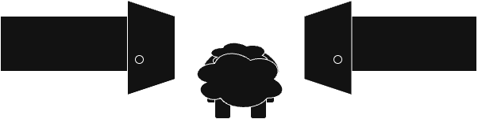
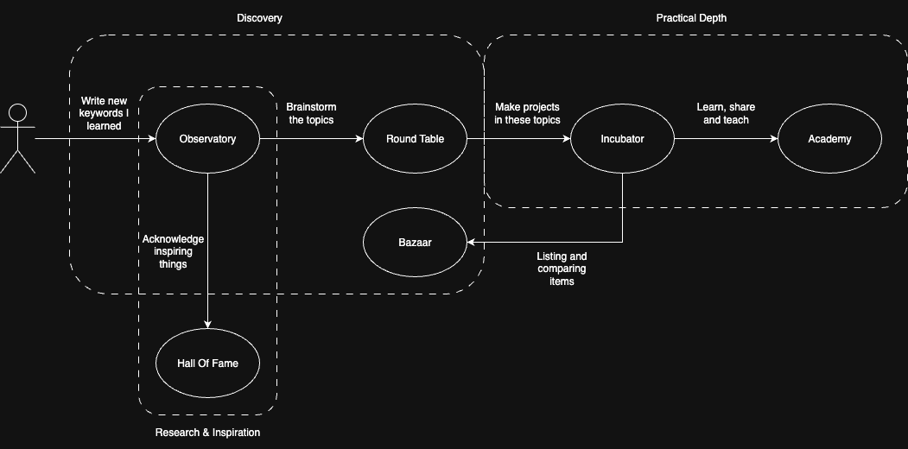

# Welcome to the `Wannabe Polymath` project

{: .center }

Hey :)  

I'm learning new things everyday and I want to share some of them in my own unique way.  
The goal is simple - I want to be a polymath, I want to document things I learn and write, and I want you to learn new stuff.  

## Getting Started

The website is organized into several `Corners`, each with a unique purpose.  
Don't worry about understanding everything at once — start with a section that interests you, and you'll see how it all connects as you explore.

!!! example "Home"
    

    -   [:material-home: **Home**](./index.en.md)

        ---

        You are here. This is the main landing page.

    

!!! example "Corners"
    

    -   [:material-telescope: **Observatory**](./observatory/)

        ---

        Collect, define, and connect key terms, concepts, influential figures, and sources.

    -   [:material-comment-question: **Round Table**](./round_table/)

        ---

        Dissecting challenges, brainstorming solutions, and conceptualizing projects.

    -   [:material-lightbulb: **Incubator**](./incubator/)

        ---

        Showcasing projects and ideas being designed and developed.

    -   [:material-school: **Academy**](./academy/)

        ---

        Learning and skill-sharing hub I write.

    -   [:material-cart: **Bazaar**](./bazaar/)

        ---

        Collection of needs, and researched and recommended items to fit them.

    -   [:material-trophy: **Hall of Fame**](./hall_of_fame/)

        ---

        Take inspiration and honor different figures.

    

    

    -   [:material-dots-horizontal: **Other Corners**](./other_corners/)

        ---

        A list for all the other corners that didn't fit.

    

!!! example "About"
    

    -   [:material-information: **About**](./about/)

        ---

        The "why" and "how" of the Wannabe Polymath project.

    

## Line of Thought

<figure markdown="span">
  {: .center }
  <figcaption>you can read more in the about section</figcaption>
</figure>

---

## How to Contribute

This project is a living document, and the best way to contribute is by opening an issue or pull request on the [project's GitHub repository](https://github.com/Sh4peSh1fter/wannabepolymath).

Any feedback will be very helpful! so feel free to reach :)

---

Happy Learning!