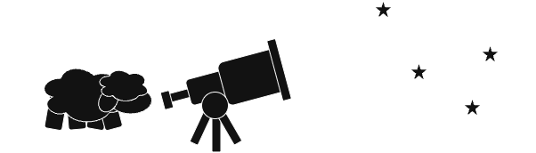

# Observatory

<figure markdown="span">
  {: .center }
  <figcaption>Map the constellations of knowledge</figcaption>
</figure>

## Introduction

This space is dedicated to collecting, defining, and connecting key word, terms, and influential figures, across various disciplines to help us navigate complex subjects.

## Structure

The `fields` grouped by the science type. Each `field` contains its own set of key concepts, figures, and resources.

- Natural Sciences (1)
    - [Physics](./natural_sciences/physics/)
    - [Chemistry](./natural_sciences/chemistry/)
    - [Biology](./natural_sciences/biology/)
    - [Earth Science](./natural_sciences/earth_science/)
    - [Astronomy](./natural_sciences/astronomy/)

- Formal Sciences (2)
    - [Mathematics](./formal_sciences/mathematics/)
    - [Logic](./formal_sciences/logic/)
    - [Computer Science](./formal_sciences/computer_science/)

- Social Sciences (3)
    - [Psychology](./social_sciences/psychology/)
    - [Sociology](./social_sciences/sociology/)
    - [Economics](./social_sciences/economics/)
    - [Political Science](./social_sciences/political_science/)
    - [Anthropology](./social_sciences/anthropology/)
    - [History](./social_sciences/history/)

- Applied Sciences (4)
    - [Engineering](./applied_sciences/engineering/)
    - [Medicine](./applied_sciences/medicine/)

- Humanities (5)
    - [Philosophy](./humanities/philosophy/)
    - [Linguistics](./humanities/linguistics/)
    - [Literature](./humanities/literature/)

- Other (6)
    - [Military](./other/military/)
    - [Nutrition](./other/nutrition/)
    - [Woodworking](./other/woodworking/)

1.  Fields that deal with the physical world, such as physics, chemistry, and biology.
2.  Fields that are based on formal systems, such as logic, mathematics, and computer science.
3.  Fields that study societies and the relationships among individuals within those societies.
4.  The application of existing scientific knowledge to practical purposes, like technology or inventions.
5.  Fields that study human society and culture.
6.  Miscellaneous fields that don't fit into the other main categories.
