# Fitness: Functional Strength & Health

This fitness system is designed for performance-driven training focused on overall health, functional movement, and long-term well-being. The approach emphasizes strength, endurance, mobility, and injury prevention rather than aesthetics or bulk.

## Body Parts & Muscle Groups

Understanding the major muscle groups and how they work together is fundamental for effective training, injury prevention, and functional movement. Here's a breakdown of the main body parts and their constituent muscle groups:

### Upper Body

#### Chest (Pectorals)
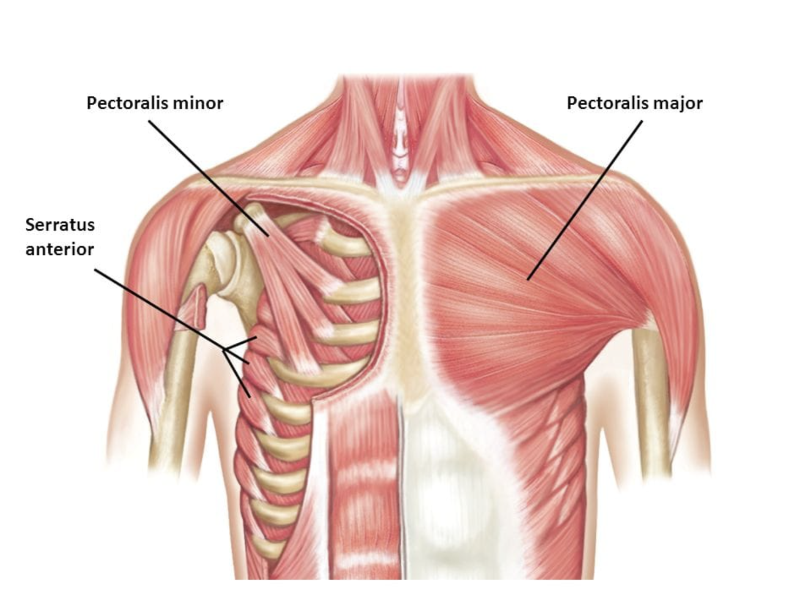

- **Pectoralis Major:** Primary chest muscle for pushing movements
- **Pectoralis Minor:** Smaller muscle beneath pec major, important for shoulder stability
- **Serratus Anterior:** "Boxer's muscle" - important for shoulder blade movement

#### Back
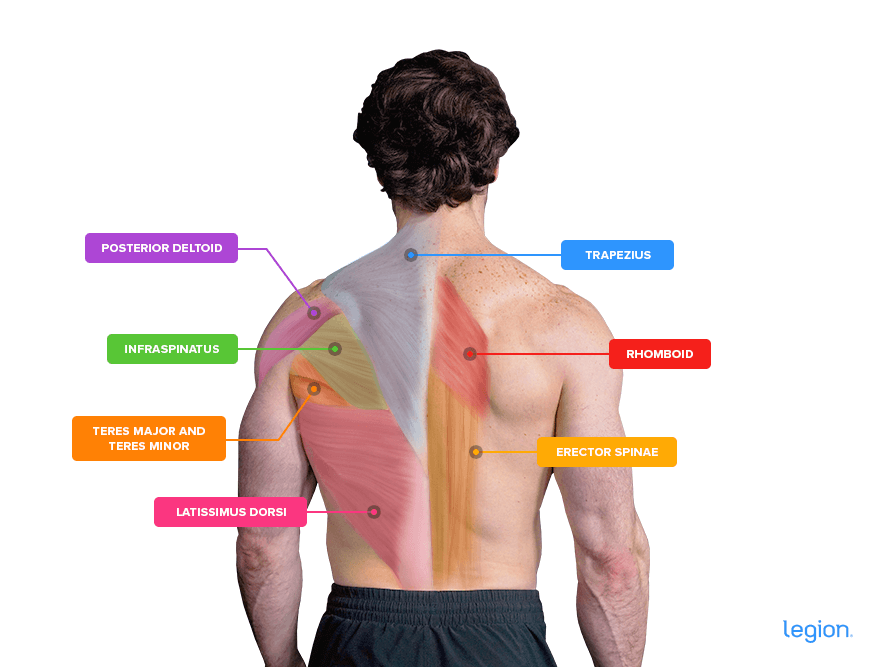

- **Latissimus Dorsi:** Large pulling muscles, create V-shape silhouette
- **Rhomboids:** Between shoulder blades, important for posture
- **Trapezius:** Upper (neck/shoulders), middle (between shoulder blades), lower (lower back)
- **Erector Spinae:** Deep back muscles along spine for posture and stability
- **Posterior Deltoids:** Rear shoulder muscles, often neglected but crucial for balance

#### Shoulders (Deltoids)
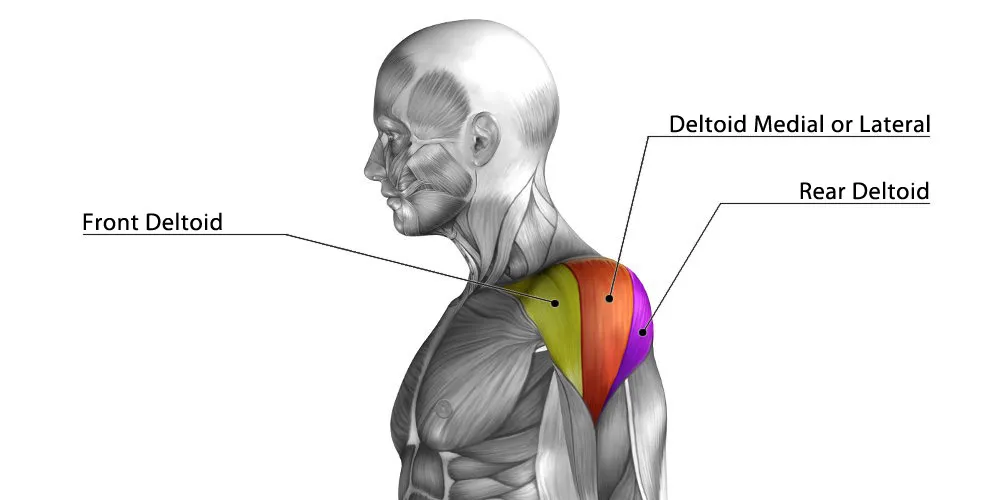

- **Anterior Deltoid:** Front shoulder, used in pressing movements
- **Medial Deltoid:** Side shoulder, creates shoulder width and stability
- **Posterior Deltoid:** Rear shoulder, crucial for posture and pulling balance

#### Arms
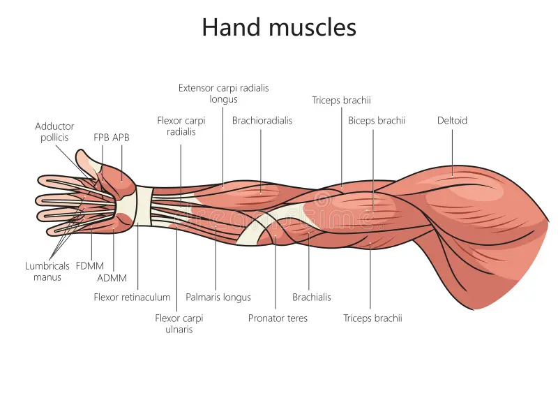

**Biceps:**
- **Biceps Brachii:** Main arm flexor muscle (curling motion)
- **Brachialis:** Underneath biceps, important for arm strength
- **Brachioradialis:** Forearm muscle involved in curling

**Triceps:**
- **Triceps Brachii:** Three-headed muscle at back of arm (straightening motion)
- Makes up 2/3 of arm mass, more important than biceps for arm size

**Forearms:**
- **Flexors:** Inside forearm muscles for gripping
- **Extensors:** Outside forearm muscles for wrist extension
- **Pronators/Supinators:** Muscles that rotate forearm

### Core & Torso

#### Abdominals
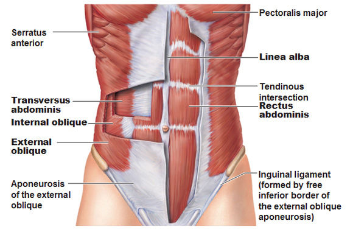

- **Rectus Abdominis:** "Six-pack" muscle, flexes spine
- **External Obliques:** Side abs, important for rotation and lateral flexion
- **Internal Obliques:** Deeper layer, works with external obliques
- **Transverse Abdominis:** Deepest core muscle, acts like natural weightlifting belt

#### Deep Core
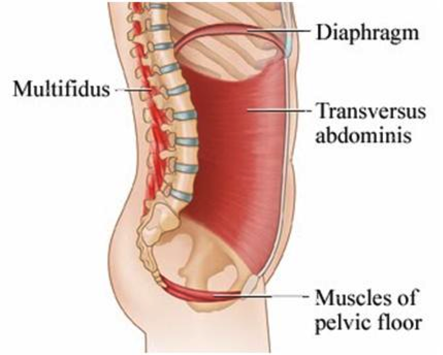

- **Diaphragm:** Primary breathing muscle, core stability
- **Pelvic Floor:** Bottom of core cylinder, pelvic stability
- **Multifidus:** Deep spinal stabilizers
- **Psoas:** Hip flexor that connects spine to legs

### Lower Body

#### Glutes (Buttocks)
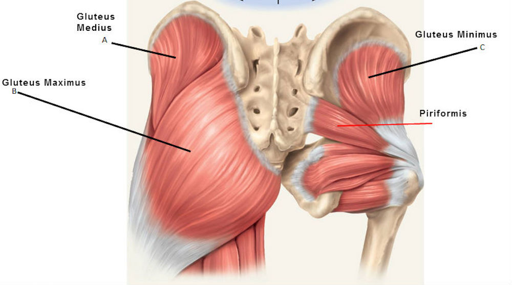

- **Gluteus Maximus:** Largest muscle in body, hip extension and power
- **Gluteus Medius:** Side glute, hip stability and preventing knee cave
- **Gluteus Minimus:** Smallest glute, fine motor control and stability

#### Quadriceps (Front Thigh)
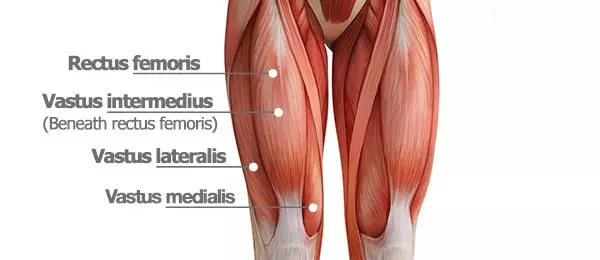

- **Rectus Femoris:** Crosses hip and knee joints
- **Vastus Lateralis:** Outside quad, largest quad muscle
- **Vastus Medialis:** Inside quad, important for knee tracking
- **Vastus Intermedius:** Deep quad muscle underneath rectus femoris

#### Hamstrings (Back Thigh)
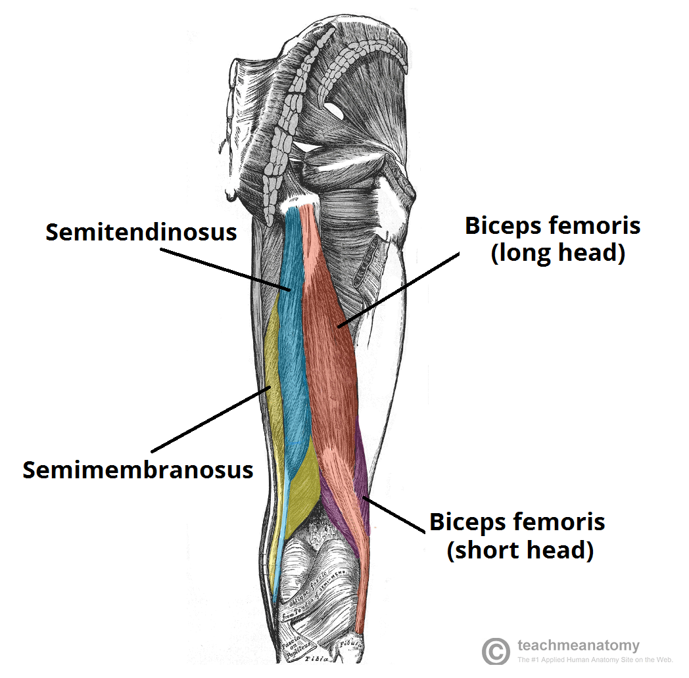

- **Biceps Femoris:** Two-headed muscle, knee flexion and hip extension
- **Semitendinosus:** Inner hamstring, knee flexion and hip extension
- **Semimembranosus:** Inner hamstring, knee flexion and hip extension

#### Calves
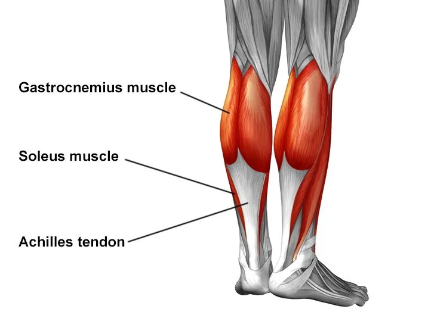

- **Gastrocnemius:** Large calf muscle with two heads, plantar flexion
- **Soleus:** Deeper calf muscle underneath gastrocnemius
- **Tibialis Anterior:** Shin muscle, dorsal flexion (lifting toes)

#### Hip/Pelvis Area
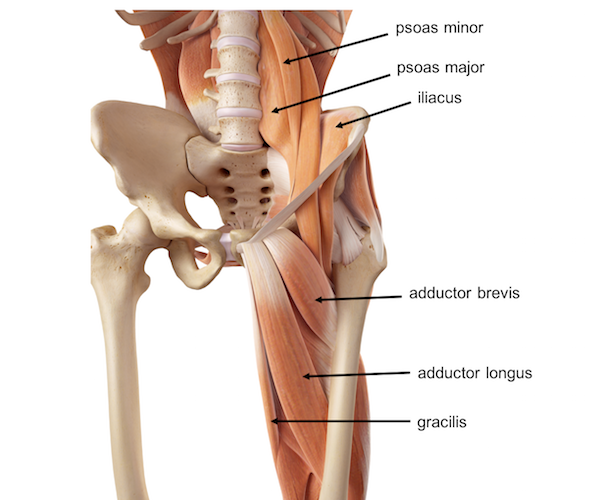

- **Hip Flexors:** Lift knees toward chest (psoas, iliacus, rectus femoris)
- **Hip Adductors:** Inner thigh muscles, bring legs together
- **Hip Abductors:** Outer hip muscles, move legs away from centerline
- **Piriformis:** Deep hip rotator, can cause sciatica if tight

## Functional Movement Patterns

### Primary Movement Patterns
1. **Squat:** Knee and hip dominant movement (quads, glutes, core)
2. **Hinge:** Hip dominant movement (hamstrings, glutes, erector spinae)
3. **Push:** Moving weight away from body (chest, shoulders, triceps)
4. **Pull:** Moving weight toward body (back, biceps, rear delts)
5. **Carry:** Moving while loaded (core, grip, full body stability)
6. **Gait:** Walking/running pattern (full body coordination)

### Movement Integration
- **Kinetic Chain:** How muscles work together in sequences
- **Stabilizers vs. Movers:** Some muscles stabilize while others create movement
- **Bilateral vs. Unilateral:** Two-sided vs. single-sided training
- **Compound vs. Isolation:** Multi-joint vs. single-joint exercises

## Training Principles for Your Goals

### Functional Strength Focus
- **Multi-joint movements:** Squats, deadlifts, pull-ups, push-ups
- **Unilateral training:** Single-leg and single-arm exercises
- **Core integration:** Every exercise should engage core
- **Movement quality:** Perfect form over heavy weight

### Health & Longevity Approach
- **Joint mobility:** Full range of motion in all movements
- **Muscle balance:** Equal attention to opposing muscle groups
- **Injury prevention:** Progressive overload and recovery emphasis
- **Cardiovascular integration:** Heart health alongside strength

### Performance Enhancement
- **Power development:** Explosive movements and plyometrics
- **Endurance training:** Both muscular and cardiovascular
- **Swimming integration:** Full-body, low-impact conditioning
- **Flexibility/mobility:** Daily movement quality work

## Key Training Concepts

### Progressive Overload
- **Volume:** Increase sets, reps, or frequency
- **Intensity:** Increase weight or difficulty
- **Density:** More work in less time
- **Complexity:** Progress from simple to complex movements

### Recovery & Adaptation
- **Muscle protein synthesis:** 24-48 hours post-workout
- **Nervous system recovery:** Varies by training intensity
- **Sleep importance:** Primary recovery mechanism
- **Nutrition timing:** Support recovery and adaptation

### Individual Adaptation
- **Movement assessment:** Identify limitations and imbalances
- **Progressive exercise selection:** From basic to advanced
- **Personal response:** Monitor how your body adapts
- **Lifestyle integration:** Fit training into your daily routine

## Next Steps

Based on your profile (24M, 180cm, 78kg, beginner with gym access, twice weekly + home options), we'll develop a comprehensive program that addresses:

1. **Movement Assessment:** Identify any limitations or imbalances
2. **Exercise Selection:** Choose movements that match your goals and abilities
3. **Program Structure:** Optimal frequency, volume, and progression
4. **Swimming Integration:** How to include swimming effectively
5. **Nutrition Optimization:** Meal timing and macro balance for your goals
6. **Recovery Protocols:** Sleep, mobility, and stress management
7. **Progress Tracking:** Measurable outcomes and adjustments

This anatomical foundation will help you understand why specific exercises are chosen and how they contribute to your functional strength, health, and performance goals.
