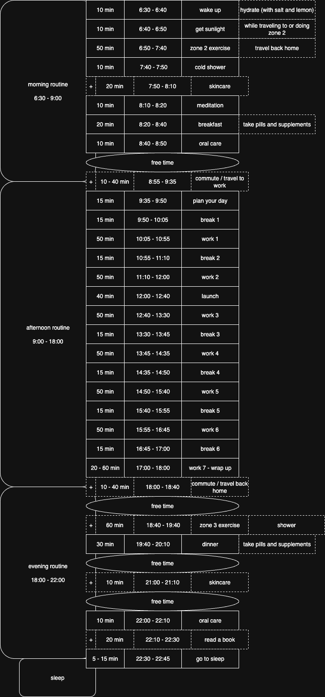

# Daily Routine

## Guiding Questions

what is our daily routine?
how can we improve our daily routine?

## Introduction

To build an optimized and healthy daily routine, we'll structure our day into two main categories: chronological blocks and recurring habits. This approach allows us to focus on specific phases of the day while also integrating essential habits that occur throughout.

## Daily Routine Diagram

## Daily Flow (Chronological Blocks)

This is the timeline of our day, from waking up to going to sleep.

1.  [**Morning Routine**](./morning_routine.en.md) - *From waking up until the start of the workday.*
2.  [**Workday Routine**](./workday_routine.en.md) - *Commute, work hours, breaks, and lunch.*
3.  [**Evening Routine**](./evening_routine.en.md) - *The wind-down period after work until bedtime.*
4.  [**Sleep**](./sleep.en.md) - *Optimizing sleep for recovery and performance.*

## General Habits

These are foundational habits that can be integrated throughout the day's chronological blocks. Each habit may occur multiple times per day or be embedded within specific routine steps.

- [**Nutrition**](./general_habits/nutrition.en.md) - *Meal planning, hydration, food choices, and timing strategies.*
- [**Hygiene**](./general_habits/hygiene.en.md) - *Personal care routines, oral health, and cleanliness protocols.*
- [**Physical Activity**](./general_habits/physical_activity.en.md) - *Exercise zones, movement breaks, and recovery methods.*
- [**Social Connection**](./general_habits/social_connection.en.md) - *Relationship building and meaningful interactions.*
- [**Mindfulness & Learning**](./general_habits/mindfulness_and_learning.en.md) - *Meditation, reading, skill development, and mental training.*
- [**Light Management**](./general_habits/light_management.en.md) - *Circadian optimization through strategic light exposure.*

## Keywords

- Cortisol
- Hypothalamus
- Adenosine
- Circadian Clock

## Notes

1. get natural light in your eyes within 1 hour of waking up

## Prompt

Hey, you are a professional scientist with vast experience, and you truly understand in human health, habits, brain and body connection and activity, biology and any other field that is related to building a day to day routine. any data or claim you suggest is well researched and science based.
I'm a 24 male, living in Israel, and I want to build a day to day routine that is optimized and the most healthiest I can do. my goals are improving my body and abilities, improve overall health, body functionality, mood and so on. note that I'm working from 9:00 to 17:00.
please build me the best routine.

## Sources

1.  [Andrew Huberman: A Biologist on Optimal Health, Performance, & More](https://youtu.be/gR_f-iwUGY4?si=FfT1TlL1ZegqATKj)
2.  [Andrew Huberman: How Your Brain Works & How to Improve It](https://youtu.be/mMGhOeFQIv8?si=8dGwnO-Alj2mamhJ)
3.  Josh Waitzkin
4.  Daily Rituals book
